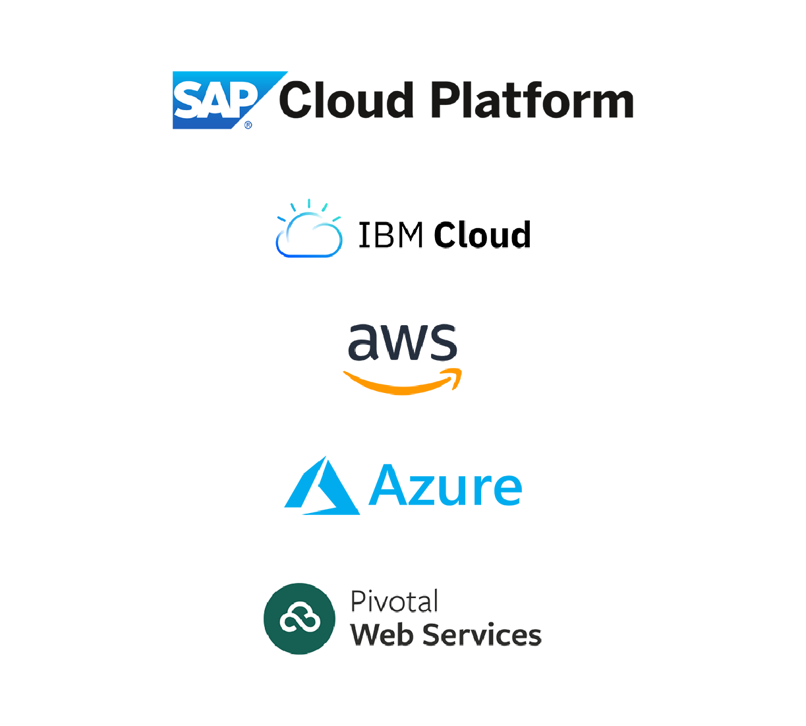
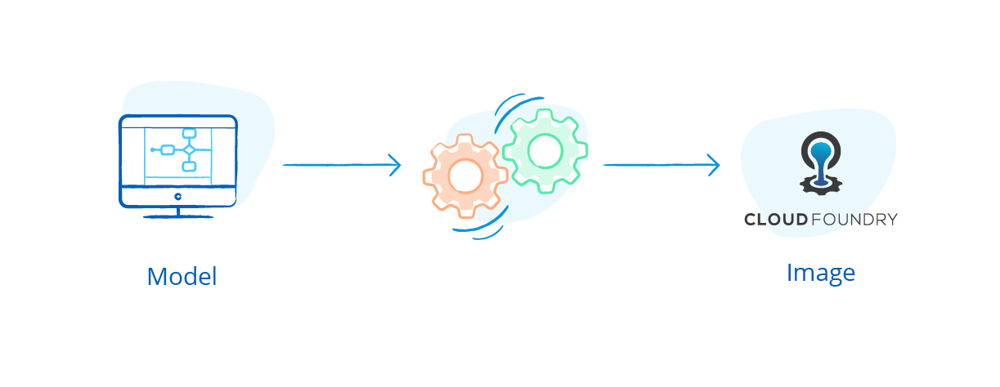
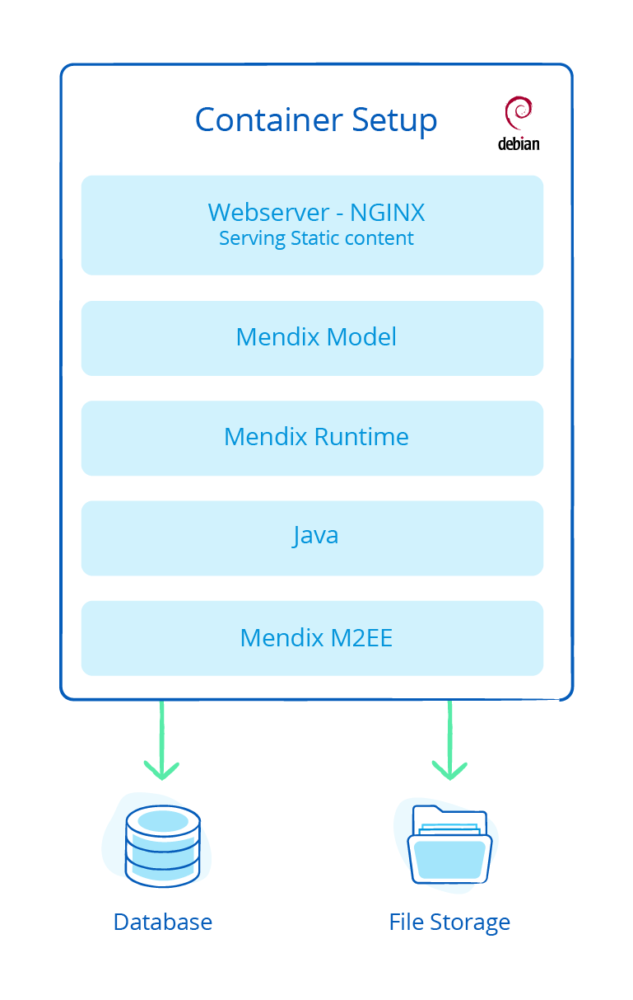
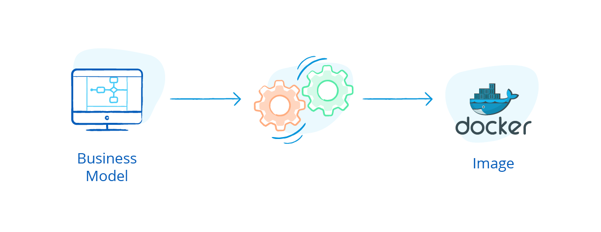
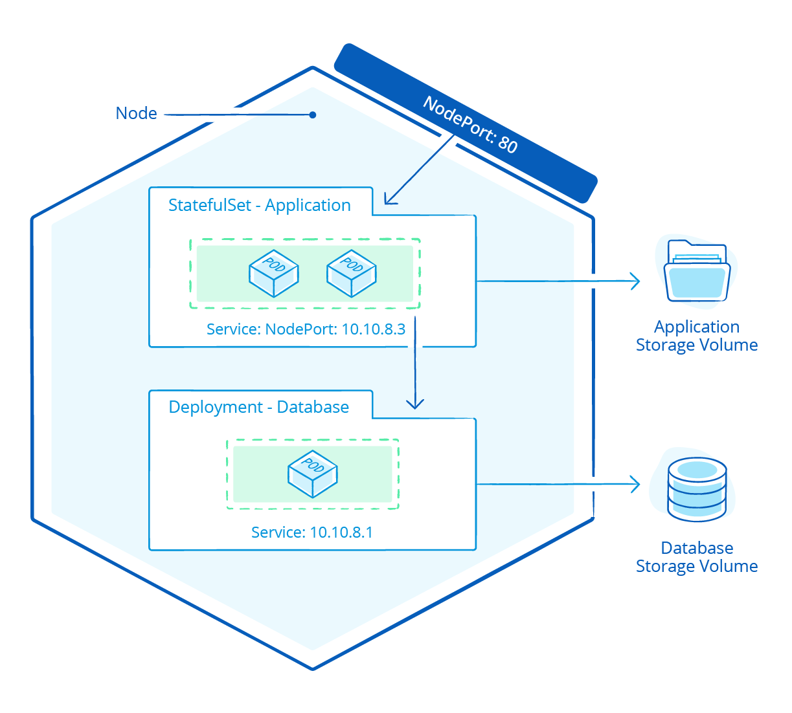

## 1 Which Cloud Providers Can I Use for Mendix? {#which-cloud}

Mendix is compatible with all the well-known cloud providers: IBM Cloud, SAP Cloud Platform, Microsoft Azure, Amazon Web Services (AWS), Redhat Openshift, and Google Cloud Platform.

In addition, Mendix has formal partnerships with SAP, IBM, Microsoft, and AWS. [SAP](../strategic-partners/sap) is an official reseller and sees Mendix as an extension of SAP Cloud Platform. [IBM](../strategic-partners/ibm) has selected Mendix as the preferred low-code development platform for use on top of IBM Cloud.

This table presents an overview of the deployment options for each provider:

| Provider / Deployment | Public Cloud Foundry | Public Managed Kubernetes | Docker Container Services | (Virtual) Service-based | Virtual Private Cloud  | Private Cloud (On-Premises) |
|-----------------------------|-----|-----|-------|-----|-----------|--------|
| IBM | 
&#10004;
 | 
&#10004;
 |  | 
&#10004;
 | 
&#10004;
 | 
&#10004;
 |
| SAP | 
&#10004;
 |  |  |  |  |  |
| Azure |  | 
&#10004;
 | 
&#10004;
 | 
&#10004;
 | 
&#10004;
 | 
&#10004;
 |
| AWS |  |  | 
&#10004;
 | 
&#10004;
 | 
&#10004;
 |  |
| Openshift |  | 
&#10004;
 |  | 
&#10004;
 |  | 
&#10004;
 |
| Google |  | 
&#10004;
 |  |  | 
&#10004;
 |  |

## 2 How Does Mendix Provide Support for Cloud Foundry?

In 2014, Mendix adopted Cloud Foundry (CF) as the basis for the Mendix Cloud. This was also the year Mendix joined the Cloud Foundry Foundation open source project to contribute to the community.

Cloud Foundry is a platform-as-a-service (PaaS), although it is positioned by some analysts as an application-platform-as-a-service (aPaaS). Cloud Foundry provides an abstraction layer on top of an IaaS like Vmware, Openstack, Azure, or AWS. This allows you to provision services and applications without having to deal with servers, network, routing, or storage.

The key benefits of using Cloud Foundry are user governance, high control combined with self-service capabilities, auto-scaling, auto-healing, and auto-provisioning. This reduces the overall maintenance cost of running a large amount of applications and allows your DevOps team to maintain these themselves.

An application runs in a fully isolated container, consuming the specific services that are connected to this container. To deploy an application on Cloud Foundry, a compatible buildpack needs to be available that is responsible for compiling, building, and running the application on Cloud Foundry.

As the Mendix Cloud is based on Cloud Foundry, a buildpack is available at [https://github.com/mendix/cf-mendix-buildpack](https://github.com/mendix/cf-mendix-buildpack) to deploy a Mendix application to any Cloud Foundry offering. This buildpack is part of the open-source Cloud Foundry community and is officially supported by Mendix. For more information, see the [cf-mendix-buildpack repository documentation](https://github.com/mendix/cf-mendix-buildpack).

The container build within Cloud Foundry contains the full runtime setup for running your application. Together with a database service and optionally a storage service, you are able to run your application on Cloud Foundry.

{}

{}

### 2.1 How Can I Use the Mendix Cloud Foundry Buildpack in Offline Mode?

The Mendix Cloud Foundry buildpack will by default download dependencies for building the container from the Mendix content delivery network. If you are running Mendix on premises without internet access, it is possible to fully run the buildpack offline. In that case, all the dependencies need to be stored on a web server in the local network. While executing the buildpack, an environment parameter will set the alternative download location for the dependencies.

###  2.2 How Can I Scale a Mendix Application on Cloud Foundry?

Because the Mendix Runtime is stateless, the standard scaling capability of Cloud Foundry can be used for a Mendix application. This means that adding horizontal scaling and increasing the memory of a single container for vertical scaling is as simple as adding instances of the container. For processes that need to be run on a single node (for example, scheduled events), the first container of the cluster will perform these tasks (which is also addressed as cluster ID 0). In case this container stops, Cloud Foundry automatically restarts it.

## 3 How Can I Make Use of Docker for My Mendix Applications?

Mendix added official support for Docker in 2017. This means it is possible to create a Docker image from your modeled Mendix application and distribute it using a Docker Hub repository so that you can run it on platforms like Docker Desktop, Swarm, Enterprise, DCOS, and Kubernetes.

Mendix provides a Docker buildpack as a generic Docker build file. This buildpack inherits from the Mendix Cloud Foundry buildpack, so it has all the capabilities that are already provided in the Cloud Foundry buildpack.

For building a Docker image, the standard `Docker build` command can be used. This will result in an image containing the full runtime setup for your application.

Along with a database and optionally a storage service, you will be able to run your application.

For more information, see [How to Run a Mendix Docker Image](https://docs.mendix.com/developerportal/deploy/run-mendix-docker-image) in the *Mendix Developer Portal Guide*.

### 3.1 How Does Mendix Run on Kubernetes?

Mendix added official support for Kubernetes in 2017. Kubernetes is a container orchestration layer, also positioned as an aPaaS or PaaS. It is typically used to support DevOps teams and microservices architectures. In the combination of Mendix Docker support, a Mendix application is a smooth fit for running on a Kubernetes cluster.

To run a Mendix application with high availability on a Kubernetes cluster, the app should be deployed in a StatefulSet of a minimum of two pods. This allows you to horizontally scale the application to your own needs while keeping control of single processes like scheduled events. The pods need to have access to a database. This database can also run on the Kubernetes cluster, or it can be served by an underlying cloud like Azure SQL, AWS RDS PostgreSQL, IBM Compose PostgreSQL, or IBM DB2.

If the application needs file storage, this can be attached using a standard storage classed to the StatefulSet or by using cloud services like AWS S3 storage, Azure Blob storage, or IBM Swift storage.

{}

{}

For more details, see [How to Run Mendix on Kubernetes](https://docs.mendix.com/developerportal/deploy/run-mendix-on-kubernetes) in *Mendix Developer Portal Guide*.

