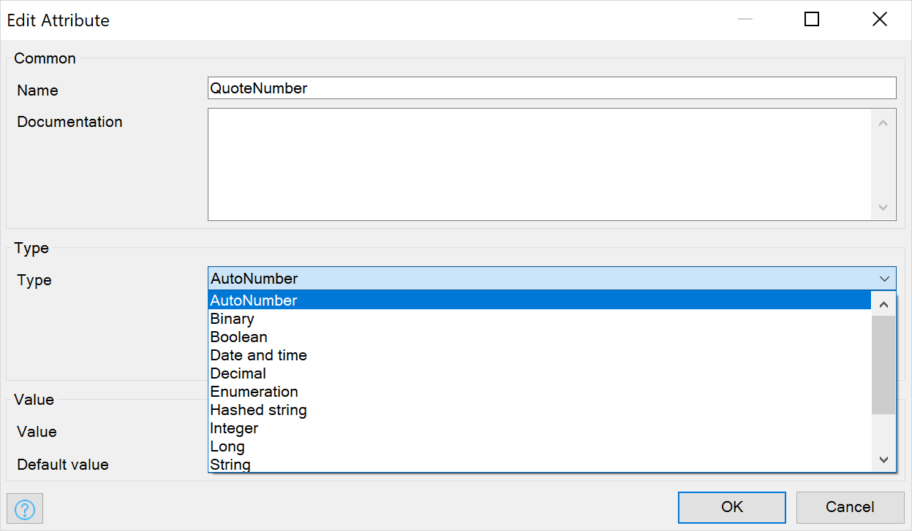
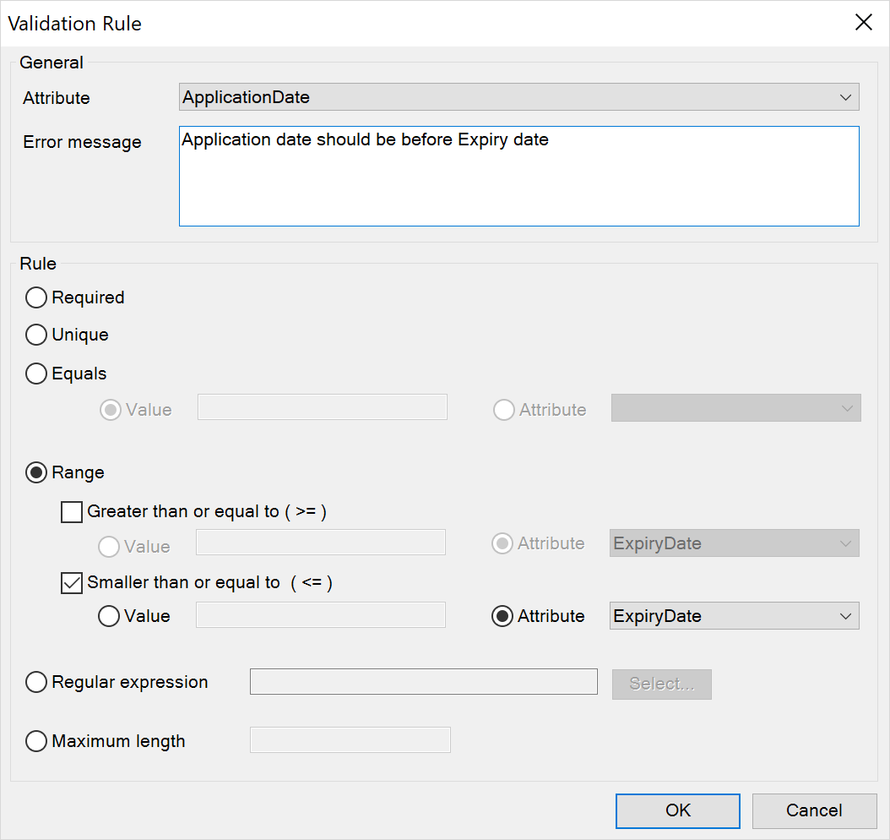
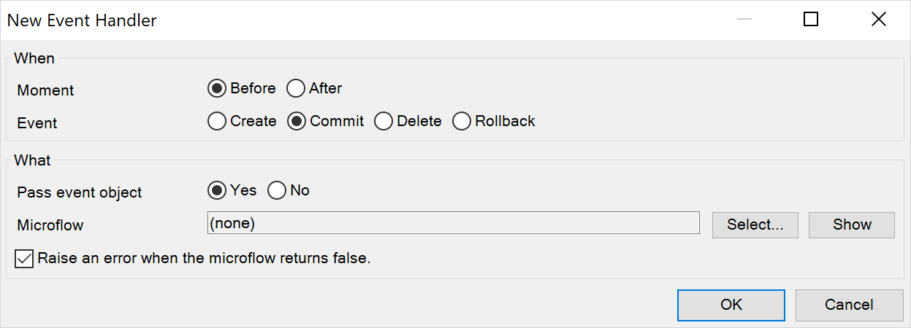
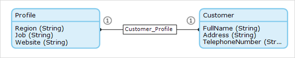
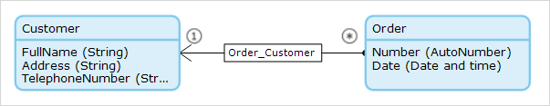

## 1 How Do I Ensure the Integrity of My Data?

Mendix supports different methods to ensure the integrity of your application data:

* **Data types** – ensure only valid data types can be stored
* **Validation rules** – validate if the data is unique, specified, and within a range
* **Event handlers** – use microflows to provide custom logic to validate data
* **Access rules** – ensure only authorized users can access or modify data
* **Referential integrity** – ensure data is stored with the required associated data

## 2 What Data Types Can I Use in Mendix?

Data types define what sort of data can be stored in an attribute. The type ensures that, for example, text fields only contain text and numeric fields only contain numbers.

You can use the following types for your attributes:

* **Autonumber** – an automatically generated number
* **Binary** – binary data
* **Boolean** – true or false
* **Date and time** – a point in time
* **Decimal** – a positive or negative number
* **Enumeration** – one value of a predefined set of values
* **Hashed strin**g – the hash value of a string
* **Integer** – a 32-bit whole number
* **Long** – a 64-bit whole number
* **String** – text containing letter, numbers, spaces, and other characters

{}

{}

For more details, see [Attributes](https://docs.mendix.com/refguide/attributes#type-1) in the *Mendix Studio Pro Guide*.

## 3 What Validation Rules Can I Use in Mendix?

Validation rules specify the rules to which your data should adhere. If your data does not follow the rules specified, you will receive an error when you try to save the data.

{}

{}

Depending on the rule type, this will be handled by the Mendix Runtime or by the database.

## 4 How Do I Use Event Handlers in Mendix?

Event handlers give you the ability to run logic before or after certain events. There are many use cases for this, such as the following:

* **Setting default values on object creation** – if you want to initialize a new object (for example, one with non-constant default values), you can use a before-create event
* **Keeping an audit trail** – sometimes keeping a trail of all the changes made to data is required, and after-events enable you to do this by storing any changes into an audit trail object (the [Audittrail](https://appstore.home.mendix.com/link/app/138/) module in the Mendix App Store provides this exact functionality)
* **Validating data changes** – before-events can be used to trigger a microflow that validates data changes

To set event handlers on all the entities in your application, you can use the Mendix Java API. For example, to set a before commit event listener for all entities, use this method: [Core.getListenersRegistry().registerAfterCommitListener](https://apidocs.mendix.com/8/runtime/com/mendix/core/actionmanagement/ListenersRegistry.html).

{}

{}

## 5 How Can I Configure Access Rules?

A major aspect of data integrity relates to who is allowed to change what data, so data authorization is a built-in feature of the Mendix Platform. User roles can be directly tied to what those roles are allowed to do with an end-user's data.

The access right aspects you can define on entities include the following:

* Who can read or change entities
* Who can read or change attributes
* Who can create or delete entities

You can also use XPath constraints to define so-called **row-level security**, which defines what objects a user is allowed to see. This can be used to ensure customers can only see their data, case workers can only see data related to their cases, and tenants get access to only their tenant data in a multi-tenant application.

{}

{}

## 6 How Does Referential Integrity Work in Mendix?

Referential integrity is added using delete behavior properties. Delete behavior defines what should happen to the associated object when an object is deleted. The following options can be configured for each end of the association.

| Value |	Description |
| --- | --- |
| Delete {name of entity} object but keep {name of other entity} object(s) | When an object is deleted, the associated object(s) is not deleted. |
| Delete {name of entity} object and {name of other entity} object(s) as well | When an object is deleted, the associated object(s) is also deleted. |
| Delete {name of entity} object only if it has no {name of other entity} object(s)	| An object can only be deleted if it is not associated with any other object(s). |

Here are two examples:

* **Delete {name of entity} object but keep {name of other entity} object(s) (default value)** – used if you want to delete any associated **Customer_Profile** when a **Customer** is deleted :

  

* **Delete {name of entity} object only if it has no {name of other entity} object(s)** – used if you want to be able to delete a **Customer** only if it is not associated with any **Order**:

  
