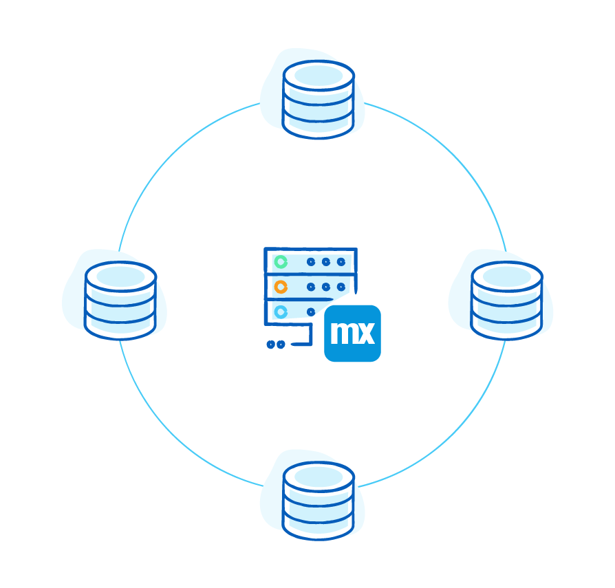

The data required to build new enterprise applications is derived from many sources, such as existing SQL databases, service calls, web APIs, and local application-specific databases. Mendix applications sit on top of their own SQL database, which is created and managed by the platform and without the need for a dedicated database administrator.

{}

{}

## What Databases Does Mendix Support? {#support}

The Mendix Platform supports the database servers listed in the [Databases](https://docs.mendix.com/refguide/system-requirements#databases) section of *System Requirements* for data being managed by the Mendix Runtime.

For integration purposes, Mendix supports integration with any database via the JDBC protocol.

For more information, see [What Databases Does Mendix Support?](data-storage#database-support).

## How Does Object-Relational Mapping Work in Mendix? {#object}

ORM in Mendix enables developers to concentrate on the creation of domain models using our visual domain modeling editor. Developers drag and drop entities, configure attributes, and map associations across entities to create the required data model visually. Once complete, the Mendix Platform will turn this domain model into an underlying SQL database, automatically creating and maintaining the desired tables, data types, joins, and constraints.

For details, see [How Does Object-Relational Mapping Work in Mendix?](data-storage#object-relational-mapping).

## How Does Mendix Ensure Data Security? {#security}

Mendix provides a comprehensive security DSL that enables your team to create fine-grained security controls across your application's navigation, UI, logic, and data. At the database level, access can be either granted or denied against specific attributes and entities, while server-side rules can be built to constrain data before leaving the server.

For details, see [How Does Mendix Ensure Data Security?](data-security#ensure-data-security).

## Read More

* [Data Storage](data-storage)
* [Data Integrity](data-integrity)
* [Data Security](data-security)
* [Data Querying & Management](data-querying)
