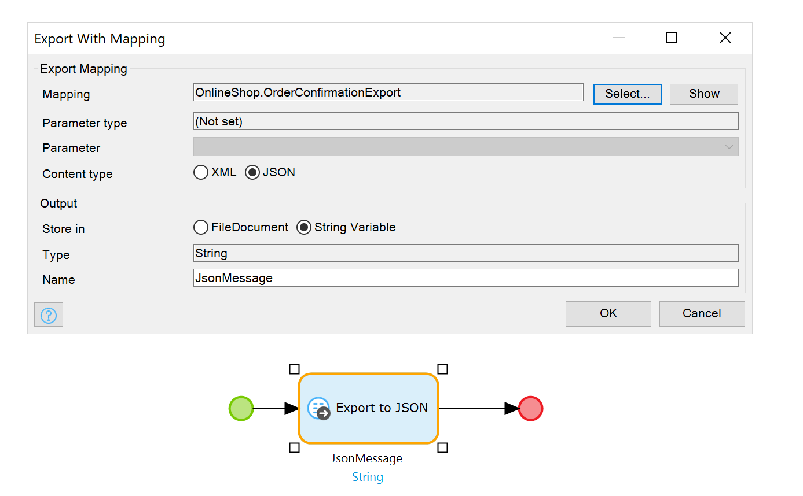
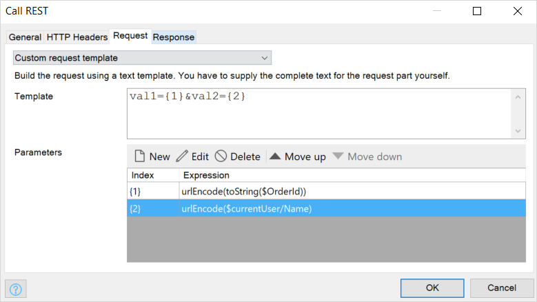

## 1 How Does Mendix Support Data Mapping? {#data-mapping}

Being able to easily map external data formats to the entities used in your application is an important aspect of integration. Mendix gives you both advanced control over these mappings and an easy-to-understand visual editor for defining your mappings. This gives you the ability to handle anything you may encounter in external systems as well as to collaborate with any stakeholder in your organization on the correct mapping.

Using mappings in Mendix involves two steps:

1. You define what the message looks like that you are going to use while communicating with external systems. This could be a JSON or XML message based on an example JSON snippet, or an XML message based on an XML Schema (XSD).
2. You configure a mapping to define how to transform the message into Mendix objects and vice versa.

<video controls src="attachments/Integration_JSON_Import_and_Mapping-1.mp4">VIDEO</video>

These message definitions and mappings can be reused through the different integration facilities offered by Mendix (as in, web services, REST services, or connectors using the Connector Kit to provide custom integrations).

<video controls src="attachments/ApplyImportMapping.mp4">VIDEO</video>

## 2 How Can I Use JSON Snippets? {#message-definition}

External REST APIs often come with documentation including example JSON messages that you need to send to receive. With Mendix, you can just copy and paste these examples from the documentation to create a message definition in your application project. Mendix will automatically detect the structure of the message as well as the data types of the properties in the JSON snippet.

After doing this, you can use the message definition as any other message definition in your mappings.

{}

{}

## 3 How Can I Use XMLs and WSDLs?

When importing a web service definition (WSDL), the message definition will be automatically provided in your application based on the XML schema used in the WSDL.

Alternatively, you can define your messages based on a separate XML schema document. Simply create an XML schema document in your project, read the XSD file, and all the available message will be displayed. You can then use them in your mappings.

{}

{}

## 4 How Can I Create XML and JSON Messages from Application Data?

When creating services or APIs in Mendix, you can easily support both XML and JSON. To do this, you can create a message definition document, and then define all the separate message simply by dragging and dropping entities into your message definition document. Here you exclude properties you do not want included in your JSON or XML, or provide different naming for external systems.

{}

{}

When you use import or export mappings based on these message definitions, you can choose if you want to create XML or JSON. There are many places in your Mendix application where you can use mappings (for example, web service calls or REST APIs).

The image below illustrates how to use a microflow export activity to generate a JSON message. Generating XML is just a matter of selecting XML instead of JSON.

{}

{}

## 5 How Does Mendix Support Using REST with Formats Other than JSON?

You can use REST with import and export mappings, which support both JSON and XML. You are not limited to using mappings, as you can directly use the content payload when sending and receiving message, or you can use a string template to define the message.

This image illustrates how you can use a string template to define form-URL-encoded data to be sent to an API:

{}

{}
