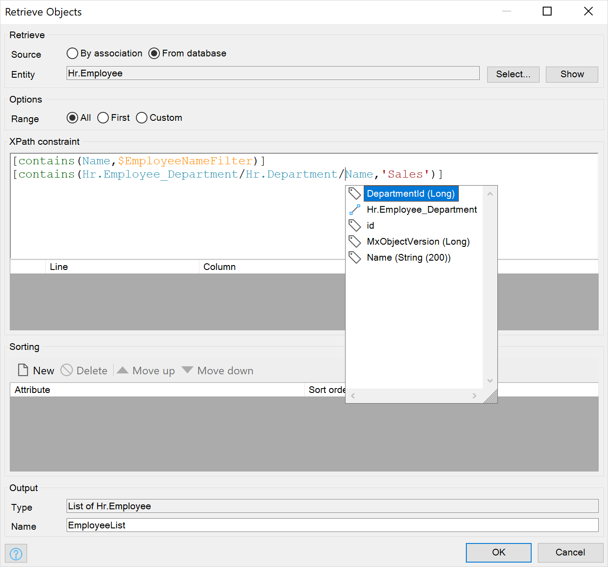
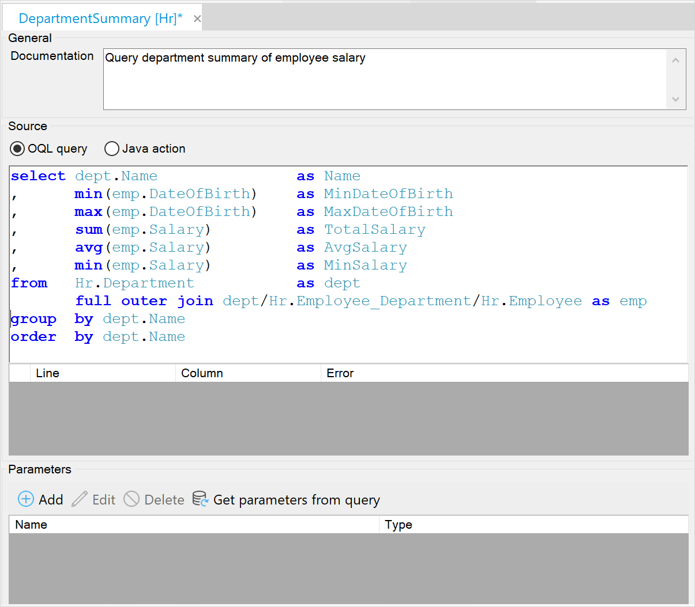

## 1 Which Query Languages Does Mendix Support?

Mendix offers a number of ways to specify the data you want to retrieve:

* Both Mendix Studio Pro and Mendix Studio offer visual ways to specify your query needs via an expression editor
* To retrieve specific objects or a set of related objects, you can use XPath expressions (see [XPath](#xpath) below)
* For reporting needs where the aggregation and joining of multiple entities into a single result set is important, Mendix offers OQL queries (see [OQL](#oql) below)
* A Java API is available if you want to use SQL queries on the application database (see [SQL](#sql) below)
* For data sharing with other applications or data analytics tools, Mendix offers out-of-the-box support for OData on entities in your domain model (see [OData](#odata) below)

### 1.1 XPath {#xpath}

XPath is an easy-to-use query language that enables retrieving specific objects. You can use it to get objects that you want to display or edit in pages as well as to modify these objects through microflows.

With XPath, you can define expressions to filter the objects you are interested in, and you can use associations to retrieve and filter related objects.

{}

{}

XPath automatically ensures that all the access rules you define on your entities are applied.

For more details, consult [XPath](https://docs.mendix.com/refguide/xpath) in the *Mendix Studio Pro Guide*.

### 1.2 OQL {#oql}

The Mendix Object Query Language (OQL) is a relational query language based on SQL. The major advantage of OQL over SQL is that OQL uses the entity and association names used in your model instead of the actual database table names.

OQL can use the predefined relations (associations) to easily join objects without having to calculate which columns should be coupled. Despite these differences, many SQL keywords also work in OQL.

{}

{}

OQL is mostly used for reporting where you need aggregation functions while grouping over certain attributes. Another reason to use OQL is to define custom security expressions, which you need to define manually. In some cases, this may result in faster queries if you handle security yourself using OQL than by using the out-of-the-box security of XPath.

For more details, see [OQL](https://docs.mendix.com/refguide/oql) in the *Mendix Studio Pro Guide*.

### 1.3 SQL {#sql}

All application data is stored in a relation database. In the [Mendix Cloud](mendix-cloud-overview), this is PostgreSQL, but there are other options as well, depending on your deployment environment.

Mendix provides Java APIs to directly interact with your underlying relation database. Through the Mendix Java API, you can use Java JDBC to run SQL queries and execute stored procedures. This provides you with a very powerful way of using your data, but it requires an understanding of relational database systems and SQL. You can use database vendor-specific extensions, but this will limit the portability of your application to other databases.

For more information on access to the JDBC API from Mendix, see [DataStorage.executeWithConnection](https://apidocs.mendix.com/8/runtime/com/mendix/datastorage/DataStorage.html#executeWithConnection-java.util.function.Function-).

### 1.4 OData {#odata}

OData provides a generic data access and query interface on top of the REST protocol. It enables a large range of third-party tools to access your data in a controlled way. These tools include basic query tools like LINQPad, spreadsheets like MS-Excel, and business intelligence and analytics tools like PowerBI and R. By providing access through OData, all the validation and security constraints defined on your data and handled by the Mendix Runtime are guaranteed to be applied. This means that OData is a safe and secure way to provide access to data to external parties.

While OData is a broad standard that provides both query and manipulation operations on data, Mendix currently only provides query facilities. Currently, OData in Mendix is targeted at read-only analytical use of Mendix data by third-party applications.

For more information on the use of OData with Mendix, see the [Turn Data into Insight with Mendix OData Support](https://www.mendix.com/blog/mendix-odata-support/) and [Using R to Gain Insight from the Data in Your Mendix Applications](https://www.mendix.com/blog/using-r-to-gain-insight-from-the-data-in-your-mendix-applications/) blog posts.

## 2 How Can I Optimize My Queries?

The Mendix Platform provides a lot of optimization out of the box. For example, when retrieving data for your pages through XPath, Mendix will automatically retrieve all the related information used on the page in one go. A concept called schemas is used for this. A schema tells the data retrieval component to not only retrieve a specific set of objects from the database, but to include specific associated entities in the result as well.

Besides optimized queries, Mendix also optimizes to avoid the need to query. This is done, for example, in the web client where objects are cached and reused through multiple pages. Another optimization made in the Mendix Runtime uses knowledge of the page structure to determine if objects need to be sent from the Runtime to the client at all.

In addition to these out-of-the-box optimizations, there are a number of steps you can take to optimize your queries:

* **Retrieve only what you need**, and make sure you do not include attributes or objects in your query that you do not need
* Ensure that you have **indexes** on the following:
  * Columns that are regularly **searched** or filtered on
  * Columns that are used for **sorting**

In some cases—especially when you have a large number of objects—it can be helpful to use database-specific indexes. You can create these through the JDBC API, as described above in [SQL](#sql).

## 3 How Can I Migrate Data from My Existing Database? {#migrate-from-existing}

You may want to use existing data from old non-Mendix applications in your new Mendix application. If you need a one-time migration into your Mendix app, you have the options described below.

### 3.1 Database Replication Module

The [Database Replication](https://appstore.home.mendix.com/link/app/160/) module available from the Mendix App Store enables connecting to a large number of different types of databases. It will show you what data structures exist in the existing database. You can then define (through a web page) what data you want migrated to your Mendix database. You can also define how you want to map the data from existing columns to your entity attributes.

### 3.2 Database Connector

The [Database Connector](https://appstore.home.mendix.com/link/app/2888/) module provides you with microflow activities to run queries on any database with JDBC support. This means you can create microflows to define what data you want from your existing database as well as how you want to convert that data into your new Mendix application.

### 3.3 Backing Up & Restoring

If you prefer a manual migration through SQL statements or SQL scripts, you can do this with a local database. For example, you can set up a copy of your existing database, deploy your Mendix app that is connected to this database, and then use an SQL statement to copy data from the old tables to the Mendix tables. Once you have all the data migrated locally, you can create a backup of the Mendix data and restore this in your target Mendix environment.

For more details, see [Backups](https://docs.mendix.com/developerportal/operate/backups#3-2-uploading-data) in the *Mendix Developer Portal Guide*.

### 3.4 Initializing Your App Database from an Existing Database

When deploying a Mendix application for the first time, you have the option to initialize it with data from an existing Mendix app. The main purpose of this functionality is to enable migrating from one environment to another (for example, from the Mendix Cloud to a private cloud). Once you have migrated your non-Mendix data into Mendix data, you can use this data to initialize a new Mendix app. This will work between databases from the same vendor, and also when moving from one database vendor to another. This means that you can initialize an Azure SQL database using data in a PostgreSQL database running on your workstation.

For more information, see [How to Migrate Your Mendix Database](https://docs.mendix.com/howto/data-models/migrating-your-mendix-database) in the Mendix Documentation.

## 4 How Can I Use My Existing SQL Database in Mendix?

You can use the Database Connector to run SQL actions on any database you are using. To learn more about using an existing SQL database in Mendix, see the section [How Does Mendix Support Direct Access to an External SQL Database?](external-data#external-sql) in *External Data*.

## 5 What APIs Does Mendix Offer to Extend Data Storage Behavior?

The Mendix Runtime provides Java APIs that enable extending the data storage behavior. Mendix ensures that anybody on your team can use these extensions by enabling you to provide them through normal microflow activities. For more info on this extensibility feature of Mendix, see the section [What Kind of APIs Does Mendix Expose?](../enterprise-capabilities/openness-api-sdk#apis) in *Openness (API & SDK)*.

Regarding data storage extensibility, the main Java APIs provide the following functionality:

* **XPath** – APIs to [retrieve from the database using Xpath queries](https://apidocs.mendix.com/8/runtime/com/mendix/core/Core.html#retrieveXPathQuery-com.mendix.systemwideinterfaces.core.IContext-java.lang.String-)
* **OQL** – APIs to [retrieve data from the database using OQL queries](https://apidocs.mendix.com/8/runtime/com/mendix/core/Core.html#createOQLTextGetRequestFromDataSet-java.lang.String-)
* **SQL** – APIs to directly use the underlying [Java JDBC connection](https://apidocs.mendix.com/8/runtime/com/mendix/datastorage/DataStorage.html) to run any SQL required on your application database
* **Entity event handlers** – APIs to register [entity event listeners](https://apidocs.mendix.com/8/runtime/com/mendix/core/actionmanagement/ListenersRegistry.html#registerAfterChangeListener-java.util.function.Consumer-) for all your entities, which can be used to extract auditing information or do a real-time export of all data changes to an external system

## 6 How Can I Control the Connection Pooling?

You can configure the number of concurrent database connections per runtime to the database using the custom setting `ConnectionPoolingMaxActive`.

<video controls src="attachments/MA_ConnectionPooling-1.mp4">VIDEO</video>
For other relevant pooling settings, see [Customization](https://docs.mendix.com/refguide/custom-settings#4-2-connection-pooling) in the *Mendix Studio Pro Guide*.
