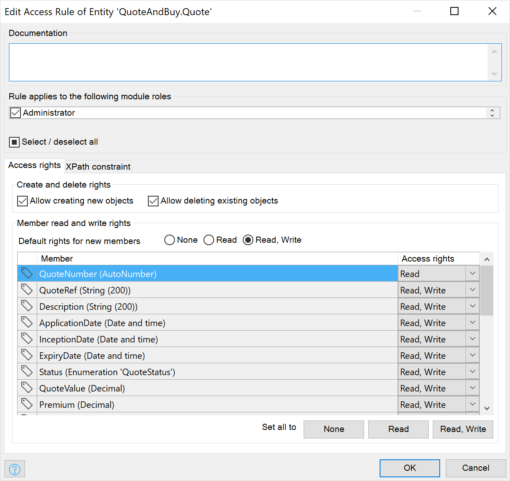

## 1 How Does Mendix Ensure Data Security? {#ensure-data-security}

Data security in Mendix is handled by defining the data access rules on your entities. Per entity, you can define who can see what data and who can create or delete data.

{}

{}

These rules will be applied anytime your application uses an entity. The rules will be automatically applied to XPath retrieves done in your model. You can define XPath constraints on entities, which means you can define access rules depending on the user role or organization. This can be used to ensure strict data separation in multi-tenant applications.

For more details, see [Security Model](../enterprise-capabilities/security-model).

## 2 How Can I Encrypt My Data?

You can use the [Encryption](https://appstore.home.mendix.com/link/app/1011/Mendix/Encryption) module available in the  App Store to encrypt your Mendix application data. You can encrypt your data with the Advanced Encryption Standard (AES).

Note that all the database files in the Mendix Cloud are stored on an encrypted file system. This means that your data in rest is always encrypted, even if you do not use this module. For more information, see the section [What Kind of Encryption Is Provided by the Mendix Platform?](../enterprise-capabilities/platform-security#encryption) in *Platform Security*.
