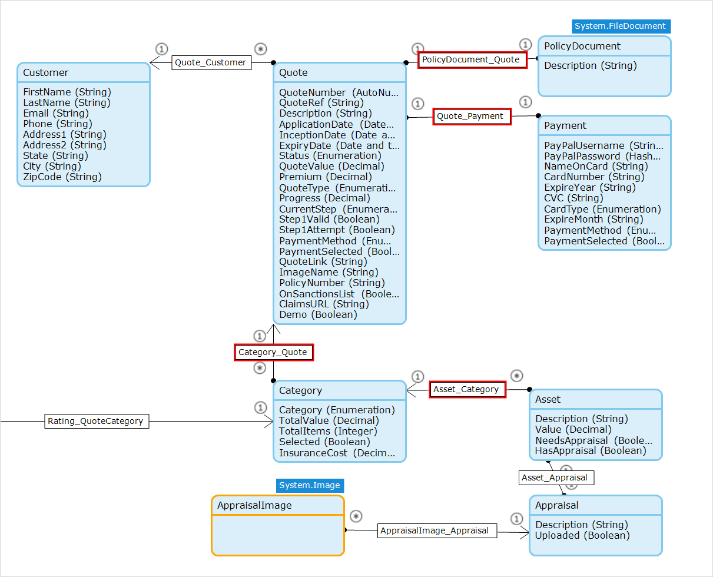
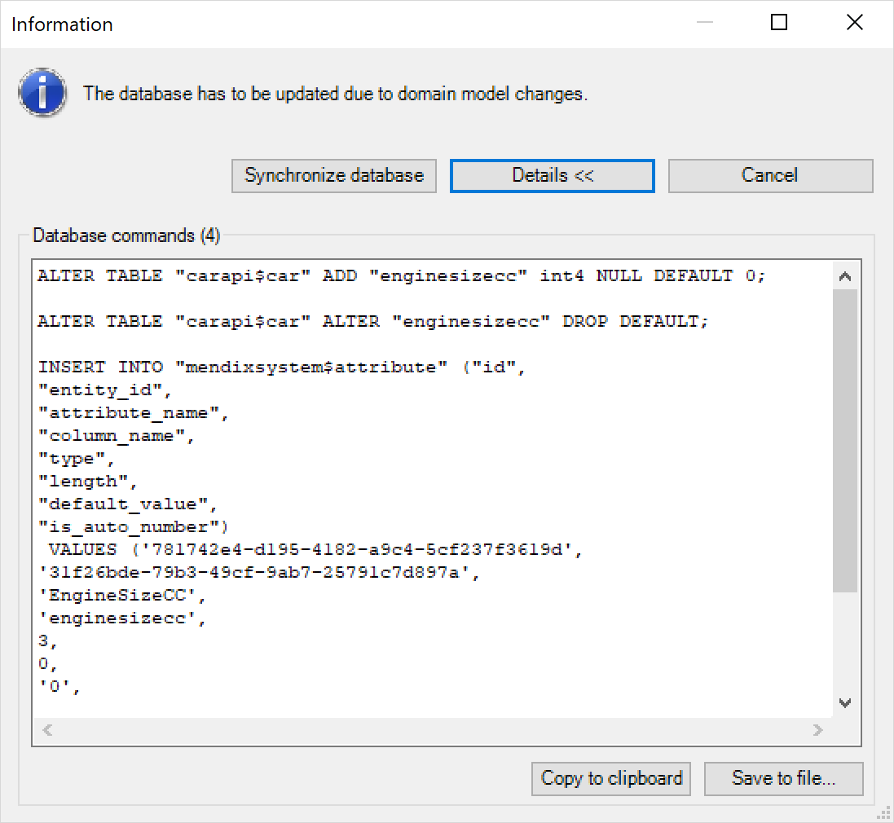
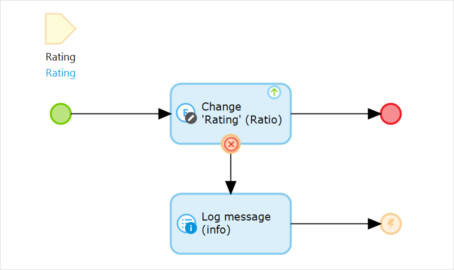

## 1 How Do I Define Data in Mendix?

In Mendix, you define your data needs using domain models. Every module in your app project can have its own domain model, which consists of one or more entities. These entities can be persistable or non-persistable, and they contain one or more objects.

{}

{}

Persistable objects are stored in a database, and Mendix automatically creates tables to store your entities in the database. For every object, one record is inserted in the table. Non-persistable entities only live in memory for the duration of a user session.

For every entity, you can define the attributes and what type of data the attributes should hold. You can also define security rules, who can see what data, and validation rules. A validation rule specifies what values are allowed for an attribute.

When you start or redeploy your application, Mendix automatically creates database tables to store your data. When you redeploy, all of your app's tables are automatically changed as required, and data is migrated to the new table structures.

## 2 What Is the Difference Between Persistable & Non-Persistable Objects?

Persistable objects are stored in a database, so you can use your data across sessions and across users. However, because non-persistable entities only live in memory for the duration of a user session, such entities cannot be shared between users or across user sessions.

Non-persistable entities are mostly used for calculations where you do not want to store all the intermediate results, or for temporarily storing data fetched from external systems through different integration means.

<video controls src="attachments/Integration_PersistableEntity.mp4">VIDEO</video>

## 3 How Does Object-Relational Mapping Work in Mendix? {#object-relational-mapping}

Mendix object-relational mapping (ORM) handles all aspects of your database management, from your modeled data needs to technical storage and retrieval with most popular relational database systems. The main goal of Mendix ORM is to remove the need for users to think about technical database aspects, like how to create and modify tables or access and update data.

### 3.1 Data Definition Language

Mendix ORM starts with a data definition language (DDL) phase upon deployment of your application, which will automatically create the correct database structures based on your business data requirements as you model them in your domain models.

The database structure created will include tables, data types, associations, relevant constraints and even inheritance.

It is important to note that whenever you make changes to your applications, the underlying database tables will be automatically updated accordingly. Your data will also be migrated.

{}

{}

By handling both table creation and data migration, the Mendix Platform helps you to deliver apps quickly. You do not have to manage the database schema yourself. Equally important is that for most migrations (for example, attribute renaming or type changes), Mendix also automates data migration.

In a private cloud environment or when you are deploying on premises, you do have the option to manage the database yourself. In this case, you can take the SQL generated by Mendix as a starting point, and then give it to your database administrator so they can ensure the database is created as required.

The data migration phase can also migrate data from one Mendix app to another across different database vendors. This can be useful if you want to migrate from on-premises to cloud or from one cloud to another cloud. For more details, see [How to Migrate Your Mendix Database](https://docs.mendix.com/howto/data-models/migrating-your-mendix-database) in the *Mendix Studio Pro How-to's*.

### 3.2 Data Retrieval

Mendix offers a number of ways to specify what data you want to retrieve:

* Both Mendix Studio Pro and Mendix Studio offer visual ways to specify your query needs
* To retrieve specific objects or a set of related objects, you can use XPath expressions
* For reporting needs (where aggregation and the joining of multiple entities into a single result set is important), Mendix offers OQL queries

Under the hood, all retrieves are first translated into XPath, then into OQL, and finally into database-specific SQL statements.

When retrieving data, Mendix ORM performs the following steps for you:

1. Translates your XPath query into an OQL query.
2. Includes additional retrieve requirements (for example, on associated objects that are also needed by your pages).
3. Applies security rules as defined on your entities.
4. Maps your entities to technical database tables.
5. Maps your entity attributes to table columns.
6. Optimizes the required OQL statements.
7. Translates the OQL statement to database-specific SQL statements.
8. Retrieves the records from the database.

As you can see, Mendix ORM applies a number of performance optimizations that are far from trivial. Because of the application model, the Mendix Platform can determine that it is more efficient to query associated database records in one go.

## 4 How Can I Use Indexes to Improve Performance?

Indexes are lists of attributes for which a database index is created on the underlying database table of the entity. Indexes improve the speed of retrieving objects if the indexed attributes are used in a search field, in the XPath constraint of a data or template grid, or in an XPath query.

Indexes are added using the entity properties menu inside Mendix Studio and Mendix Studio Pro. Multiple indexes can be added to one entity.

<video controls src="attachments/IndexSettings.mp4">VIDEO</video>

## 5 How Can I Use a Stored Procedure with Mendix?

Using a stored procedure in Mendix depends on where your data resides.

If you want to use a stored procedure in the database of your Mendix application, you can use the Mendix Java API. For more information, see [How to Use the Java API](https://docs.mendix.com/howto/logic-business-rules/java-api-tutorial) in the *Mendix Studio Pro How-to's*. And for details on executing SQL statements on your Mendix app database using JDBC, see [DataStorage executeWithConnection](https://apidocs.mendix.com/8/runtime/com/mendix/datastorage/DataStorage.html#executeWithConnection-java.util.function.Function-).

If you are using an external database, you can use the [Database Connector](https://appstore.home.mendix.com/link/app/2888/) add-on available in the Mendix App Store.

Calling stored procedures is mostly relevant if you are building on top of an existing legacy database. In this area, there are a lot of Oracle relational database management systems (RDBMSs). The [Oracle Connector (Beta)](https://appstore.home.mendix.com/link/app/8683/) available in the Mendix App Store provides support for features often seen in legacy Oracle databases, such as table APIs built with PL/SQL stored procedures and packages, ref cursors, and user-defined types.

## 6 How Does Mendix Handle Transaction Management?

Every request to the Mendix Runtime automatically starts a new transaction. Upon successful completion of the request, the transaction is committed with all related data. In case of an error, all the data changes are rolled back by default. You have the option to provide custom error handling logic to change this default behavior.

In the following microflow, a custom error handler is defined. When the **Change** activity fails, any changes it made to the database are rolled back. The error handler defines what you want to do with the transaction: you can roll back everything that happened in the microflow, or you can compensate for the problem and continue. In this example, a log message is generated, after which the microflow ends in an error. The calling microflow can then decide how to handle this.

{}

{}

## 7 What Databases Does Mendix Support? {#database-support}

A Mendix application can by default be deployed to a number of different database servers. As long as you do not include any database-specific code, you can switch database vendors at any moment.

The Mendix Platform supports the database servers listed in the [Databases](https://docs.mendix.com/refguide/system-requirements#databases) section of *System Requirements*.

