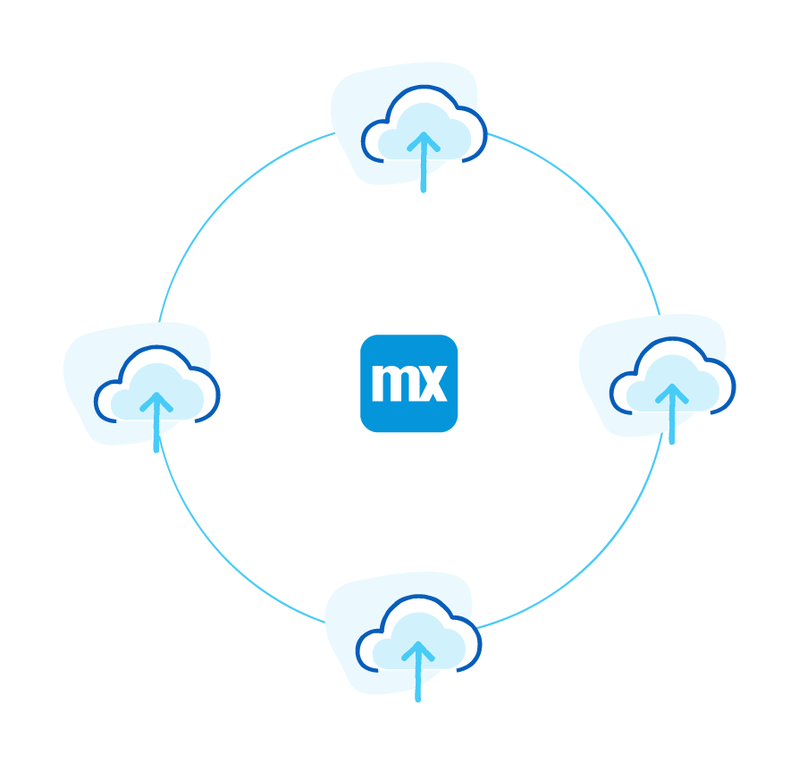

Mendix applications run on the platform's cloud-native stateless runtime architecture that conforms to [Twelve-Factor App](https://12factor.net/) principles with support for modern cloud platforms such as Docker, Kubernetes and Cloud Foundry. As a result, Mendix apps benefit from auto-scaling, auto-provisioning, auto-healing, low infrastructure overhead, CI/CD, and cloud interoperability out of the box.

{}

{}

## What Deployment Options Does Mendix Provide? {#options}

Mendix applications run on a variety of deployment options, including public cloud, virtual private cloud, private cloud, hybrid cloud, and traditional (virtual) servers.

For deployment details, see [What Deployment Options Does Mendix Provide?](multi-cloud-overview#deployment-options).

## How Do I Run & Deploy My Mendix Application? {#run}

Mendix applications are packaged and deployed to the cloud provider of your choice using our one-click deployment. This feature automatically builds the appropriate deployment package, such as Docker or Cloud Foundry, including all the necessary assets required before deploying it to the staging area of your cloud provider. Mendix also supports the creation of build packs for deployment on premises and infrastructure-as-a-service (IaaS).

For details, see [How Do I Run & Deploy My Mendix Application?](multi-cloud-overview#run-deploy).

## Which Cloud Providers Can I Use for Mendix? {#providers}

Mendix supports all the major cloud providers:

* IBM Cloud
* SAP Cloud Platform
* Microsoft Azure
* Amazon Web Services (AWS)
* Red Hat OpenShift
* Google Cloud Platform

In addition, Mendix offers formal partnerships with IBM, SAP, Microsoft, and AWS. For details, see [Which Cloud Providers Can I Use for Mendix?](cloud-providers#which-cloud).

## Read More

* [Multi-Cloud Overview](multi-cloud-overview)
* [Cloud Providers](cloud-providers)
* [Mendix Cloud Overview](mendix-cloud-overview)
* [Mendix Cloud Features](mendix-cloud-features)
* [Strategic Partner Clouds](strategic-partner-cloud)
