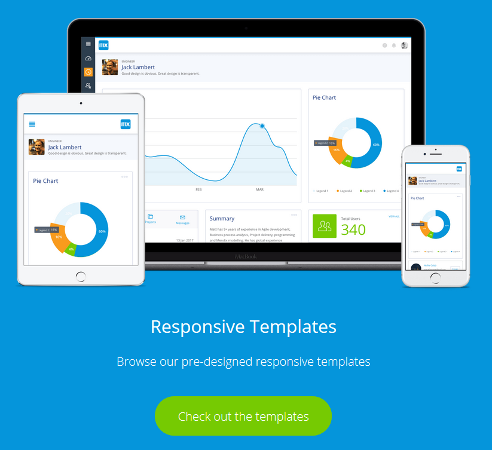
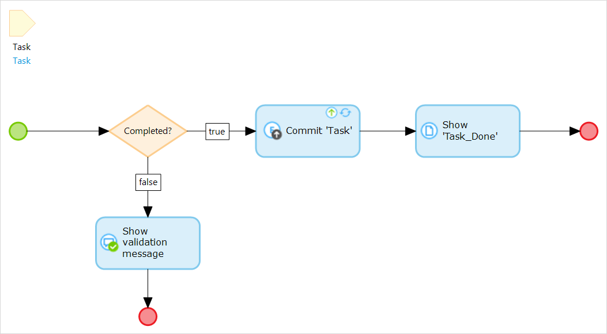
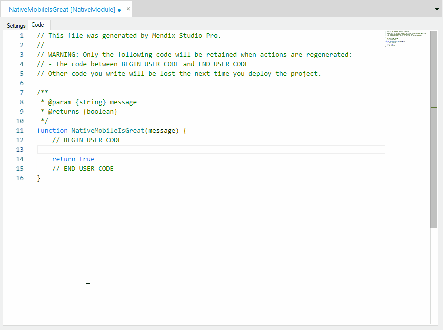

## 1 How Does Mendix Support Multi-Channel Applications? {#support-multi-channel}

Mendix allows you to combine web and mobile applications into the same app model using common development tools and a single code base. This increases productivity, reduces maintenance costs, and also reduces the need for differing skillsets to build web and mobile apps.

With Mendix, you can build responsive user interfaces that adapt automatically to the end-user’s device. By default, Mendix provides a full set of layouts, pages, building blocks, and widgets. There is a flexible grid system that can be easily nested and configured for different screen sizes. The Mendix front-end is based on [Bootstrap](https://getbootstrap.com/), which is also fully responsive, making it easy for (new) users to build responsive user interfaces.

{}

{}

To gain more flexibility and optimize the user experience, Mendix allows you to specify a user interface per device type (desktop, tablet, and mobile). In addition, it is possible to distinguish between a mobile website and a mobile app that can be installed. This can be done for both phones and tablets, which means you can build a mobile website and a native mobile app from a single model. Using the concept of navigation profiles, you can configure the channels and corresponding user flow for the app. Besides these navigation profiles, it is also possible to use the device type in the logic for other scenarios.

This multi-channel approach allows developers to optimize the user experience by using different channels while quickly building user interfaces by reusing UI components and building responsive interfaces.

The JavaScript-based Mendix Client renders the front-end while handling the actions and communication with the server. For web and hybrid mobile apps, Mendix uses [ReactJS](https://reactjs.org/) and [Dojo](https://dojotoolkit.org/) to optimally render and update the UI. Native mobile apps are fully based on [React Native](https://facebook.github.io/react-native/), which allows the client to be highly optimized, using optimal page reload (OPR) to reload only those elements of the page that have been changed. This is combined with asynchronous data transport for all widgets and the ability to cache the assets required to render pages and data on the device/browser. This helps to reduce round-trips to the server and improve the app performance overall.

For more information, see the [Runtime](../enterprise-capabilities/architecture-principles) section in *Architecture Principles*.

## 2 How Can I Build the Front-End of My App?

With Mendix, you can create pages for the front-end user interface of your application from blank or predefined configurable layouts and templates, allowing you to consistently deliver great and responsive UX for all the apps in your landscape.

<video controls src="attachments/MCA_BuildingResponsivePages-1.mp4">VIDEO</video>

The [Atlas UI](https://atlas.mendix.com) framework offered on the Mendix Platform comes with diverse layouts, templates, and building blocks you can easily implement to design beautiful applications. You can leverage standard Mendix resources to create rich user experiences or create your own company building blocks, layouts, and templates that can be reused in other apps.

Mendix offers various UI elements (called widgets) out of the box that can be used to build these rich user interfaces. Widgets can be placed directly on the page or combined in building blocks. Mendix provides widgets that include basic inputs, buttons, and text boxes as well as widgets for Google Maps, rich text, slider functionality, and much more. The Mendix community also develops, releases, and maintains over 600 hundred open-source custom widgets for use in app development via the [Mendix App Store](https://appstore.mendix.com). Next to this, it is also possible to extend Mendix with your own [custom widgets](#extend)

{}

{}

Mendix apps can be fully styled (as discussed in [User Interface Design](ui-design)) and extended (as discussed below in the section [How Can I Extend the Mendix Front-End?](#extend)).

You can learn more about the possibilities of Mendix app UX in the Mendix Academy learning path [Creating Engaging UX](https://gettingstarted.mendixcloud.com/link/path/28).

## 3 How Does Mendix Support Client-Side Logic? {#support-client-side-logic}

With Mendix, you can visually model client-side logic via nanoflows, which can be used in both web and mobile apps. Nanoflows do not require a connection, making them also very useful in [offline mobile apps](offline-apps#build-offline). They have the same language and editor as [microflows](https://docs.mendix.com/refguide/microflows), but they contain a different set of activities that is focused on client-side possibilities. Nanoflows fully run on the device or in the browser, making them very fast. Here is an example nanoflow:

{}

{}

For more information, see [Nanoflows](https://docs.mendix.com/refguide/nanoflows) in the *Mendix Studio Pro Guide*.

In addition to nanoflows, it is possible to directly use client-side expressions on pages for validations, conditional visibility, and editability in order to create highly interactive pages.

## 4 How Can I Extend the Mendix Front-End? {#extend}

Mendix makes it possible to create extensions that seamlessly integrate with Mendix Studio and Mendix Studio Pro to make them part of your app's model. Mendix supports two types of front-end extensions, which are described below.

### 4.1 Pluggable Widgets {#pluggable-widgets}

Mendix supports building custom UI components—called pluggable widgets—that can be used for different types of visualizations and interactions. You can define all the parameter types and make these widgets reusable. The input parameters are transformed into easy-to-use settings screens that can be configured from Mendix Studio and Mendix Studio Pro. In addition, custom widgets have preview capabilities for a WYSIWYG effect, making it easy to get an impression of the widget and quickly verify its configuration.

Custom widgets can be based on JavaScript or TypeScript, and they can be used to create custom inputs, visualizations, and logic as well as to utilize device capabilities. Mendix offers an extensive [Client API](https://apidocs.mendix.com/8/client/) to leverage the Mendix functionality. For other functionality, third-party libraries and can easily be integrated by using [npm](https://www.npmjs.com/)

Developers can use their preferred IDE. In addition, to ease the development of custom widgets, Mendix provides a [Yeoman generator](https://yeoman.io/) to set up a project with an easy and fast developer workflow.

For more information, see [How to Build Pluggable Widgets](https://docs.mendix.com/howto/extensibility/pluggable-widgets) in the *Mendix Studio Pro How-to's*.

### 4.2 Pluggable Nanoflow Actions {#pluggable-actions}

For creating device integrations or custom application logic, Mendix enables developers to build customs nanofow actions. These pluggable nanoflow actions—called JavaScript actions in Studio Pro—are based on JavaScript and can leverage the many ReactNative, Cordova, or browser capabilities.

These JavaScript actions are similar to [Java actions](../enterprise-capabilities/extensibility#connector-kit).

You can edit JavaScript actions directly from Mendix Studio Pro with an integrated powerful editor based on the [Monaco Editor](https://microsoft.github.io/monaco-editor/index.html), which is the editor that powers the most popular IDE, [Visual Studio Code](https://code.visualstudio.com/). This editor delivers a great experience, as it supports smart context-aware auto-completion, embedded documentation on web and Mendix APIs, correct indenting, and code-friendly shortcuts.

{}

{}

Developers can also used their preferred IDE to edit the code outside of Mendix Studio Pro, if preferred. The files will be kept in sync.

For more information, see [How to Write JavaScript Actions](https://docs.mendix.com/howto/extensibility/write-javascript-actions) in the *Mendix Studio Pro How-to's*.

### 4.3 Distribution

You can version pluggable widgets as well as pluggable nanoflow actions and upload them to your private Mendix App Store so that other developers in your company can easily use them. It is also possible to share widgets/actions manually or embed them in company starter apps.

## 5 Does Mendix Support Multilingual Apps?

Mendix fully supports multilingual apps. In Mendix Studio and Mendix Studio Pro, you can configure multiple languages per app, and texts and captions can all be configured for multiple languages. Per language, default number and date formats can be configured for the whole app. When you use numbers and dates they are automatically applied, but it is also possible to locally specify custom formats.

For more details, see the section [How Does Mendix Support Multilingual Apps?](../app-lifecycle/user-interfaces#multi-lingual) in *User Interfaces*.
