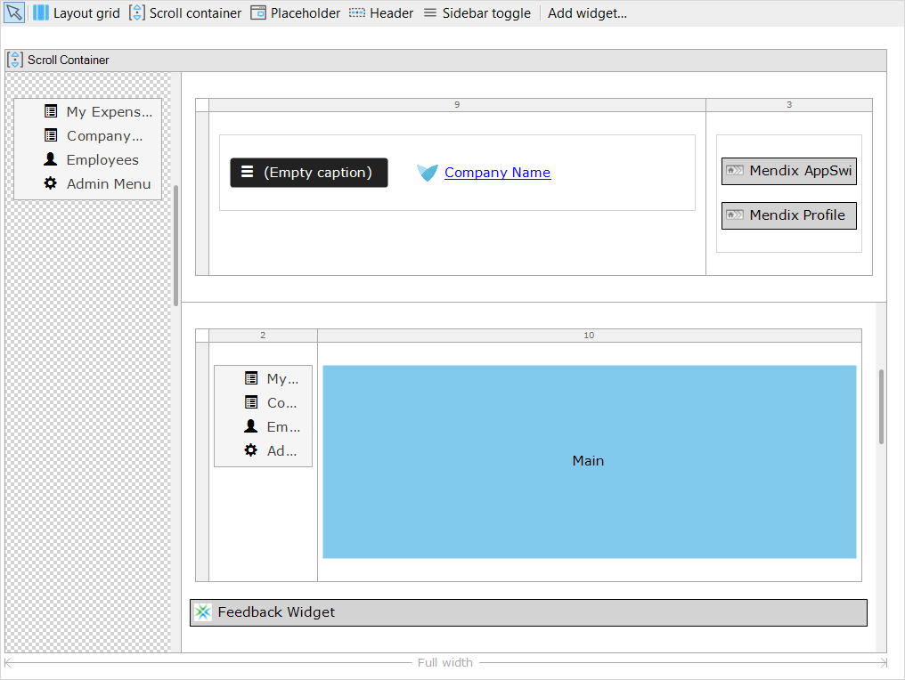

## 1 How Does Mendix Support Multi-Channel Applications? {#support-multi-channel}

Mendix allows you to combine web and mobile applications into the same app model using common development tools and a single code base. This increases productivity, reduces maintenance costs, and also reduces the need for differing skillsets to build web and mobile apps. End-users are able to swap interfaces between interactions and seamlessly continue midstream.

With Mendix, you can build responsive user interfaces that adapt automatically to the end-user’s device. By default, Mendix provides a full set of layouts, pages, building blocks, and widgets. There is a flexible grid system that can be easily nested and configured for different screen sizes. The Mendix front-end is based on [Bootstrap](https://getbootstrap.com/), which is also fully responsive, making it easy for (new) users to build responsive user interfaces.

{}[**Ask Daniel what WM equivalent is to replace screenshot with**]{}

To gain more flexibility and optimize the user experience, Mendix allows you to specify a user interface per device type (desktop, tablet, and mobile). In addition, it is possible to distinguish between a mobile website and a mobile app that can be installed. This can be done for both phones and tablets, which means you can build a mobile website and a native mobile app from a single model. Using the concept of navigation profiles, you can configure the channels and corresponding user flow for the app. Besides these navigation profiles, it is also possible to use the device type in the logic for other scenarios.

This multi-channel approach allows developers to optimize the user experience by using different channels and on the other hand allows to quickly build user interfaces by reusing UI components or build responsive interfaces.

The JavaScript-based Mendix Client renders the front-end while handling the actions and communication with the server. Mendix uses [ReactJS](https://reactjs.org/) and [Dojo](https://dojotoolkit.org/) to optimally render and update the UI. The client is highly optimized, using optimal page reload (OPR) to only reload those elements of the page that have been changed. This is combined with asynchronous data transport for all widgets and the ability to cache the assets required to render pages and data on the device/browser, reducing round-trips to the server and improving app performance.

For more information, see the section [Runtime](../enterprise-capabilities/architecture-principles) in *Architecture Principles*.

## 2 How Can I Build the Front-End of My App?

With Mendix, you can create pages for the front-end user interface of your application from blank or predefined configurable layouts and templates, allowing you to consistently deliver great responsive UX across the browser, mobile devices and apps in your landscape.

<video controls src="attachments/MCA_BuildingResponsivePages-1.mp4">VIDEO</video>

The [Atlas UI](https://atlas.mendix.com) framework offered on the Mendix Platform comes with diverse layouts, templates, and building blocks so that you can easily build and design beautiful applications. You can leverage standard Mendix widgets and building blocks to create rich user experiences or create your own company building building blocks, layouts, and templates that can be reused in other apps.

Mendix offers various UI elements (called widgets) out of the box that can be used to build rich user interfaces. Widgets can be placed directly on the page or combined in building blocks. These widgets not only include basic inputs, buttons, and text boxes, but also widgets for Google Maps, rich text, slider functionality, and much more. The Mendix community also develops, releases, and maintains over 600 hundred open-source custom widgets for use in app development via the [Mendix App Store](https://appstore.mendix.com). Next to this, it is also possible to extend Mendix with your own [custom widgets](#extend)

Mendix apps can be fully styled (as discussed in [User Interface Design](ui-design)) and extended (as discussed below in section [4 How Can I Extend the Mendix Front-End?](#extend)).

You can learn more about the possibilities of Mendix app user experience in the Mendix Academy learning path [Creating Engaging UX](https://gettingstarted.mendixcloud.com/link/path/28).

## 3 How Does Mendix Support Client-Side Logic? {#support-client-side-logic}

With Mendix, you can visually model client-side logic via nanoflows, which can be used in both web and mobile apps. Nanoflows do not require a connection, making them also very useful in [offline mobile apps](mobile-apps#build-offline). They have the same language and editor as [microflows](https://docs.mendix.com/refguide/microflows), but they contain a different set of activities that is focused on client-side possibilities. Nanoflows fully run on the device or in the browser, making them very fast. Here is an example nanoflow:

For more information, see [Nanoflows](https://docs.mendix.com/refguide/nanoflows) in the Mendix Reference Guide.

In addition to nanoflows, it is possible to directly use client-side expressions on pages for validations, conditional visibility, and editability in order to create highly interactive pages.

## 4 How Can I Extend the Mendix Front-End? {#extend}

Mendix makes it possible to extend the front-end by creating custom widgets that have a seamless integration with the Modeler and making them part of your app's model. The user can define all types of parameters and make the widgets reusable. The input parameters are transformed into easy-to-use settings screens that can be configured from the Modeler. In addition, custom widgets have preview capabilities for a WYSIWYG effect, making it easy to get an impression of the widget and quickly verify its configuration.

Users can version custom widgets and upload them to a (private) App Store so that other developers can easily use them. It is also possible to share widgets manually or embed them in (company) starter apps.

Custom widgets are based on JavaScript and can be used to create custom inputs, visualizations, and logic as well as leverage device capabilities. Mendix offers an extensive [Client API](https://apidocs.mendix.com/7/client/) to leverage Mendix functionality. For other functionality, third-party libraries, and [Cordova plugins](https://cordova.apache.org/plugins/) can easily be integrated.

Developers can use their preferred IDE and the standard available integrations with [NPM](https://www.npmjs.com/), [Gulp](https://gulpjs.com/), and [Grunt](https://gruntjs.com/) for a simple and flexible workflow.

For more information, see the [Custom Widget Development](https://docs.mendix.com/howto/custom-widget-development/) how-to's in the Mendix documentation.

## 5 Does Mendix Support Multilingual Apps?

Mendix fully supports multilingual apps. In the Modeler, you can configure multiple languages per app. Texts and captions can all be configured for multiple languages. Per language, default number and date formats can be configured for the whole app. When you use numbers and dates they are automatically applied, but it is also possible to locally specify custom formats.

For more details, see the section [How Does Mendix Support Multilingual Apps?](../app-lifecycle/user-interfaces#multi-lingual) in *User Interfaces*.
