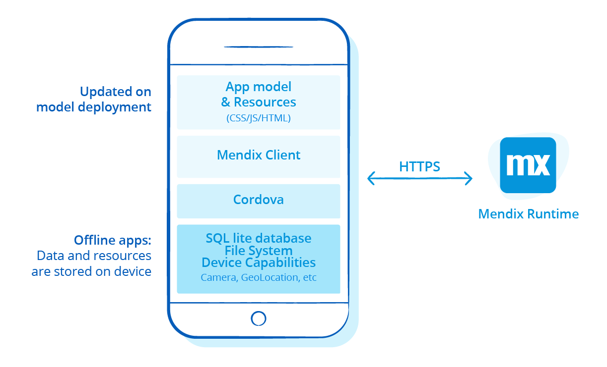
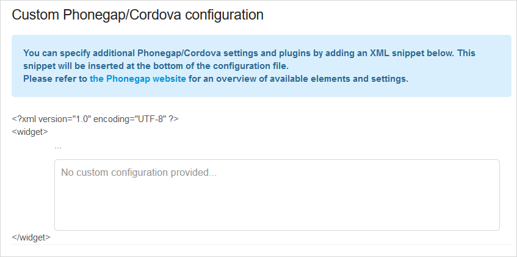

## 1 How Do Mendix Hybrid Mobile Apps Work? {#mobile-apps-work}

With Mendix, you can develop, deploy, test, and manage mobile apps from a single integrated visual development environment. Mendix leverages the popular [Cordova](https://cordova.apache.org/) framework for building mobile apps that offer a native experience and run both on Android and iOS. You can reuse the existing domain model, logic, and user interface components in Mendix apps. In addition, the apps can leverage native device features via mobile-specific controls, transitions, and gestures that are dragged into the page editor when designing rich native user experiences.

It is possible to add a mobile app as an additional channel to an existing Mendix application (as discussed in the section [How Does Mendix Support Multi-Channel Applications?](front-end#support-multi-channel) of *Front-End*). You can reuse app pages and navigation for both phone and tablet via responsive design. However, Mendix enables defining a specific profile for phone and/or tablet so that you can create device-optimized user experiences.

The mobile app connects to the Mendix Runtime server in order to load. This acts as a mobile-back-end-as-a-service (mBaaS) for the mobile app, wherein the communication is automatically handled by Mendix. The mobile app automatically loads everything that is needed at startup and in later use of the app. Because Mendix is model-driven, the application does not need to be reinstalled or published again to the app stores when changes are made to the model. This allows developers to quickly and easily test and release new features.

This diagram below shows the runtime architecture of a Mendix  mobile app:

{}

{}

## 2 How Can I Leverage Device Capabilities in My Mobile Apps?

A Mendix hybrid mobile app can leverage various native capabilities via actions and widgets that use [Cordova plugins](https://cordova.apache.org/plugins/). You can easily add these actions or widgets to your mobile app projects and configure them in Mendix Studio Pro. Many capabilities are provided out of the box by Mendix or by partners via the [Mendix App Store](https://appstore.home.mendix.com/index3.html). If other device capabilities are needed, you can extend your app project with a custom JavaScript action or widget that wraps a Cordova plugin and so accesses the device capabilities, as described in [How Can I Extend the Mendix Front-End?](front-end#extend).

## 3 How Can I Build and Publish My Mobile App?

The Mendix Platform generates the Mendix mobile app and provides all the logic to run the app. Via the [Mendix Developer Portal](https://sprintr.home.mendix.com/index.html), it is possible to customize the environment (for example, test or production) as well as the necessary settings like app details, icons, splash screens, and permission settings. From the Developer Portal, it is also possible to build the app binaries without the need to install software like Xcode or Android Studio. The binaries can be downloaded from the Developer Portal and uploaded to the app stores.

<video controls src="attachments/Eval_Mobile_PhoneGapBuild.mp4">VIDEO</video>

Mendix also leverages [PhoneGap Build](https://build.phonegap.com/) to build the mobile app. This allows you to easily manage certificates and share the mobile app binaries (for example, via QR code). It is also possible to download the source of the mobile app and build locally. For more information, see [How Can I Extend My Mobile App?](#how-can-i-extend-my-mobile-app) below as well as [How to Publish a Mendix Hybrid Mobile App in Mobile App Stores](https://docs.mendix.com/howto/mobile/publishing-a-mendix-hybrid-mobile-app-in-mobile-app-stores) in the *Mendix Studio Pro How-to's*.

## 4 How Can I Update My Mobile App?

From Mendix Studio or Mendix Studio Pro, changes can be published to the preferred environment, and the mobile app will automatically load the latest changes. There is no need to go through the app store process, which makes updating apps efficient.

<video controls  src="attachments/update-app.mp4">VIDEO</video>

A new app store publication is needed when changes are required for the generated app. Some examples of this are changes in the app information, icon, splash screen, permissions, or the Cordova plugins that are used. These changes can be made in the Developer Portal, and with a single click, the new version of the app is built with the new settings.

{}

{}

## 5 How Can I Preview & Test My Mobile App? {#mxapp-preview}

There are several approaches to testing your mobile app. Mendix offers an out-of-the-box mobile view in the browser, so you can preview your mobile app with one click. And with the [Mendix mobile app](https://docs.mendix.com/refguide/getting-the-mendix-app) (available for [Android](https://play.google.com/store/apps/details?id=com.mendix.SprintrMobile) and [iOS](https://itunes.apple.com/nl/app/mendix/id458058946)), you can quickly test the mobile app on a real device by scanning the QR code in Mendix Studio and Mendix Studio Pro. This can be used for local testing, but also to test mobile apps that are published to the (free) cloud.

<video controls src="attachments/MA_TestingMobile.mp4">VIDEO</video>

When testing locally, your app is automatically reloaded within seconds after you make a change and click **Run** in Mendix Studio Pro.

## 6 How Can I Share My Mobile App? {#mxapp-share}

You can share your mobile app via the share functionality of the Mendix mobile app or by manually sharing its URL.

Another way to share is by building a mobile app for a test or acceptance environment and then downloading the related binaries. You can share these directly via PhoneGap Build or upload them to the app stores for beta testing. With this approach, you can also test the icons and splash screens. This is a one-time process, because the model updates will be automatically reflected.

## 7 How Can I Extend My Mobile App? {#how-can-i-extend-my-mobile-app}

From the Mendix Developer Portal, you can download the source of the mobile app. With the sources, you can change the full app configuration, like the app settings, plugin icons, and splash screens.

In addition, there are several hooks that allow you to easily extend the mobile app by adding JavaScript. The source contains configuration files that allow you to define different versions of your mobile app with specific settings (like the Mendix environment) and app information in order to easily test multiple versions of your app. Because Mendix mobile apps are based on a standard Cordova stack, Cordova settings and plugins can easily be integrated.

The source leverages [npm](https://www.npmjs.com/), which makes it easy to build the project to your needs. There are several tasks available that allow you to build directly in the cloud using [Phonegap Build](https://build.phonegap.com/), to build the binaries locally, or to generate the *.zip* files that can shared or uploaded to PhoneGap Build. For more information, see the [hybrid-app-template GitHub repo page](https://github.com/mendix/hybrid-app-template/).

## 8 How Is My Mobile App Secured?

If your app requires a role, the end-user is asked for their username and password. After a successful login, a token is stored on the device and on the Mendix Server. At sequential starts of the app, this token is used to automatically authenticate the end-user (so that they do not have to re-enter their username/password). Optionally, the end-user can configure a PIN which is requested at every start.

The token information is stored as a normal Mendix object on the Mendix Server, giving full flexibility when controlling the validity of the token. Mendix provides an option for an expiry date out of the box. When the token becomes invalid or when the token object is removed, the user needs to log in again.

Authentication can be fully extended to support or integrate with other authentication mechanisms like SAML, OAuth2, or TouchID. All communication with the server is via a secure SSL connection. Mendix mobile app data is protected by the encryption mechanisms provided out of the box by the Android and iOS platforms.

### 8.1 How Can I Integrate with EMM/MDM/MAM Solutions?

Mendix mobile apps can easily be integrated with EMM and MAM solutions like [MobileIron](https://www.mobileiron.com/), [Blackberry/Good](https://us.blackberry.com/), and [Onegini](https://www.onegini.com/). It is also possible to use [AppConfig](https://www.appconfig.org/). Because Mendix uses the standard framework Cordova (which most vendors support), the mobile app can be extended to integrate with these vendors.

The Mendix Platform provides several hooks to extend the authentication mechanism and to customize the mobile app. For more information, see the section [How Can I Extend My Mobile App?](#how-can-i-extend-my-mobile-app) above.
