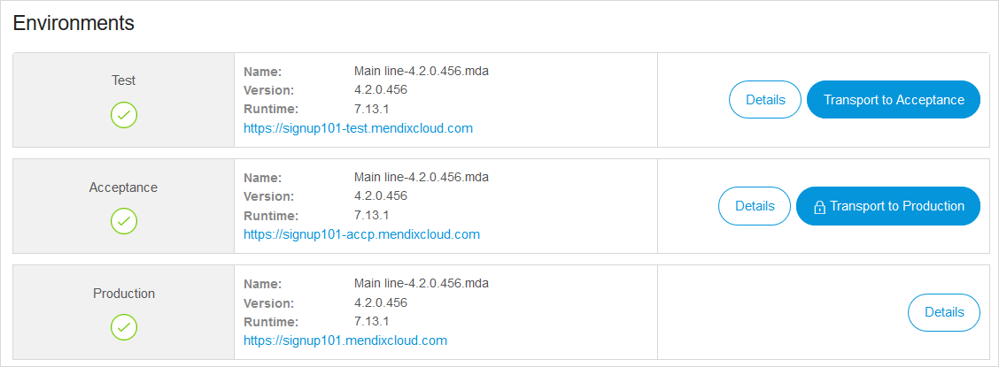
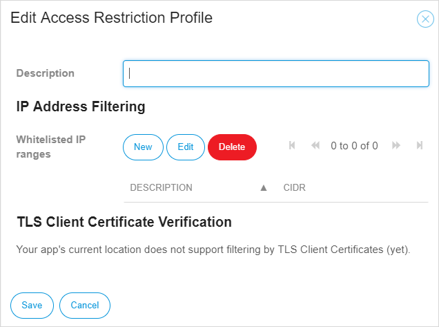

## 1 What Features Are Available in the Mendix Cloud? {#cloud-portal}

The Mendix Cloud has a full range of features that make it efficient for managing your application deployments and monitoring your app and database performance. The Mendix Cloud enables you to configure custom domains, backups, alerts, and logs. You can use the fine-grained access controls that are provided, and in the long term, you can use the rich set of tools for live debugging.

The Mendix Cloud is the most optimized and self-service cloud for running Mendix applications. It comes with a rich set of features to ensure that your your applications are run with the best possible business continuity and self-control.

The sections below describe the features delivered by the Mendix Cloud.

## 2 How Does Application Deployment Management Work?

This feature allows you to deploy a Mendix application with a single click from both the Mendix Development Portal and the Modeler.

{}

{}

## 3 Can I Use Custom Domains?

When you receive a new Mendix Cloud environment for your application, it is standard for a domain name to be assigned based on the name of your app. In addition to this domain, you can add your own custom domain as well.

## 4 How Does the Mendix Cloud Provide Backups?

Each application running in the Mendix Cloud gets a default daily backup. Next to that, it is possible to create a backup of your app at any time via self-service. Optionally, it is possible to upgrade your backup policy to go to real-time replication and backup.

For more details, see the section [How Does Mendix Cloud Support Backup & Recovery?](mendix-cloud-overview#support-backup) in *Mendix Cloud Overview*.

## 5 How Does Application & Database (Performance) Monitoring Work?

The Mendix Cloud Portal provides all the necessary metrics for you to analyze the performance of your application. This is not limited to insights into memory or CPU utilization, as it is even possible to see metrics on the actual model execution. This allows you to respond more quickly to a specific performance bottleneck and optimize your application more easily.

{}

{}

This video presents the options for monitoring in the Developer Portal:

<video controls src="attachments/DO_CloudV4Tabs-1.mp4">VIDEO</video>

## 6 What Alerts Are Available?

To be able to act proactively and ensure business continuity, Mendix Cloud sends alerts for all the critical metrics of your application, like CPU, memory, and disk. These alerts will keep you informed of your app's health on an ongoing basis.

## 7 What Logs Are Available?

In the Mendix Platform, your log files are available via the Cloud Portal. A log file rotates each 5 MB.

## 8 How Does Live Debugging Work?

If you need to perform a root cause analysis on a running application and the issue only occurs in production, it is possible to connect your Mendix Modeler to your production environment and perform live debugging.

For more information, see the section [How Can I Debug a Live App Running in the Cloud](../app-lifecycle/debugging#debug-live-app) in *Debugging Facilities*.

## 9 What Fine-Grained Access Controls Are Available?

In the Mendix Cloud, it is possible to extend the access security of your application by using whitelisting based on IP filtering and by using TLS client certificate verification. This ensures that an app is only accessible from a another specific machine or location (like your office).

{}

{}
