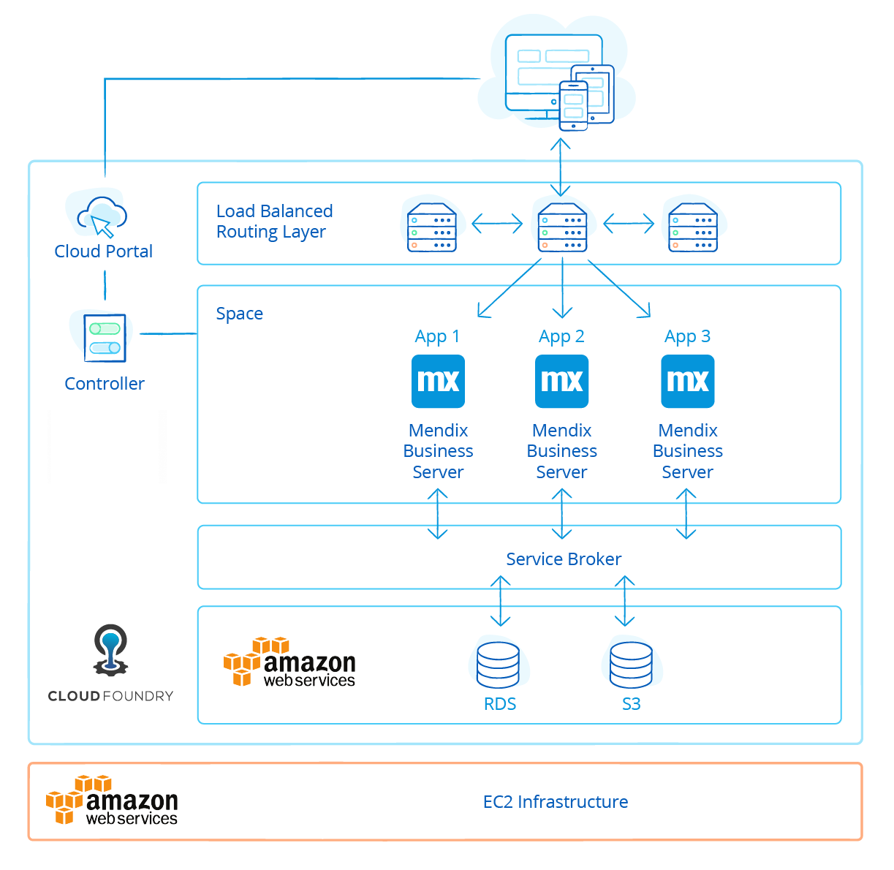
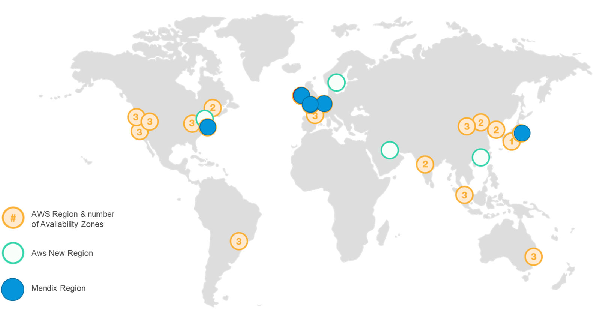
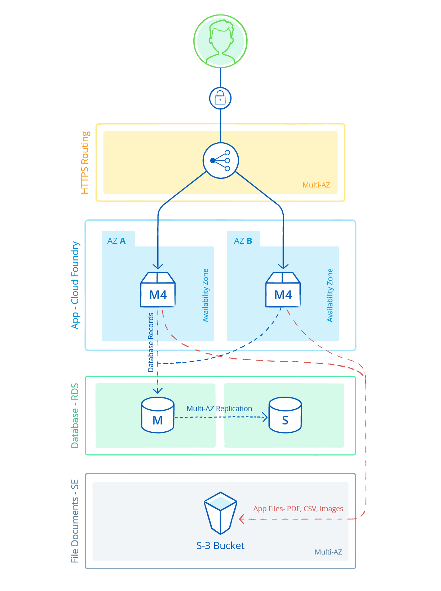

## 1 How Can I Run Mendix on the Mendix Cloud {#mendix-cloud}

The Mendix Cloud is the deployment solution in which Mendix provides hosting environments for customers. The Mendix Cloud is built on top of Cloud Foundry and AWS, is available in multiple regions around the globe, and comes with high availability options. For more information on the Mendix Cloud architecture, see [Architecture Principles](../enterprise-capabilities/architecture-principles).

Mendix Cloud is the most optimzed cloud to run Mendix Applications. It comes standard with deep insights, alerting, high availabilty, backups and this is all self-service available. See [Mendix Cloud Features]{./mendix-features).

## 2 What Does the Mendix Cloud Architecture Look Like?

The Mendix Cloud is a PaaS-based cloud architecture using Cloud Foundry running on top of AWS. A Mendix application runs within fully isolated containers, consuming PaaS services like database and storage.

For each region, the Mendix Cloud architecture is set up fully high available and divided in multi-availability zones. This means there is a fully reliable offering for disaster recovery.

For more information on Mendix architecture, see [Architecture Principles](../enterprise-capabilities/architecture-principles).

## 3 What Mendix Cloud Regions Are Available?

Mendix Cloud is currently available in the following regions:

* US East (North Virginia)
* EU (Frankfurt)
* EU (Ireland)
* UK (London)
* Japan (Tokyo)

New applications can be placed in any of the available regions. Mendix adds new regions based on customer demand.

## 4 How Does Mendix Cloud Support High Availability?

Mendix applications consist of five components that are critical for application functionality. These all have to be highly available (HA):

* Mendix Runtime
* Database
* File storage service
* HTTPS routing layer
* Network

Because Mendix is hosted on Amazon Web Services (AWS), the file storage service, HTTPS routing layer, and network are HA by default.

The Mendix Runtime supports out-of-the-box horizontal scaling. This allows you to easily scale your application up or down without downtime. In addition, by having at least two instances, you will have a fully high available solution.

For the database, a fallback option needs to be purchased per application where HA is desired. The fallback add-on will enable the Multi-AZ option that AWS RDS offers. When scaling to two or more runtime instances with the fallback option enabled, Mendix applications can be made highly available.

{}

{}

## 5 How Does Horizontal and Vertical Scaling Work in the Mendix Cloud?

A Mendix Application relies on three basic components. Which are the:

* Mendix Runtime
* The database
* S3 (File) Storage 

The Mendix Runtime instances can be scaled horizontally by added more instances and vertically by added more memory for each instance. As the runtime is stateless no additional effort is needed to run your Mendix application in cluster mode.  

By moving a slider in the Mendix Developer Portal, an application will scale up or down without application downtime.

<video controls src="attachments/OA_ScalingEnvironments-1.mp4">VIDEO</video>

For the database, vertical scaling is applied. Because Mendix makes use of standard AWS RDS Postgres instances, it is possible to scale up to a gigantic database with 32 cores and 244 GB of memory.

## 6 How Does Mendix Cloud Support Backup and Recovery? {#support-backup}

Mendix Cloud uses incremental backups with a 15-minute recovery point objective (RPO) for disaster recovery purposes. Nightly backups (with an RPO of 24 hours) are available on a self-service basis. Next to the automatic backup's it is also possible to trigger a backup manually using the Mendix Portal or API.

This video presents how you can create a backup:

<video controls src="attachments/CreateBackup.mp4">VIDEO</video>

For more information, see [Backups](https://docs.mendix.com/developerportal/operate/backups), [How to Create a Backup](https://docs.mendix.com/developerportal/howto/how-to-create-backup), and [How to Restore a Backup](https://docs.mendix.com/developerportal/howto/how-to-restore-a-backup) in the Mendix documentation.

## 7 What Is the Uptime Guarantee for the Mendix Cloud?

The Mendix Cloud guarantees 99.5% and 99.95% uptime of the cloud infrastructure. The 99.95% guarantee only applies to the Mendix Enterprise Edition when the fallback add-on is purchased and the application has been scaled horizontally to two or more instances.

## 8 How Can My App Get Access to My On-Premises Services Without Using a VPN?

The best practice for setting up a secure connection between the Mendix Cloud and your on-premises solution is by using a reverse-proxy with client-server certificates. This allows you to set up a peer-to-peer connection between your application in the cloud and the on-premises solution.

Mendix supports this way of connecting because a VPN comes with significant more maintenance as well as security risk overhead. This is because a VPN will connect to another network not at the application level but at the TCP level. The consequence of this is that, unless you secure your own network with an extra firewall, you are potentially opening your on-premises network to a public network. This is not a best practice and thus not supported by Mendix.

## 9 How Can the Mendix Support Team Assist Me When Running in the Mendix Cloud?

When approved by the user, Mendix Support can gain access to the graphs and activity logs of all Mendix Cloud applications. When troubleshooting customer tickets, Mendix Support uses this data to more effectively assist users. This is only done with the customer's consent in order to follow specific laws for data privacy.

In addition, Mendix Support can utilize their experience to advise on app container sizing, performance tuning, app optimization, and more.
