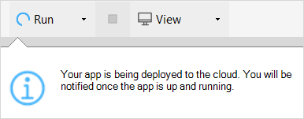
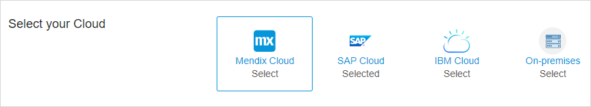
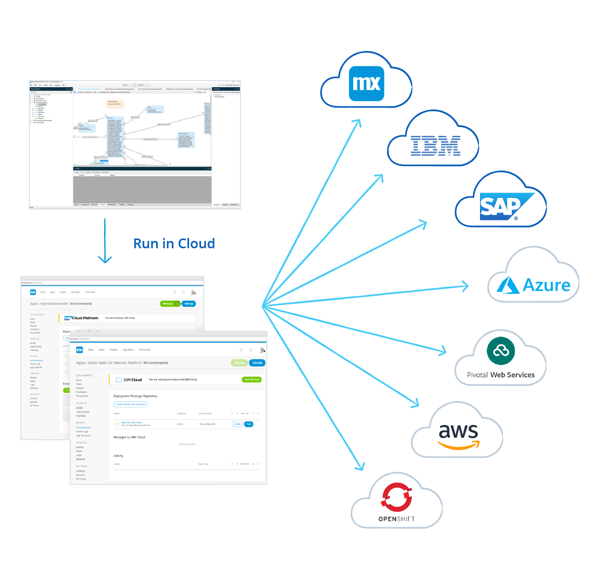
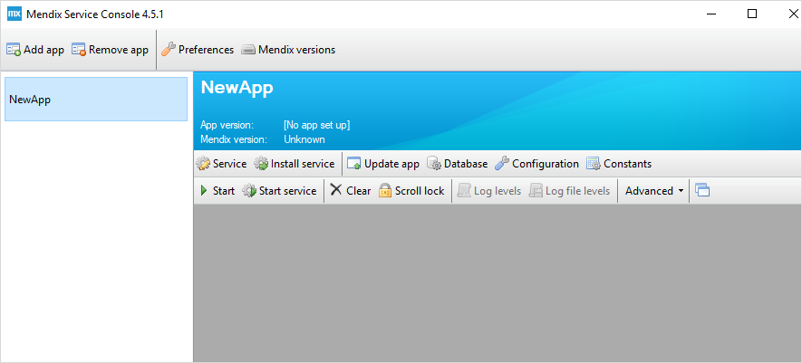

## 1 What Deployment Options Does Mendix Provide? {#deployment-options}

An application built with Mendix is based on a cloud-native design and conforms to 12-factor principles. The Mendix Runtime is fully optimized to run in a container technology that is compatible with most modern cloud platform offerings like Kubernetes and Cloud Foundry. Mendix apps are thus able to utilize benefits of these cloud platforms such as auto-scaling, auto-provisioning, auto-healing, low infra-overhead, CI/CD support, and cloud interoperability. For more information on these Mendix architecture principles, see [Architecture Principles](../enterprise-capabilities/architecture-principles).

Within this flexible model, Mendix supports a large variety of deployment options that allow you to run your Mendix application on a public, virtual private, private, or hybrid cloud or via a traditional (virtual) server.

### 1.1 Public Cloud

If you want to acquire the best utilization rate for your infrastructure, to maintain optimal flexibility, and to convert your capital investment into operational expenses, the public cloud is the best choice. Mendix has support for most public cloud vendors, such as Mendix Cloud, IBM, SAP, Microsoft, AWS, and Google. For Mendix Cloud, SAP, and IBM, we deliver a fully integrated experience in which you can run your app with a single click via your cloud choice.

For more information, see the section [How Can I Run Mendix in the Public Cloud?](#running-public-cloud) below.

### 1.2 Virtual Private Cloud (VPC)

If your business requires a higher data or application isolation level, a virtual private cloud (VPC) could be the best choice. You still can benefit from a high utilization rate and resource flexibility, but on dedicated hardware or within a separate network segment. A Mendix application runs fully decoupled from our public Mendix Developer Portal, which means running on a VPC can be accommodated easily.

For more information, see the section [How Can I Run Mendix in a Virtual Private Cloud?](#vpc) below.

### 1.3 Private Cloud – On-Premises

If your organization is complying with specific regulations and is not allowed to run in a third-party cloud, you must run your infrastructure on premises. This option can be based on a private cloud or on a traditional server. Mendix can run on both server-based solutions as private cloud IaaS or PaaS solutions.

For more information, see the section [How Can I Run Mendix in a Private Cloud or On Premises?](#on-prem) below.

## 2 How Do I Run and Deploy My Mendix Application? {#run-deploy}

In the Mendix Platform, the development and execution of your application are fully separated. After developing the app, you can choose where you want to run it. The sections below explore your deployment options.

### 2.1 How Can I Run Mendix in the Public Cloud? {#running-public-cloud}

Mendix applications can run on all common public cloud providers, like Amazon Web Services, Microsoft Azure, IBM Cloud, Google Cloud Platform, SAP Cloud Platform, Redhat Openshift, and Pivotal Web Services.

You can choose the methodology to use – from container-based to VM-based, every methodology is possible.

For more information, see the section [Which Cloud Providers Can I Use for Mendix?](#which-cloud) below.

### 2.2 How Can I Run Mendix in a Virtual Private Cloud? {#vpc}

A virtual private cloud is a public cloud with a dedicated infrastructure like a network, storage, and/or computing allocated to a customer. In most situations, this cloud is only accessible when connected to the customer's network. Therefore, the Mendix Developer Portal provides a set of APIs that make it possible to configure tools like Jenkins or Microsoft Visual Team services to automate deployment within a VPC. This ensures developers maintain the benefit of the one-click deployment experience when using the Mendix Platform in combination with a VPC.

For more information, see [CI/CD](../app-lifecycle/cicd).

### 2.3 How Can I Run Mendix in a Private Cloud or On Premises? {#on-prem}

If you are required to run your software on your own premises, you can choose an infrastructure abstraction level:

* Physical servers
* IaaS
* PaaS

In terms of speed, self-service, and governance, the PaaS level has significant benefits. Because of the small footprint of a Mendix application, having a 2-node (VMs) Kubernetes cluster allows you to run multiple Mendix applications (in test, acceptance, and production environments) with high availability as well as auto-scaling and auto-healing capabilities. This is also possible when running Mendix on traditional servers, but the setup time and maintenance will be significantly higher.

For more information, see the section [Which Operating Systems Do the Mendix Modelers Support?](../app-lifecycle/app-development#operating-systems) in *App Development*.

### 2.4 How Do I Select a Cloud Provider?

Mendix Multi-Cloud is a deep integration with different cloud providers that allows you to deploy your application with a single click from both the Mendix Modeler and the Developer Portal.

The Mendix multi-cloud solution makes use of container-based cloud solutions. The creation of the container and the required services (like the database) is done completely automatically.

It is even possible to switch between cloud providers, so you can start developing and running your application on one cloud and, over time, move it to another cloud.

At the moment, the integrated Mendix Multi-Cloud solution is provided for Mendix Cloud, IBM Cloud, and SAP Cloud. More clouds will be added to the Mendix Multi-Cloud portfolio in the near future.

### 2.5 When Should I Use IaaS vs. PaaS?

Infrastructure-as-a-service (IaaS) is the virtualization of computing, network, and storage running on-premises or within the public cloud. A platform-as-a-service (PaaS) is an extra abstraction layer on top that allows you to work with services and applications. The abstraction layer of a PaaS will allow you to think in terms of services and applications while providing capabilities like high availability, auto-scaling, auto-healing, auto-provisioning, and user governance.

The choice of either an IaaS or PaaS in relation to Mendix is based on the amount of applications you are planning to run and who the owner is of the PaaS layer on the cloud.

If you are able to consume a PaaS on demand from a public cloud, this will always be the best fit for a Mendix hosting solution based on cost, speed, and control.

In the scenario that you have access to an IaaS and you need to choose a PaaS layer yourself (like Kubernetes or Cloud Foundry), the key factor is the amount of applications. A Kubernetes cluster can be beneficial when you are planning on running more than two applications, wherein each app contains a test, acceptance, and one or more production environments. When you are planning on running more than 10 applications, a Cloud Foundry solution could be beneficial (this has to do with the footprint and maintenance of the PaaS layer). Finally, for a single application, a traditional server-based solution will be enough.

## 3 How Can I Run Mendix on a (Virtual) Server or IaaS?

The Mendix Runtime can be directly installed on a server. Mendix provides a service manager for both Linux-based and Windows-based servers that controls the start, stop, and deployment of an application on the server.

For Linux-based applications, this is a command-line based tool called [M2EE](https://github.com/mendix/m2ee-tools).

For details on supported operating systems and related databases, see [System Requirements](https://docs.mendix.com/refguide/system-requirements) in the Mendix Reference Guide..

In addition to a container-based solution, Mendix provides full support for a high availability configuration. For details, see [How to Configure High Availability](https://docs.mendix.com/deployment/on-premises/high-availability) in the Mendix documentation.

