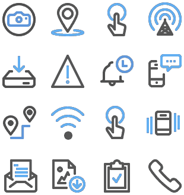

## 1 How Do Mendix Native Mobile Apps Work? {#native-mobile-apps-work}

With Mendix, you can build truly native mobile apps from a single integrated visual development environment.

Mendix native mobile apps are truly native mobile apps based on [React Native](https://facebook.github.io/react-native/). Native mobile apps differ from hybrid apps in that they do not render inside a web view. Instead, they use native UI elements, which results in faster performance, smooth animations, natural interaction patterns (like swipe gestures), and improved access to all native device capabilities. React Native has a large community that is continuously building components and modules, and this community supports users in creating rich native mobile apps with numerous extension options. What is more, for a great user experience, native mobile apps are based on an [offline-first architecture](offline-apps).

{}

{}

In native mobile apps, you can reuse existing domain models and logic. Pages for native mobile are optimized for mobile use, as they show only the native mobile widgets and related properties. These can leverage native device features via mobile-specific actions, controls, transitions, and gestures that are dragged into the page editor when designing rich user experiences. Existing pages for web or hybrid apps can be made available for native mobile apps by changing the layout to a native mobile layout. And consistency checks are applied to make sure no web/hybrid mobile-related features are used.

It is possible to add a native mobile app as an additional channel to an existing Mendix application. For more information, see the [How Does Mendix Support Multi-Channel Applications?](front-end#support-multi-channel) section of *Front-End*.

A Mendix native mobile app connects to the Mendix Runtime server in order to load. This acts as a mobile-back-end-as-a-service (mBaaS) for the app, wherein the communication is automatically handled by Mendix. The mobile app automatically loads everything that is needed at startup and for later usage.

{}

{}

## 2 How Can I Leverage Device Capabilities in My Mobile Apps?

Mendix native mobile apps come out of the box with a rich set of actions to leverage native device capabilities (such as the camera, biometric authentication, GPS, and Bluetooth) as well as platform features such as sharing data, opening the navigation, and drafting an email. 

{}

{}

In addition, native capabilities can be leveraged using widgets for great UI and UX. You can easily add these widgets to your native mobile app projects and configure them in Mendix Studio Pro. 

If other device capabilities are needed, you can extend the project with custom nanoflow actions or pluggable widgets that wrap [React Native Components or APIs](https://facebook.github.io/react-native/docs/components-and-apis.html) to leverage device capabilities. For more information, see [How Can I Extend the Mendix Front-End?](front-end#extend).

## 3 How Can I Preview & Test My Native Mobile App? {#mxapp-preview}

You can preview a Mendix native mobile app directly on your device via the Mendix Make It Native app (available for [Android](https://play.google.com/store/apps/details?id=com.mendix.developerapp) and [iOS](https://apps.apple.com/us/app/make-it-native/id1334081181)) by scanning the QR code in Mendix Studio Pro or manually entering the IP address. When you make a change to your app and press the run button, the app will be automatically reloaded, quickly making your changes visible while keeping the original state so that you are still on the same page with the same data. This creates a very short feedback cycle. Next to this, you can use a simple three-finger tab to reload the app after you make changes to the styling.

For more information, see [How to Get Started with Native Mobile](https://docs.mendix.com/howto/mobile/getting-started-with-native-mobile) in the *Mendix Studio Pro How-to's*.

## 4 How Can I Extend My Native Mobile App? {#how-can-i-extend-my-mobile-app}

You can extend native mobile apps with custom UI components or app logic to leverage any type of visualization, UI/UX, or device capability. For details, see [How Can I Extend the Mendix Front-End?](front-end#extend) in *Front-End*. 
