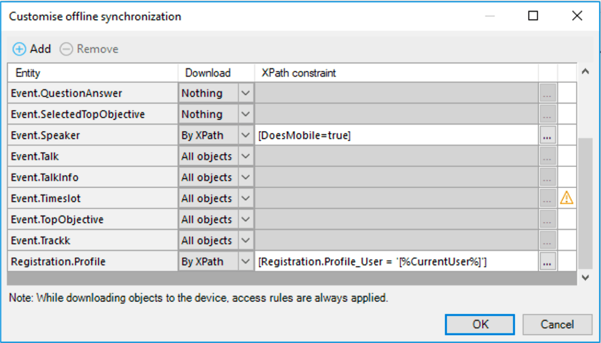

## 1 How Can I Build an Offline-First Mobile App? {#build-offline}

Mendix offers all the functionality to build rich offline-first mobile apps that always work, regardless of the network connectivity status. An offline-first approach is one in which data is stored and handled locally on the device, so the app always works smoothly and users can perform their tasks. No connection is needed, except for synchronizing and updating. The offline-first approach increases the reliability and performance of your applications.

With offline-first, your apps remain fully supported via consistency checks and data synchronization while you maintain the ability to fine-tune both the apps and the synchronization process.

## 2 How Do Mendix Offline-First Apps Work?

Mendix makes it easy to add offline capabilities to an existing app model, allowing for the reuse of UI components, logic, and domain models. Offline capabilities are exposed as a separate channel that can be enabled by adding an offline navigation profile. For details, see [How Does Mendix Support Multi-Channel Applications?](front-end#support-multi-channel) in *Front-End*. Note that native mobile apps are always offline-first.

<video controls  src="attachments/create-offline-profile.mp4">VIDEO</video>

Mendix Studio Pro automatically analyzes the model of the app to determine what needs to be synchronized with the device, which relieves the developer from thinking about this. The user interface components, styling, logic, and data are all stored on the device so that the app can run without a connection. By adding rules to the model, the developer can control and specify which data needs to be synchronized to the device.

When the user starts the application and there is a connection, the app checks if there is a newer version of the application model deployed. If so, the app is automatically updated to the device and the data is synchronized.

Data is stored in a local SQLite database, which is only accessible by the app. All the (unsynchronized) data is persisted, even if the app is closed, the device is rebooted, or the power is lost. There are no size limitations of the database (other than the device storage). However, in practice, it is good to think about what data needs to be available on the device, which can be controlled (for details, see [What Data Is Stored on the Device](#what-data-is-stored-on-the-device) below).

The synchronization of data can be triggered automatically on event (for example, when the device gets a connection), via logic, manually via buttons and gestures, or when data is saved. If an error occurs while synchronizing, the app tries to sync the data again later. For more information about offline mobile apps, see [Offline First](https://docs.mendix.com/refguide/offline-first) in the *Mendix Studio Pro Guide*.

## 3 What Data Is Stored on the Device? {#what-data-is-stored-on-the-device}

Mendix knows what data should be available offline based on the automatic analysis of the application model (while respecting access control settings). The result is that the end-user only sees the data they are assigned to and allowed to access. The data to which the user is assigned is synced and can be filtered and controlled on a fine-grained level by applying XPath constraints. Data can also be assigned to a specific user in a specific context via microflow logic. All the data and resources are automatically removed when the user logs out.

{}

{}

## 4 How Are Data Conflicts Handled?

Mendix supports the standard [conflict resolution](https://appstore.home.mendix.com/link/app/66614/) patterns **first wins** and **last wins** as well as the possibility to trigger a human workflow to handle conflicts. These mechanisms can easily be extended by visually modelling the resolution with microflows.

For more information about offline-first apps, see [Offline-First](https://docs.mendix.com/refguide/offline-first) in the *Mendix Studio Pro 8 Guide*.
