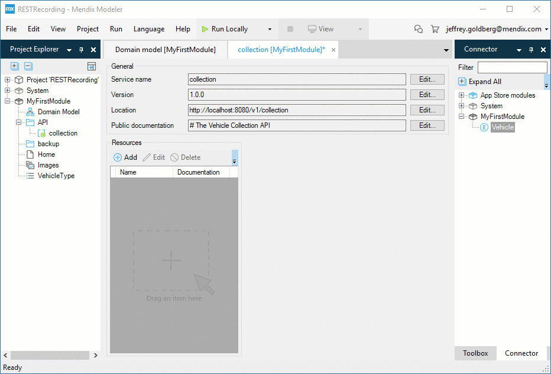
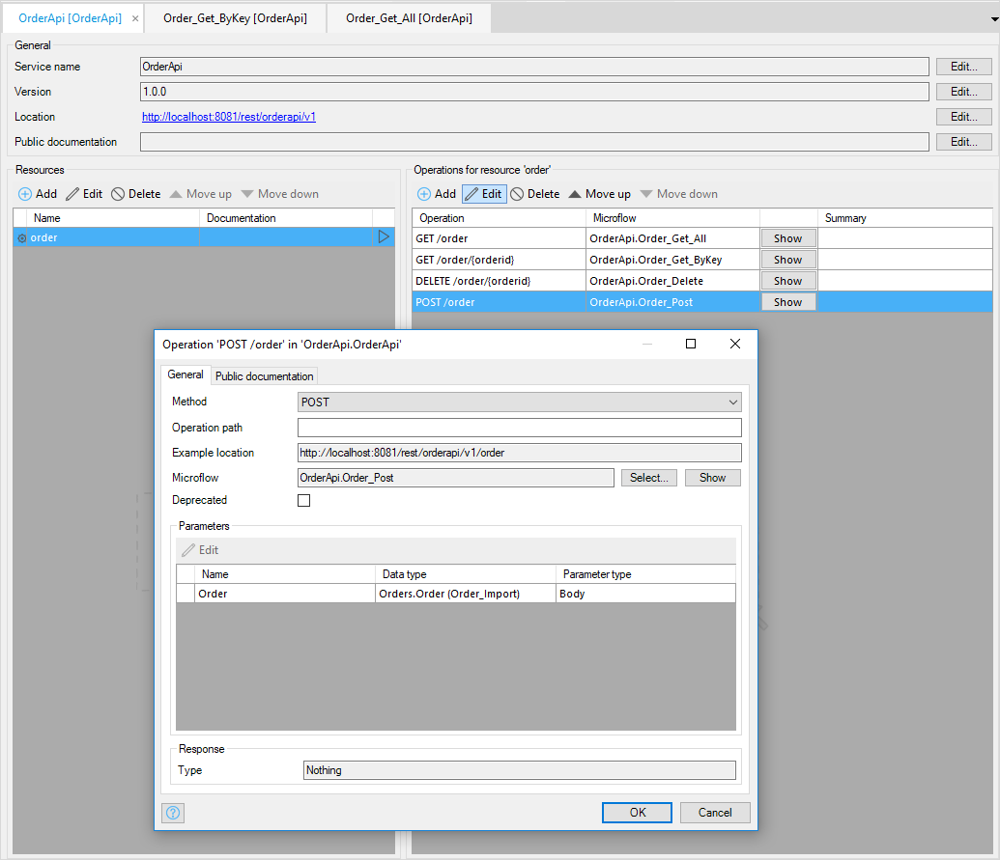
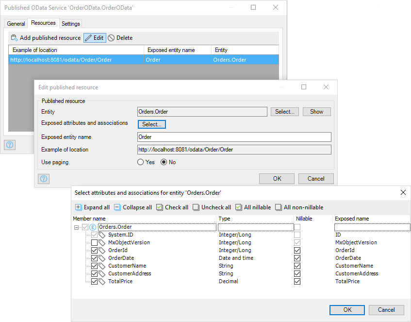
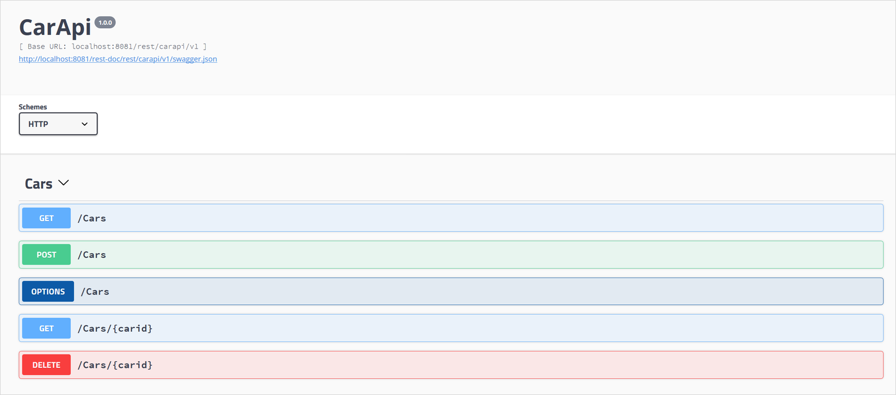

## 1 How Can I Publish a REST API?

Most newer services use REST instead of web services nowadays. Using REST requires a small shift in the design of your services. Web services are about calling and providing access to remote logic, but in REST, you design a data model that can be used by external apps. Objects in your domain model are called resources, and the operations on your resources are standardized into the following options

* Read or find one or more existing resources (`GET`)
* Create a new resource (`POST`)
* Change an existing resource (`PUT`)
* Delete an existing resource (`DELETE`)

You will also see this approach in contracts for REST services like Swagger and OpenAPI – first the resources are listed, and then the operations on those resources are listed.

The Mendix REST publish functionality follows the approach used by OpenAPI in which you define your resources first and then the operations on those resources. You have full control of your REST API because you define the resources, messages exchanged, and microflows that implement the operations.

Alternatively, you can let Mendix handle all of this automatically. Just expose your entity from your domain model or drag an entity onto the resources section of a publish-REST document, and everything required will be generated for you, including security. All the security rules you define on your entities are automatically used by your REST API.

{}

{}

Whether you want full control of the API you implement or you just want to generate a back-end for your mobile application in a few minutes, Mendix can do it.

{}

{}

Looking at the implementation of your REST operations, you can use any microflow as the implementation of a REST operation. Mendix will automatically detect the parameters you need as well as any objects that need an import or export mapping. This can be specified in the **Operation** dialog box. You can also use, send, and receive binary data or file documents, for example, if you want to provide an operation to retrieve a PDF document.

The following images use the optional `httpResponse` parameter, which you can use to override HTTP status code or status message. If required, you can also specify that you want access to the HTTP request, for example, to determine the value of the HTTP header values.

Mendix automatically provides an OpenAPI contract and documentation page for every REST service you create. If you provide example values in your message definitions, users of your REST service literally only have to click **Execute** to see the result of calling your service. We cannot make it any easier than this!

<video controls src="attachments/PublishREST.mp4">VIDEO</video>

## 2 How Can I Publish a SOAP Service or Web Service?

Creating a web service is as easy as selecting **Publish as web service operation** in the Mendix Desktop Modeler.  When you turn a microflow into a web service operation, the input parameters and the microflow return value will automatically be converted into input and output messages for the operation.

<video controls src="attachments/Integration_PublishWebService-1.mp4">VIDEO</video>

You have full control over the message, and you can select which attributes to include as well as what names to use, as illustrated in this image:

<video controls src="attachments/Integration_ExposingParameters.mp4">VIDEO</video>
This enables you to ensure the contract with the outside world is stable, while you can still make changes to your application. Furthermore, using this information is enough to generate both the WSDL and the documentation automatically.

<video controls src="attachments/Integration_PublishMultipleWebServices.mp4">VIDEO</video>

## 3 How Can I Publish an OData Service?

Mendix currently provides OData in the Mendix Modeler as an integration facility for a specific use case, which is providing Mendix app data for analytics. Next to this, Mendix also provides an SAP integration based on OData, but this is also based on Mendix Connector Kit technology, as described in section [5 How Can I Import & Export Fixed-Length & Delimited Files?](importing-data#fixed-length) of *External Data*.

OData provides an interface similar to what you may expect from a database. It has insert, select, update, and delete functionality available. OData achieves this by standardizing a data language on top of REST. The benefit of this is that all client tools understand up front how to work with the data you expose.

The data analytics tools that support OData range from Microsoft Excel to Tableau, ETL tools, basic query tools like LINQPad, and even statistical analytics tools like R. This means that you can expose your data from Mendix once, and all these tools can directly work with the data within your application.

To expose your Mendix data through OData, select **Expose as OData resource** your entity in a domain model:

<video controls src="attachments/Integration_PublishODataService.mp4">VIDEO</video>

Next, you will be able to specify which attributes you want to expose. You can also specify who can access this data. Of course, all the entity access rules specified on your domain model entities still apply when retrieving data through OData.

{}

{}

You can now open the exposed entity directly in a tool like Microsoft Excel or PowerBI and always have up-to-date information from your Mendix application.

## 4 How Can I Implement a Custom HTTP Protocol in Mendix?

Mendix provides a Java API to define [custom request handlers](https://www.mendix.com/blog/requesthandlers-at-your-service/), which enables defining a completely custom way to handle HTTP endpoint calls. This can be useful for scenarios such as the bulk import or export of data or for implementing a custom authentication handler. Custom request handlers are also used by the [DeepLink](https://appstore.home.mendix.com/link/app/43/Mendix/Deep-link-module) module to provide deeplinks into pages that need custom microflow logic before a page can be displayed. Another use case is the [PublicImagePath](https://appstore.home.mendix.com/link/app/54112/) module, which provides direct URLs to image entities in your application, including support for caching in CDNs.

## 5 How Does Mendix Support Swagger and OpenAPI?

Every REST API you implement with Mendix will automatically include an OpenAPI document, describing all the resources and methods provided by your API. If you include documentation and example values in your message definition, these will also be included in your OpenAPI documentation. This will make it very easy for your users to start using your API.

{}

{}

## 6 How Can I Use Certificates to Secure My Integrations?

Mendix enables using certificates for incoming and outgoing communication in the following ways:

* You can use certificates to ensure secure communication with services. You can provide multiple pkcs12 certificate files to be used for authentication with the service, including both REST services and SOAP web services. In the configuration, you can specify which certificate should be used for which service domain.
* For connections from the internet to your Mendix Cloud applications, Mendix provide a *.mendixcloud.com* or *.mxapps.io* domain with a certificate managed by Mendix. If you want to set up your own domain name, you can configure [custom domains](https://docs.mendix.com/developerportal/howto/custom-domains). You can also restrict incoming traffic by requiring client certificates signed by a Certificate Authority of your choice. For details on how to set this up, see [How to Restrict Access for Incoming Requests](https://docs.mendix.com/deployment/mendixcloud/access-restrictions) in the Mendix documentation.

The following documentation provides more information:

* [How to Use a Client Certificate](https://docs.mendix.com/howto/integration/use-a-client-certificate)
* [Securing Outgoing Connections from Your Application](https://docs.mendix.com/deployment/mendixcloud/securing-outgoing-connections-from-your-application)
* [Using Certificates in the Mendix Cloud](https://docs.mendix.com/deployment/mendixcloud/certificates)
