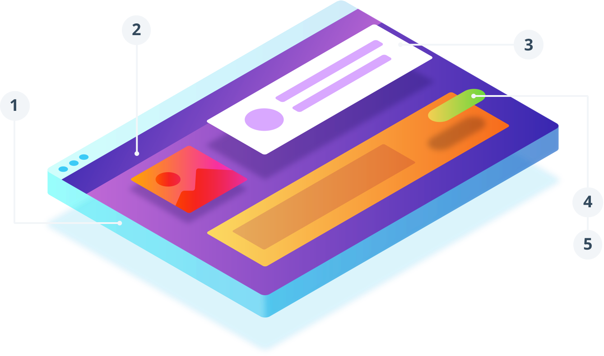
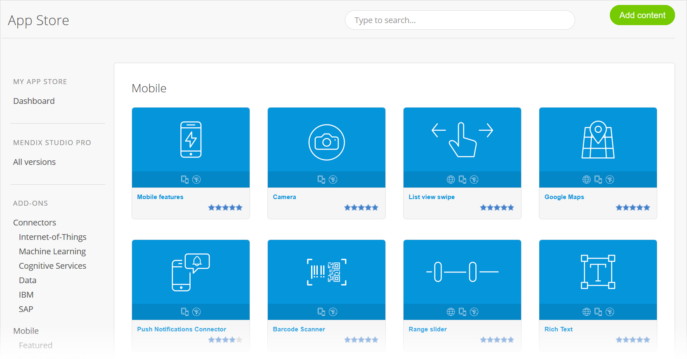

## 1 How Can I Design Rich User Interfaces? {#atlas-ui}

User interfaces are built via the combination of a drag-and-drop interface with a WYSIWYG page editor. Our Web Modeler and Desktop Modeler environments can be used with the [Atlas UI](https://atlas.mendix.com) framework, which is a fully responsive, [open-source](https://github.com/mendix/atlas-framework), and extensible design language that facilitates a design-thinking approach to building user interfaces.

Common page patterns such as searchable lists, data views, dashboards, and wizards are made available as starter templates that help accelerate development and ensure a consistent, standard user interface across multiple devices.

For speed and flexibility in building rich interfaces, Mendix uses the concepts described via this diagram:

### 1.1 Navigation Layouts

When building a Mendix app, the first thing you do is choose a navigation layout. These layouts are the frame within which your dynamic pages are housed, and they provide a consistent structure throughout your app.

Navigation layouts are built using the platform layout editor, which allows you to create the layout patterns needed for your pages.

Layouts use specific controls—such as layout grids, content placeholders, scrolling containers, sliding menus bars, and snippets—to centrally define the required page layout patterns that will be consumed when building the your application's UI.

This video presents selecting a reusable navigation layout for your app project in the Web Modeler:

<video controls src="attachments/OE_ReusableNavigationLayouts.mp4">VIDEO</video>

### 1.2 Page Templates

Page templates are pre-designed collections of building blocks that can be used as-is or enhanced with custom building blocks and widgets.

This video demonstrates how you can find the best page template for your app project:

<video controls src="attachments/OE_ReusablePageTemplates-1.mp4">VIDEO</video>

### 1.3 Building Blocks {#building-blocks}

Building blocks are single-purpose UI elements comprised of multiple widgets and styling. Multiple building blocks are usually used together on one page. You can drag a building block into any of the respective mobile, tablet, or responsive pages to implement common UI patterns, which substantially speeds up the development of custom pages.

<video controls  src="attachments/building-blocks.mp4">VIDEO</video>

### 1.4 Widgets

Widgets are small user interface elements (for example, alerts, buttons, charts) used to enhance existing building blocks.

Mendix provides many widgets out of the box, and there are hundreds of open-source widgets available in the Mendix App Store. You can also build your own widgets using JavaScript, as discussed in section [4 How Can I Extend the Mendix Front-End?](front-end#extend) of *Front-End*.

### 1.5 Design Properties

You can further customize widgets by changing their design properties. Colors, text, and many other variables can be altered to customize widgets on a case-by-case basis if the styling or placement are not quite right. Theme developers can implement their own (company) design properties so that other users can easily change the look and feel of widgets to match the company's brand.

Here is an example of how easy it is to change some design properties of a button in the Web Modeler:

<video controls src="attachments/Eval_WebModeler_DesignProperties.mp4">VIDEO</video>

## 2 What UI Elements Does Mendix Provide Out of the Box?

Mendix provides a growing list of out-of-the-box widgets. This is a selection of the most common ones:

* **Menu widgets** – allows the end-user to navigate through the application (for example, a menu bar and navigation tree)
* **Data widgets**  – central to building forms in Mendix so that the end-user can view and edit data in the application (for example, a data view and data grid)
  * Also includes common input widgets, like a text box and radio button
* **Layout widgets**  – form the backbone of the interface and are typically used on layouts (for example, a layout container and title)
* **Common widgets** – commonly found on any page, layout, and snippet (for example, a label and image)
* **Container widgets**  – can contain other widgets (for example, a table and group box)
* **Input widgets** – make it possible to show and edit the values of attributes and associations (for example, a  text box and date picker)
* **File widgets**  – allow you to work with files, including images stored in files
* **Button widgets**  – these buttons trigger actions (for example, a save button, close page button, and microflow button)
* **Visualization widgets**  – more graphical widgets like charts and maps

New widgets are being built all the time by both our core Mendix development team and our community of developers using the standard available tooling. You can find available widgets in the [Mendix App Store](https://appstore.home.mendix.com/index3.html) and download them to use in your application.

## 3 How Can I Customize the Look & Feel of My Apps? {#customize}

The Mendix front-end uses the [Atlas UI](https://atlas.mendix.com) framework to render responsive pages. The framework is based on a default theme that be fully customized. With the **Theme Customizer** tool, you can easily upload a logo that is used to determine your brand's colors. The various colors, fonts, and size settings can be quickly configured and previewed.

<video controls  src="attachments/ThemeCustomizer.mp4">Theme Customizer</video>

Next to this, Mendix uses [Sass](https://sass-lang.com/) to define the styling. It contains a configuration file with many variables that can be used to configure and tweak the theme. The configuration is set up so that it can be easily changed and extended by providing custom Sass files. It is also possible to directly extend the styling with custom CSS. The styling can also be shared, as discussed in the next section about creating consistent user experiences.

<video controls src="attachments/SassCompiler.mp4">VIDEO</video>

For more information, see the collection of [Atlas UI](https://docs.mendix.com/howto/atlasui/) how-to's in the Mendix documentation.

## 4 How Can I Create a Consistent User Experience Across My Apps?

Mendix apps are based on a theme that can be published to your private App Store or embedded in a company starter app for easy reuse across apps. For every app, it is possible to extend the default theme so that you can fine tune the app according to your needs.

## 5 How Does Mendix Support Reuse of Design Patterns & Elements?

Atlas UI promotes the reuse of elements and layouts by facilitating a layered and componentized approach to application design. What is more, Atlas UI enables your UX Designers to extend out-of-the-box components, assemble their own building blocks, create custom widgets, and override default design properties. New and enhanced design elements are automatically propagated throughout all the applications in which each element is used.

The three main types of reuse are described below.

### 5.1 Snippets

Snippets are fragments of page design that contain design elements, widgets, and data. Snippets are built and managed centrally at the model level, and they can be reused across multiple pages within an application.

This video demonstrates how to use a snippet call widget in your app project:

<video controls src="attachments/Snippet.mp4">VIDEO</video>

### 5.2 Layouts, Navigation, & Page Templates

Layouts are wireframe page designs that combine widgets, navigation placeholders, and branding into a centralized repository of reusable components. Layouts can be designed to support specific form factors in order to create a common user experience across devices. Once created, the layouts are applied to application pages at design time.

### 5.3 Building Blocks

Building blocks are optimized for reuse in the Web Modeler. For more details, see the section [Building Blocks](#building-blocks) above.
