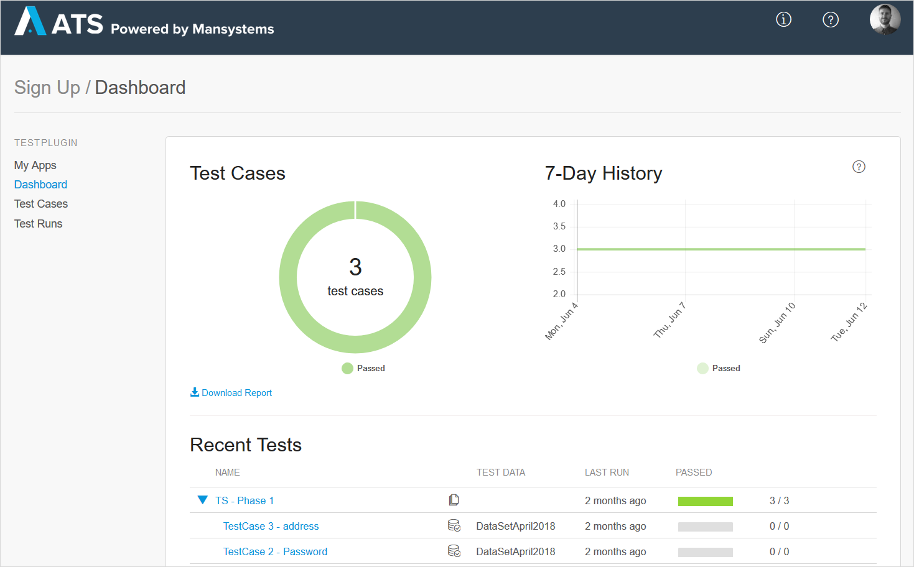

## 1 How Do Mendix Web Apps Work?

As discussed in the [How Does Mendix Support Multi-Channel Applications?](front-end#support-multi-channel) section of *Front-End*, a web app is one possible channel for Mendix applications. The Mendix Client is responsible for rendering web apps, which are rich single-page applications (SPA) based on JavaScript, HTML5, and CSS3.

Using the WYSIWYG page editor in the Mendix Modelers, users can model pages and interactions that can run locally or be deployed directly from the Modeler. When running locally, the changes are made visible directly. This is done with our **instant update** feature that instantly reloads the UI while preserving the current state, making testing and previewing apps a breeze.

When an app is deployed to the cloud, the static resources (HTML, CSS, JavaScript) are deployed on a front-facing server that caches and efficiently serves the resources. The main entry is the *index.html* page, which loads the Mendix Client, renders the page, and starts handling events. If authentication is needed, the end-user is redirected to either the login page or an identity provider. Mendix makes sure that there are no caching issues when deploying new versions by applying a cache-busting mechanism.

The Mendix JavaScript Client renders the UI, handles actions in the browser, and communicates through APIs via HTTPS with the Mendix Runtime. The rich client can perform many actions without the need to call the server, thus minimizing the number of (costly) server round-trips. Combined with our [client-side functionality](front-end#support-client-side-logic) and the fact that Mendix apps support browsers' back/forward functionality while complying with accessibility guidelines, you can efficiently model web apps that have excellent performance.

## 2 How Does Mendix Support Different Screen Sizes & Devices?

Mendix pages are responsive by default, so they automatically adjust to screen size. This results in web apps that look great out of the box on screen sizes from desktops to phones. For an optimized user experience, it is possible to define separate mobile web channels for phone and tablet. The device type (as in, phone, tablet, or desktop) can also be used in the logic for other scenarios.

<video controls src="attachments/Eval_Mobile_ResponsiveFormFactorsBuild_V2-2.mp4">VIDEO</video>

Mendix provides several common patterns and best practices per device to help you build great user experiences. You can also extend these patterns with custom variants, as discussed in [User Interface Design](ui-design).

## 3 How Can I Extend My Web App?

Both the *index.html* and login page can be fully customized to your needs. It is also possible to add additional resources like styling and images or to provide a [Web App Manifest](https://www.w3.org/TR/appmanifest/).

Mendix offers several options for extending web apps. These are discussed in the section [How Can I Extend the Mendix Front-End?](front-end#extend) of *Front-End* and the section [How Can I Customize the Look and Feel of My Apps?](ui-design#customize) of *User Interface Design*.

## 4 How Can I Test My Web App?

Mendix offers an integrated [Application Testing Suite (ATS)](https://docs.mendix.com/ats/), in which (non-technical) users can test web applications using recorded test scripts on multiple browsers and multiple devices.

{}

{}

It is also possible to use standard test tooling, like [Selenium](https://www.seleniumhq.org/). Because Mendix widgets have unique identifiers in the document object model (DOM), test tooling can easily leverage these IDs to create readable and robust test scripts.
