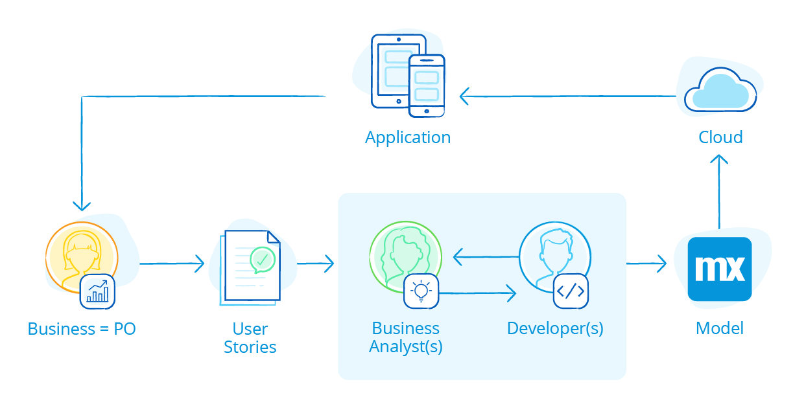

## 1 The BizDevOps Process {#bizdevops}

Mendix adopts a DevOps methodology with a high focus on business and IT collaboration, also known as a BizDevOps or DevOps 2.0. Mendix has optimized the BizDevOps approach for the low-code uses. This combination of changing the process to [BizDevOps ](#bizdevops) and using [low-code](#low-code) in this process results in a shorter feedback loop and [changes the roles](#changing-roles) within the software development process.

This section explains the concept of the BizDevOps process and compares this with other software development processes.

### 1.1 BizDevOps

BizDevOps encourages developers, operations staff, and business teams to work together so the organization can develop software more quickly, be more responsive to user demand, and ultimately maximize revenue. In this approach, not only does the business team set the requirements, they also work directly with the development team to set priorities for Agile software development sprints and backlogs. The development team becomes partners with the business side and works with business managers to solve problems and achieve business goals.

### 1.2 DevOps

DevOps is a software engineering culture and practice that aims at unifying software development (Dev) and software operation (Ops). The main characteristic of the DevOps movement is to strongly advocate automation and monitoring at all steps of software construction, from integration, testing, releasing to deployment and infrastructure management. DevOps aims at shorter development cycles, increased deployment frequency, and more dependable releases, in close alignment with business objectives. 

Compared to DevOps, the BizDevOps approach knocks down the silos between the DevOps teams (meaning, the development teams and operations staff) and the business teams.

### 1.3 Agile

The Agile methodology is adopted in the DevOps approach. The Agile methodology changed traditional Waterfall projects from a linear approach to an iterative, team-based approach to software development. This approach emphasizes the rapid delivery of an application in complete functional components per “time-boxed” phases called sprints. Each sprint has a defined duration with a running list of deliverables, planned at the start of the sprint. The Agile approach enables the business to review a minimal viable product (MVP), which is a product with just enough features to satisfy and enable the business to provide feedback for future development.

### 1.4 Traditional App Development

In Traditional App Development feedback could only be given on full working applications, instead of iterative approach in the Agile methodology. Compared to DevOps the teams, Traditional app development projects, development teams, operation teams, and business management teams all operated in silos instead of unifying software development (Dev) and software operation (Ops). 

The development team worked on the app (or better said, worked on the code before the introduction of low-code platforms), the operations team maintained the app after it was released, and the business management team reviewed the app, gave feedback, and set the requirements for new app development projects. In BizDevOps the business management team is so tight integrated in the process that they can be seen as partners of the development team.

## 2 The Low-Code Addition to BizDevOps {#low-code}

Mendix has optimized the BizDevOps approach for the use of low-code, resulting in a feedback loop of weeks, not months on the app under development. On a high level, the short feedback loop is ensured due to four factors of the Mendix Platform:

* **An integrated feedback mechanism** – The business can provide their feedback on the live app (minimal viable product) through a user friendly feedback mechanism, which is integrated with the Mendix Platform.
* **Team synergy **– The business analyst in the development team speaks the language of the business, can translate the requirements and feedback into user stories, and builds the functionality with the professional developer.
* **1 visual model** – With the Mendix low-code platform, the business analysts is enabled to visually build apps and work together with the professional developer's work on a common model, in a shared environment with ongoing real-time feedback. Any issues are quickly detected and resolved ensuring apps meet business and customer expectations with the first release.
* **1-click deployment** – The one-click deployment to the cloud ensures that the MVP can be released in minutes to enable the business to provide their feedback on the next iteration.

### 2.1 The Evolution of the Feedback Loop

This section will explain how the combination of the evolving processes and the involvement of low-code decreased the feedback loop process from an average of 12 months in traditional Waterfall projects to less than 1 month in low-code BizDevOps projects.

* **12 months, Waterfall** – Due to the bigger teams, the linear approach, and the fact that feedback could only be given on full working applications, the feedback loop in Waterfall projects reached up to 12 months.
* **6 months, Agile** – The iterative process—with providing feedback on an MVP instead of on a full working application—resulted in a 6-month feedback loop for Agile software development projects.
* **3 months, low-code DevOps** –  Instead of working on a big team with specialties in silos, the smaller size of development teams and the use of one-click deployment enables the business to give feedback on the MVP of features instead of the MVP of full applications (as is done in Agile). This results in a 3-month feedback loop.

* **1 month, low-code BizDevOps** – The involvement in the development team of the business analyst who understands the business and the integrated feedback mechanism (which pulls the business directly into the development process) enables the business to directly share their ideas with a development team who understand the requirements without having to first build the feature. This results in a 1-month feedback loop in low-code BizDevOps projects, saving 2 months compared to low-code DevOps projects.

## 3 Changing Roles in Low-Code and BizDevOps {#changing-roles}

There are three main roles involved in a core development team in Mendix low-code BizDevOps projects. 

The other roles that were traditionally part of the development process are involved too, as enablers of the project

The other roles that were traditionally part of the development process are involved too, as enablers of the project. They are often involved as an enabler and specialist over the complete program/portfolio of apps that are under development.

### 3.1 Three Roles in the Core Development Team

First of all, the business user has a key role in the BizDevOps process. The business user is as a product owner responsible for providing the input from the business in requirements or feedback on the app, and translating them into user stories. 

Next, the business analyst (who talks to the business) works together with a more technical developer to run the entire application delivery lifecycle, including the operations. The involvement of the business analyst is key in interpreting the requirements and feedback from the business correctly. In other words, they speak the same language to verify the UX/UI (pages) and business rules (logic). The technical developer is key to helping build the app and deliver tangible results.

This core development team runs the entire application delivery lifecycle without the direct help of a database expert, Java programmer, UX/UI expert, test engineer, project manager, or operations staff. All these roles are still important, especially in an enterprise-scale delivery of multiple applications. However, they are part of a higher level Center of Excellence, which is often spread between multiple Mendix application development teams.

### 3.2 Roles in Center of Excellence (CoE)

The roles in the Center of Excellence can be seen as enablers of multiple core development teams, delivering the specific knowledge needed to align the development of multiple apps from a performance, UX/UI, integration, architecture, or process perspectivsae.
