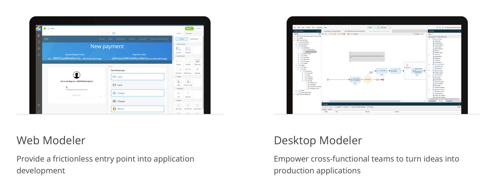
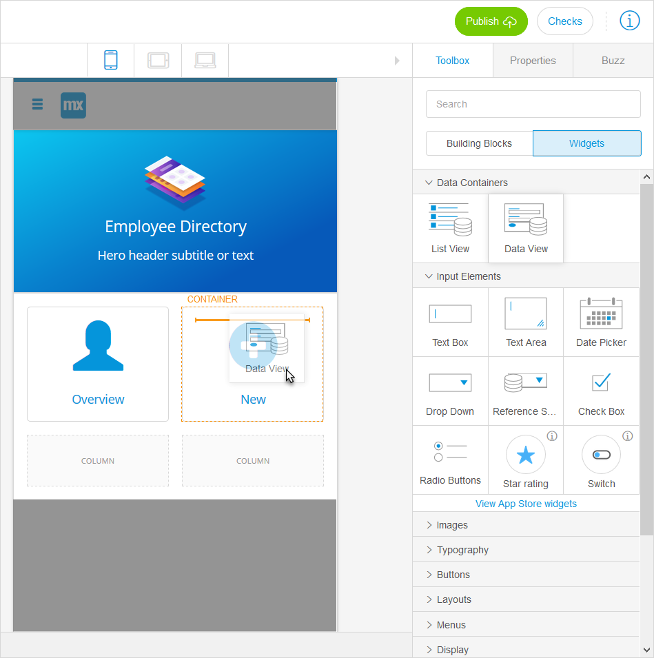
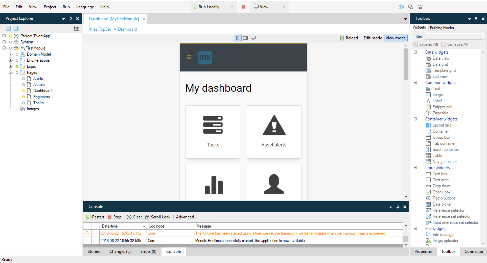

## 1 How does Mendix support the different developer profiles? {#developer-profiles}

The Mendix platform is designed for a variety of app developers. From business oriented developers without any software development skills to very experienced technical oriented developers with extensive software development skills and programming experience.

**[to be added: picture with the developer continuum]**

* Business Analysts and Business Developers can directly use the Mendix Web Modeler to build, review, and collaborate on an app. The Web Modeler provides the tools to build the app, no matter the user's programming experience or background. Users familiar with the Web Modeler can easily start using the Mendix Desktop Modeler too, if more advanced app features need to be added. The Modelers share the same concepts and terminology, which makes for a smooth user experience.
* Developers with a technical programming background (for example, in JavaScript, Java, or .NET) can use the Mendix Desktop Modeler along with CSS, Java and JavaScript to build, customize and extend an app.

For information on getting started with Mendix, have a look at [First Steps with Mendix](../evaluation-learning/getting-started) and [Skills & Training](../evaluation-learning/skills-training).

## 2 How Does Mendix Enable Model-Driven Development? {#enable}

The Mendix approach leverages model execution at runtime rather than generating code from the visual model (for example, Java or .NET). This is because generating code would immediately create tomorrow’s legacy. When running your application, Mendix transforms your app model automatically into a working software application by interpreting and executing it. This results in significant advantages over traditional code:

* **Easy accommodation** – Application changes can be easily accommodated. Since the model is the application, Mendix safeguards the compatibility of the application and the model. This means you will not spend unnecessary time on refactoring earlier code.
* **Controlled extensions** – As compared to the insertion of custom code into generated code, extending models with custom code is controlled more elegantly. This is because the model is aware of the custom code and includes it for consistency checks. Mendix’s model interpretation approach solves the fundamental round-trip problem of code generation, so changes in the model do not conflict with custom code extensions. This results in a consistently high quality in the applications you build with Mendix.
* **Monitoring and analyzing** – Monitoring and analyzing application behavior at runtime can be set up dynamically. No longer do you have a single shot at defining the monitoring parameters beforehand. You simply adjust parameters and introduce new ones as required. This results in higher up-time for your apps.

Application models consist of data models as well as UI, logic, and navigation documents as the main elements. You build these models visually using the Web Modeler and Desktop Modeler, which combine to deliver an integrated, low-code, and model-driven app development experience across a spectrum of users, from Business Analysts and professional Developers to the end-users.

## 3 How Can I Work with My Team Members on the Same App?

Business Analysts and Business Developers can work together on a single app model version in the Web Modeler. This means that all changes are directly available to all other Web Modeler users. The Web Modeler can also be used for stakeholders to review the app and place comments on the app pages, domain model, and microflow logic.

Developers using the Mendix Desktop Modeler can work together on the same app model via the [Team Server](version-control) version control repository. The models in the Web Modeler and Desktop Modeler environments can be brought in sync using Team Server. For detailed steps on how to manage this, see [How to Sync  the Web Modeler with the Desktop Modeler](https://docs.mendix.com/howto/web-modeler/syncing-webmodeler-desktop) in the Mendix documentation.

## 4 The Modelers
**[Adam: please make sure this picture is visible]**

While both the Web Modeler and Desktop Modeler environments support the ability to build data models, pages, and logic, their target audiences differ, and their features are tuned accordingly.

### 4.1 What Can I Do with the Web Modeler? {#web-modeler}

The Mendix Web Modeler is our collaborative, no-code, web-based application development environment. It enables Business Developers and users with minimal coding or software development experience to create engaging web and mobile applications without having to know how to code. With the Web Modeler's visual drag-and-drop interface for design, data, and logic, collaborative software development becomes accessible to a variety of stakeholders.

Business analysts and business developers use the Web Modeler to:

* Develop application user interfaces with styled building blocks and widgets
* Create domain models for reading and writing data in an application
* Visually model the interactions and flow control of an application
* Leverage the enterprise design language to create engaging apps that conform to company standards beyond branding and theming
* Collaborate and align with stakeholders both in Business and IT in a what-you-see-is-what-you-get environment, which is a key element of iterative software development

In short, the Web Modeler empowers them to solve problems collaboratively, creatively and quickly, maximizing the productivity of your organization and gaining higher end-user adoption.

{}

{}

### 4.2 What Can I Do with the Desktop Modeler? {#desktop-modeler}

The Mendix Desktop Modeler is our comprehensive low-code application development environment. It allows cross-functional teams to turn ideas into production applications. A range of developers—from the seriously experienced to those with little previous exposure to coding—can build applications from the ground up by adding complex logic and building sophisticated integrations to create enterprise-grade, transactional web and mobile applications.

The Desktop Modeler is designed for (experienced) Business Analysts and Developers to build applications from start to finish while they harness the power of collaborative software development. Users of the Desktop Modeler benefit from a wider set of functionality compared to the Web Modeler. Within the Desktop Modeler, you are able to build extensions, add integration to underlying systems, manage branch lines, and manage security. What is more, the Desktop Modeler consists of an extensive set of domain-specific languages and associated modeling tools, including the domain model, page editor, microflow editor, integrations, debugger, and security configuration.

### 4.3 How Can I Work Offline?

The Mendix Desktop Modeler has a **Work offline** mode in which you can continue modeling, running, and testing the app locally without the need of an internet connection. In this mode, all the changes are still stored in the local version repository. When you want to share the changes made with the rest of your App Team, you can go online again and commit to the [Team Server](version-control) version control repository.

While working offline, online services like the [Mendix App Store](https://appstore.home.mendix.com/index3.html), Team Server, and and app project stories in the Mendix Developer Portal are temporarily disabled.

### 4.4 How Can I Deploy and Test Locally?

Rapid development requires developers to test changes quickly, particularly where UX/UI is concerned. To achieve this, the Mendix Platform provides one-click deployment to the user's local machine. Local deployment works out of the box, no additional installation or configuration required. When deploying locally, a fully functional local working instance of the application with its own local SQL database is started.

The **Instant Update** feature in the Desktop Modeler provides the fastest way to quickly iterate on changes made in an app project. Only the changed parts of the app are pushed and updated to the locally running app, so you can directly test your change in the live app.

<video controls  src="attachments/instant-update.mp4">VIDEO</video>

You can even test changes locally without the need of an internet connection using `http://localhost:{dynamic variable port}`.

### 4.5 Which Operating Systems Do the Mendix Modelers Support? {#operating-systems}

Most Mendix Platform features are browser-based, including the Web Modeler. These features are available on Windows, MacOS, and Linux.

The Desktop Modeler is a Windows-based application, which can also be run in a virtual machine like Parallels on MacOS.
