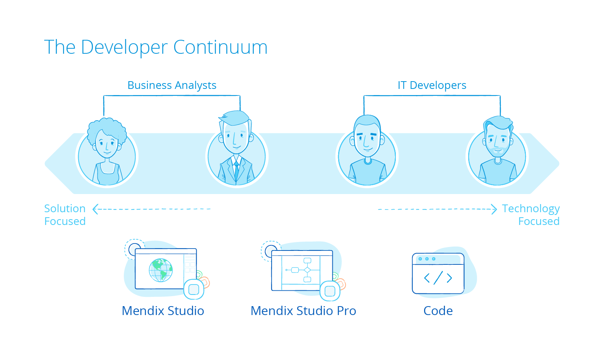
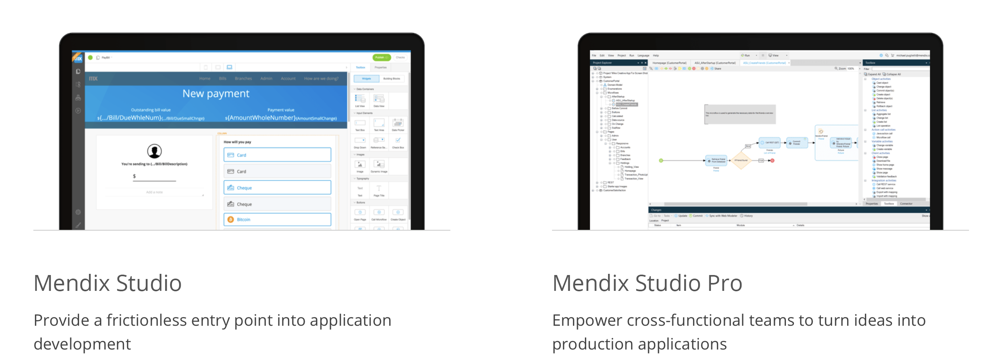

## 1 How Does Mendix Support Different Developer Profiles? {#developer-profiles}

The Mendix platform is designed for a variety of app developers, from business-oriented developers without any software development skills to very experienced technical developers with extensive software development and programming experience.

**Business Analysts** and **Citizen Developers** can directly use Mendix Studio to build, review, and collaborate on an application. Mendix Studio provides the tools to build the app, regardless of the user's programming experience or background. Getting started takes only a few minutes. Users familiar with Mendix Studio can also start using Mendix Studio Pro if more advanced app features need to be added, or involve a professional developer using Mendix Studio Pro to support them in adding these advanced features. Mendix Studio and Mendix Studio Pro share the same concepts and terminology, which makes for a smooth collaborative experience.

**Developers** with a technical programming background (for example, JavaScript, Java, or .NET) can use Mendix Studio Pro along with CSS, Java, and JavaScript to build, customize, and extend a Mendix app.

For information on getting started with Mendix, have a look at [First Steps with Mendix](../evaluation-learning/getting-started) and [Skills & Training](../evaluation-learning/skills-training).

## 2 How Can I Work with My Team Members on the Same App?

**Business Analysts** and **Citizen Developers** can work together on a single app model version in Mendix Studio. This means that all changes are directly available to all other Mendix Studio users. Mendix Studio can also be used for stakeholders to review the application and place comments on the app pages, domain model, and microflow logic.

**Developers** using Mendix Studio Pro can work together on the same app model via the [Team Server](version-control) version control repository. Changes from other team members using Mendix Studio or Mendix Studio Pro can be retrieved via the Team Server. For more details, see [Collaborative Development](https://docs.mendix.com/refguide/collaborative-development) in the *MendixStudio Pro Guide*.

## 3 How Does Mendix Enable Model-Driven Development? {#enable}

While both Mendix Studio and Mendix Studio Pro environments support the ability to build data models, pages, and logic, their target audiences differ, and their features are tuned accordingly.

### 3.1 What Can I Do with Mendix Studio? {#studio}

Mendix Studio is our collaborative, no-code, web-based application development environment. It enables citizen developers and people in the business with minimal coding or software development experience to create engaging web and mobile applications without having to know how to code. With Mendix Studio's visual drag-and-drop interface for design, data, and logic, collaborative software development becomes accessible to a variety of makers who do not sit in IT.

These makers add value in three ways using Mendix Studio:

1. They help to bridge the requirements gap by building functional app prototypes that serve to validate ideas with business stakeholders. This happens before professional developer teams are involved to complete the application. 
2. They contribute lightweight changes to existing apps (for example, operating as app users improving the user interface themselves). This saves professional developers a lot of time while ensuring the right business outcomes. 
3. They build simple business applications from start to finish themselves. Some processes are vastly improved by a simple web app, built by the person who best knows the process.

Business analysts and citizen developers use Mendix Studio to do the following:

* Develop application **user interfaces** with styled building blocks and widgets
* Create **domain models** for reading and writing data in an application
* Visually model the **interactions and flow control** of an application
* Leverage an **enterprise design language** to create engaging apps that conform to company standards beyond branding and theming
* Foster **collaboration and alignment with stakeholders in business and IT** via a what-you-see-is-what-you-get environment, which is a key element of iterative software development

In short, Mendix Studio empowers these users to solve problems collaboratively, creatively, and quickly, maximizing the productivity of your organization and gaining higher end-user adoption.

{}

{}

### 3.2 What Can I Do with Mendix Studio Pro? {#studio-pro}

Mendix Studio Pro is Mendix's comprehensive low-code application development environment that allows cross-functional teams to turn ideas into production applications. A range of developers—from the seriously experienced to those with little previous exposure to coding—can build applications from the ground up by adding complex logic and building sophisticated integrations to create enterprise-grade, transactional web and mobile applications.

Mendix Studio Pro is designed for (experienced) business analysts and developers to build applications from start to finish while they harness the power of collaborative software development. Users of Mendix Studio Pro benefit from a wider set of functionality compared to Mendix Studio.

Within Mendix Studio Pro, you are able to build extensions, add integration to underlying systems, manage branch lines, and manage security. What is more, Mendix Studio Pro consists of an extensive set of domain-specific languages and associated modeling tools, including the domain model, page editor, microflow editor, integrations, debugger, and security configuration.

{}

{}

### 3.3 How Can I Work Offline?

Mendix Studio Pro has a **Work offline** mode in which you can continue modeling, running, and testing the app locally without an internet connection. In this mode, all the changes are still stored in the local version repository. When you want to share the changes made with the rest of your app development team, you can go online again and commit to the [Team Server](version-control) version control repository.

While working offline, online services like the [Mendix App Store](https://appstore.home.mendix.com/index3.html), Team Server, and and app project stories in the Mendix Developer Portal are temporarily disabled.

### 3.4 How Can I Deploy & Test Locally?

Rapid development requires developers to test changes quickly, particularly where UX/UI is concerned. To achieve this, the Mendix Platform provides one-click deployment to the user's local machine. Local deployment works out of the box, no additional installation or configuration required. When deploying locally, a fully functional local working instance of the application with its own local SQL database is started.

The **Instant Update** feature in Mendix Studio Pro provides the fastest way to quickly iterate on changes made in an app project. Only the changed parts of the app are pushed and updated to the locally running app, so you can directly test your change in the live app.

<video controls  src="attachments/instant-update.mp4">VIDEO</video>

You can even test changes locally without the need for an internet connection using `http://localhost:{dynamic variable port}`.

### 3.5 Which Operating Systems Do Mendix Studio and Mendix Studio Pro Support? {#operating-systems}

Most Mendix Platform features are browser-based, including Mendix Studio. These features are available on Windows, MacOS, and Linux.

Mendix Studio Pro is a Windows-based application, which can also be run in a virtual machine like Parallels on MacOS.
