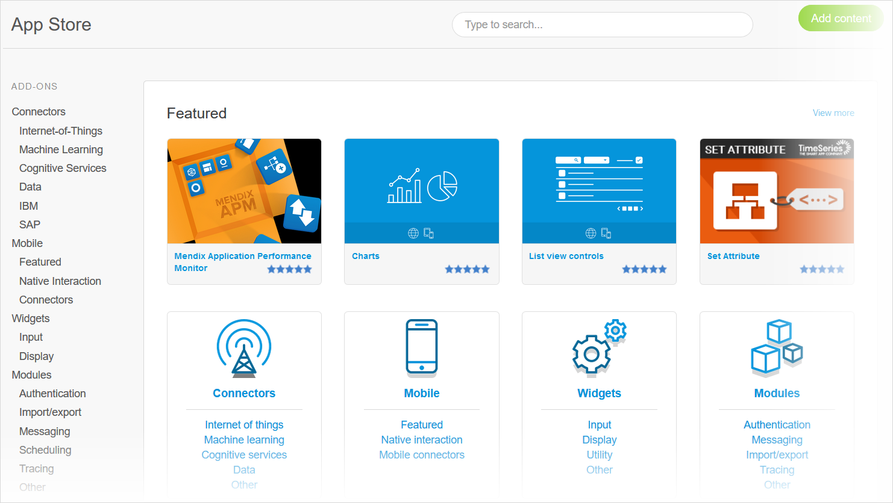
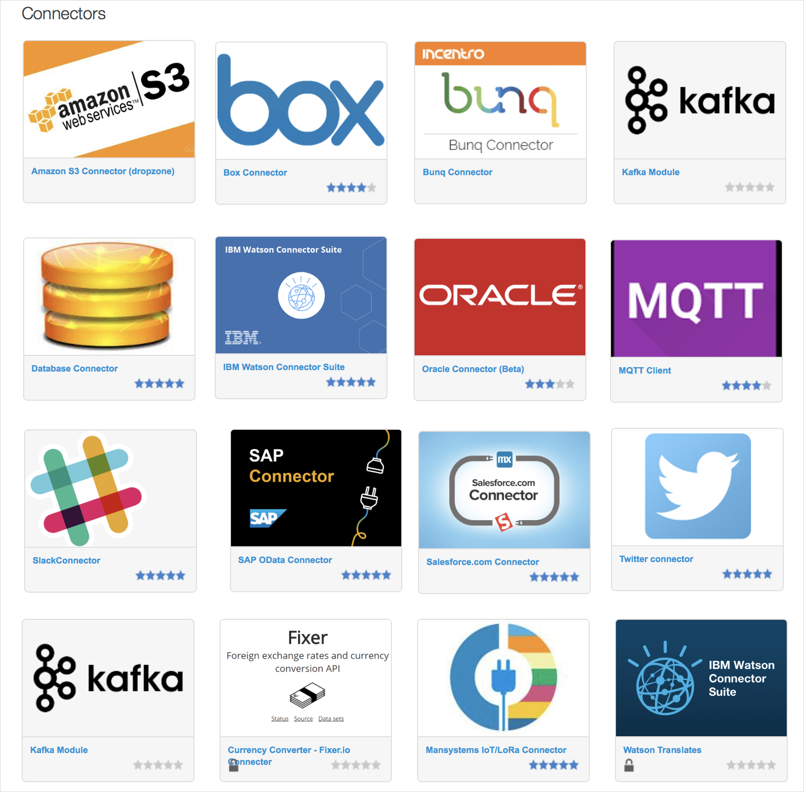
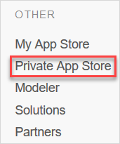

## 1 What Are the Platform Capabilities of the Mendix App Store?

The Mendix Platform is integrated with the [Mendix App Store](https://appstore.home.mendix.com/index3.html), which is full of components built by both Mendix and the Mendix community. There is a Public App Store for apps and application components, and a Private App Store where companies can internally share apps and application components.

The App Store is fully integrated in both Mendix Studio Pro and Mendix Studio. Users can directly search for and implement reusable components in their applications.

For more information, see [App Store Overview](https://docs.mendix.com/developerportal/app-store/app-store-overview) in the *Mendix Developer Portal Guide*.

{}

{}

## 2 What Types of Reusable Components Are Available in the Mendix App Store?

For developers, the Mendix App Store offers a rich repository of reusable components that can significantly accelerate development productivity. These components are shared in the Mendix community as open-source components or commercial products.

The Mendix App Store is directly accessible from Mendix Studio Pro, where app store components can be loaded into the project model with a single click. The components are presented in the categories described below.

### 2.1 Connectors {#connectors}

A connector is a Mendix App Store component that contains microflow activities that can directly be used in your app logic to connect to external systems. For example, the [IBM Watson Connector Suite](https://appstore.home.mendix.com/link/app/2860/) contains microflow activities to translate text to speech or to analyze an image, or the [OData Connector for SAP solutions](https://appstore.home.mendix.com/link/app/74525/) to connect to any SAP system.

{}

{}

### 2.2 Widgets

A Mendix widget is a part of your Mendix app's UI that enables functionality and interaction with users of the app. The widget is a page element used to display (visual) information on the page and to provide additional page interactions, like swipe controls or form-based fields.

The Mendix Platform provides several dozen widgets out of the box, and additional widgets are available from the Mendix App Store. A full overview of Mendix-supported widgets is shown on the [Mendix Atlas UI site](https://atlas.mendix.com/p/widgets).

In addition to the widgets provided by Mendix, any developer can build additional custom widgets and upload these to the Mendix App Store. A custom widget can alter the interface, data, and images of the app as well as the way the app works. For details on creating a custom widget, see the [Make Custom Widgets](https://docs.mendix.com/howto/extensibility/widget-development) how-to's in the *Mendix Studio Pro How-to's*.

### 2.3 Modules

A module is a self-contained application component that can be reused in multiple applications. Modules can be downloaded from the Mendix App Store into a project as a local copy. By doing this, the module becomes part of the project scope and is maintained through its lifecycle as part of the application project.

A module typically consists of a domain model, user interfaces, and microflows. Although technically identical, the following types of modules can be distinguished:

* Functional business modules (for example, [PostalCodeHousenumber](https://appstore.home.mendix.com/link/app/105751/) for discovering street addresses)
* Integration connectors (for example, the [Excel Importer](https://appstore.home.mendix.com/link/app/72/))
* Technical module (for example, [Audittrail](https://appstore.home.mendix.com/link/app/138/) for audit logging)

## 3 How Can I Share Private Reusable Components in My Company?

The Mendix App Store can be used as a private enterprise app store so that project teams can discover the reusable components (like connectors, widgets, styling, and starter apps) that are accessible to them within their organization.

The Mendix App Store supports the distribution of private company-only content. Any other user in your company can search for and use this private content from the App Store. Private content is always marked as "Company only" so that it is clear what is publicly and privately available.
