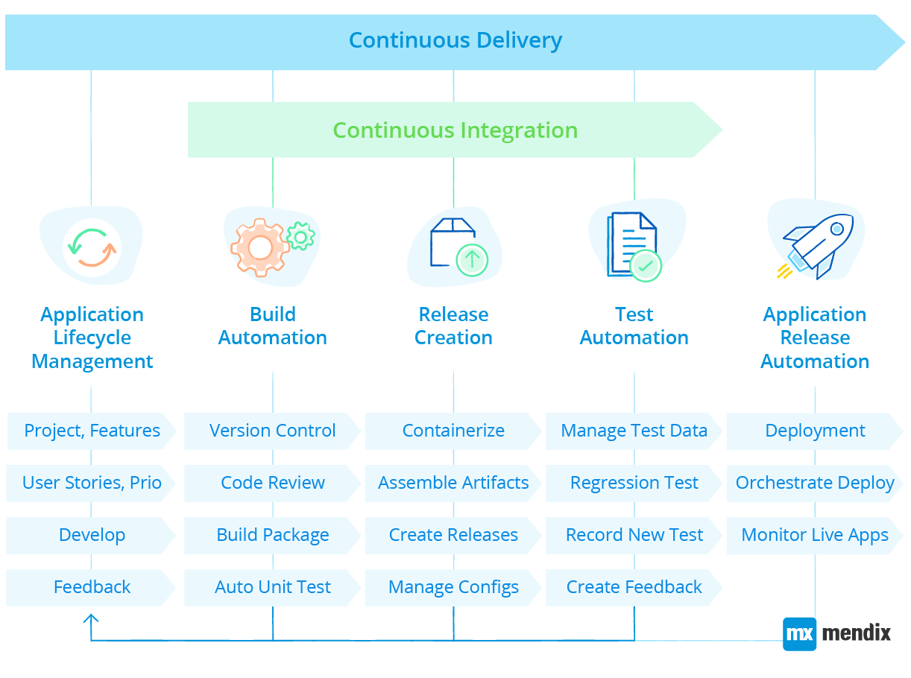
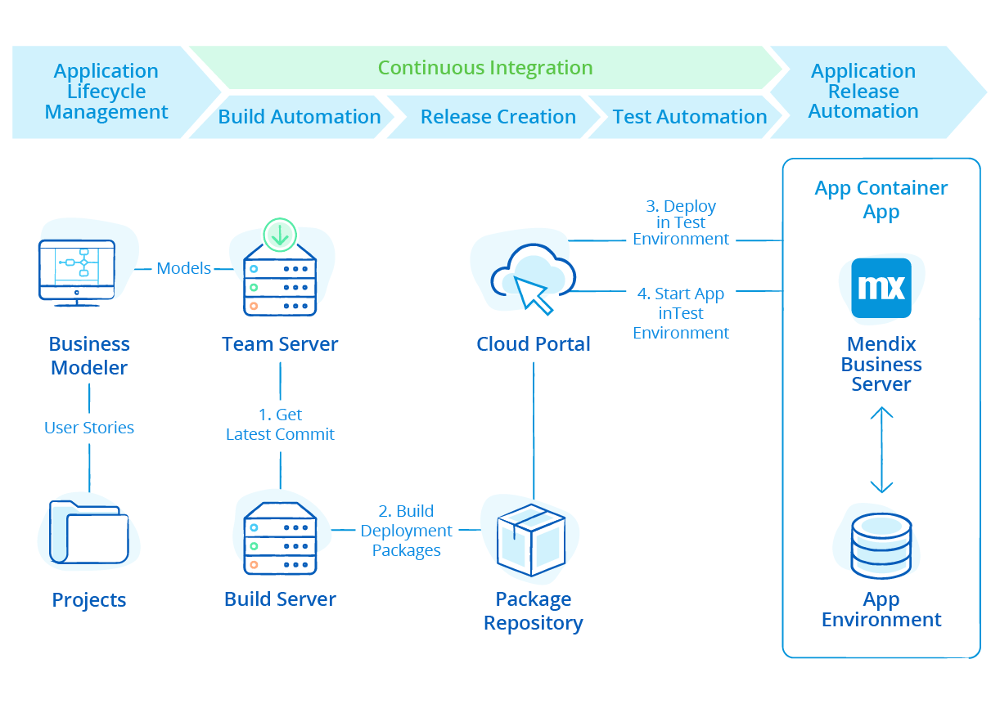
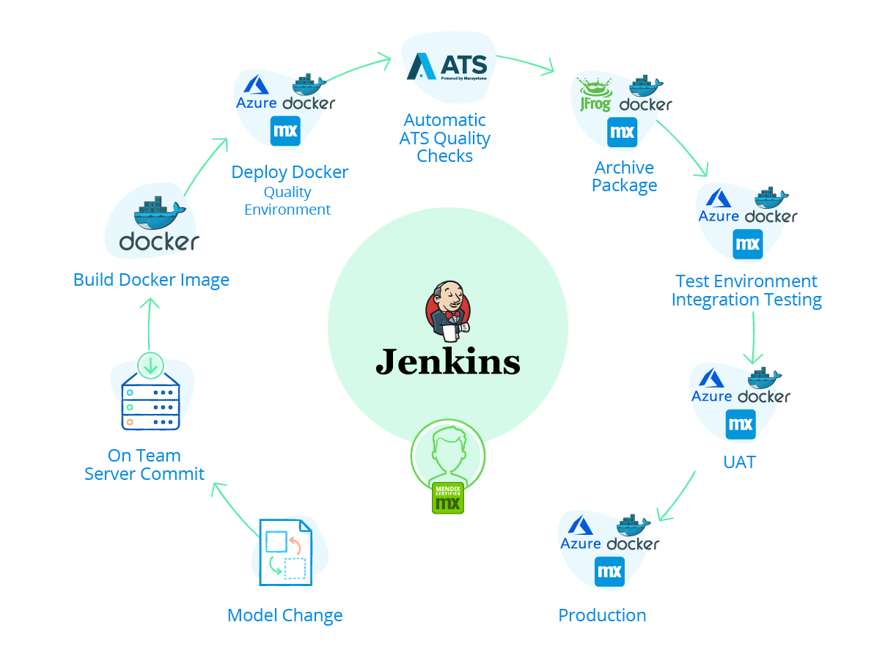

## 1 How Does Mendix Support Continuous Integration & Delivery (CI/CD)? {#support-cicd}

Continuous integration and continuous delivery (CI/CD) is supported both in the Mendix Developer Portal and via the platform APIs. The platform APIs enable [integrating with external tools](devops-overview#devops-tools) to build a delivery pipeline using products like [Jenkins](https://github.com/mendix/azure-kubernetes-cicd-reference-impl) and [Visual Studio Team Services](https://github.com/mendix/azure-kubernetes-cicd-reference-impl-vsts) coupled with container technologies like Cloud Foundry, Kubernetes, and Docker and quality assurance services like Mendix Application Test Suite (ATS), Mendix Application Quality Monitor (AQM), and Selenium.

The Mendix Platform’s support for CI/CD facilitates the rapid development and deployment of applications, enabling organizations to ship multiple code revisions through one or more test environments and into production environments daily (if required). This reduces risk and cost through automation and standardization, and it enables DevOps and microservices.

The core of the Mendix Platform provides all the tooling required to continuously integrate model revisions. Revisions are committed to the [Team Server](version-control) version control repository, where they are merged with the latest revision of the model and assigned to the relevant user stories and test cases.

At any point and with a single click, a model revision can be versioned and pushed to the Mendix Build Server, packaged, and moved to staging before it is deployed to test. At that point, the platform’s built-in ATS system will run functional testing based on test cases defined against user stories.

The tested deployment packages can then be promoted to production (via further acceptance environments, if required) with two-factor authentication. Finally, applications are monitored using the platform’s built-in monitoring tools and feedback loops to complete the delivery pipeline.

Through automation with the Mendix Platform APIs, each of these functions can be automated into a continuous integration pipeline.

## 2 How Can I Integrate Automated Tests of My Mendix Apps in My CI/CD Pipeline?

As part of the CI pipeline, testing can be fully automated. To implement unit tests, you can use the [UnitTesting](https://appstore.home.mendix.com/link/app/390/) module, which is available in the Mendix App Store. In addition, testers and developers alike can use the [Mendix Application Test Suite](https://docs.mendix.com/ats/), a Selenium-based test service for automated UI testing. Third-party testing tools and services can also be used to integrate with the CI pipeline.

For more details, see [Testing](test-automation-qa).

## 3 How Can I Use My Own CI/CD Tooling with Mendix? {#cicd-other-tools}

The Mendix Platform comes with an extensive range of APIs to help developers integrate the platform into their existing DevOps pipeline. With tools for CI/CD like [Jenkins](https://github.com/mendix/azure-kubernetes-cicd-reference-impl), [Visual Studio Team Services](https://github.com/mendix/azure-kubernetes-cicd-reference-impl-vsts), GitLab-CI, and Bamboo, you can leverage these APIs to build, test, and deploy applications automatically. These apps can be deployed on any public or private cloud or on premises, using either Docker or a Cloud Foundry container, and they can run on any container platform like Kubernetes or Cloud Foundry.

The following APIs are available to enable the external promotion of model revisions to all Mendix environments from outside the platform:

* [Team Server API](https://docs.mendix.com/apidocs-mxsdk/apidocs/team-server-api) – allows you to retrieve the information (branches, revisions) of application models stored on the Team Server
* [Build API](https://docs.mendix.com/apidocs-mxsdk/apidocs/build-api) – allows you to manage and create new deployment packages using the Mendix Build Server
* [Deployment API](https://docs.mendix.com/apidocs-mxsdk/apidocs/deploy-api) – allows you to manage application environments in the Mendix Cloud – you can retrieve the app status, start and stop apps, and deploy and transport new model versions to app environments

