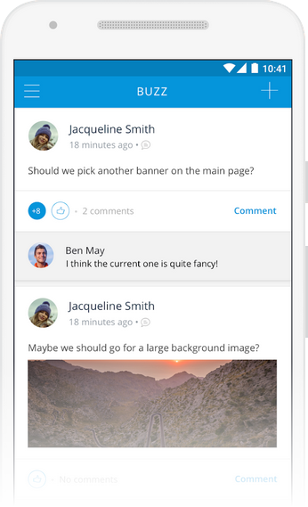
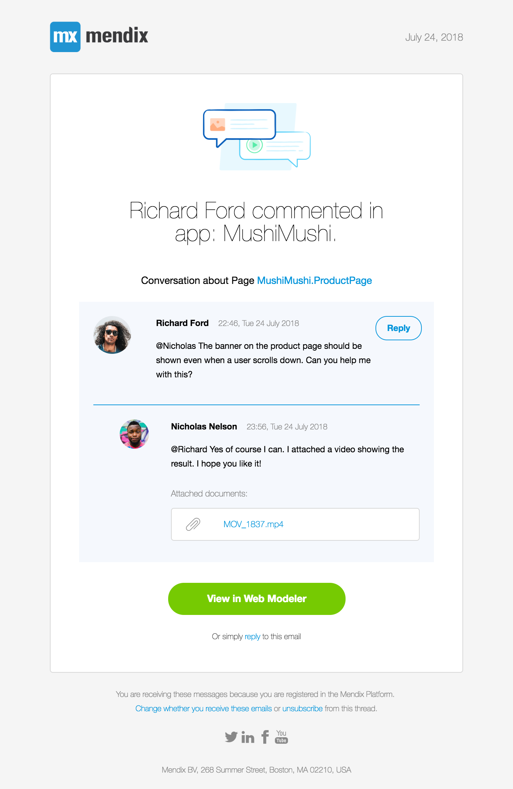

## 1 How Does Mendix Enable Active Stakeholder Involvement? {#stakeholder-involvement}

The Mendix Developer Portal is the central point for the development of Mendix app projects. Each app has its own central project space, where the development team and their stakeholders can collaborate. This project space provides [backlog management](requirements-management#requirements-management), Sprint planning and [user feedback management](feedback-management#feedback-management), development-oriented [DevOps features](devops-overview), and a central social channel, which is the [Buzz](https://docs.mendix.com/developerportal/collaborate/buzz). The Buzz can also be accessed through the [Mendix mobile app](#mxapp).

The Mendix Platform provides various channels of engagement for different stakeholders:

* Developer Portal
* Mendix Studio and Mendix Studio Pro (IDE)
* Mendix mobile app
* Notification emails
* Buzz

### 1.1 How Can Stakeholders Get Involved via the Mendix Developer Portal?

The [Mendix Developer Portal](https://docs.mendix.com/developerportal/) is where stakeholders can collaborate and perform requirements management. This is usually the place where product managers, product owners, and similar roles specify user stories, review feedback, prioritize the backlog, and provide their input to the development team through the Buzz.

{}

{}

Stakeholders can post updates, comments, and photos as well as upload documents and publish polls. All the updates can be posted both to a company-wide Buzz channel as well as to project-specific Buzz channels.

### 1.2 How Can Stakeholders Get Involved via the Mendix IDE?

Developers are usually found working on stories in an active Sprint. In [Mendix Studio Pro](app-development#studio-pro), the active stories are displayed right inside the IDE. Developers can mark stories as complete when committing their changes.

Communication between the developers on a development team is also integrated into the IDE. For instance, in [Mendix Studio](app-development#studio), team conversations are available in a side panel showing the [Buzz](https://docs.mendix.com/developerportal/collaborate/buzz). This enables in-context collaborative modeling, ruling out any room for misinterpretation of comments made, as shown here:

<video controls src="attachments/buzz-in.mp4">VIDEO</video>

### 1.3 How Can Stakeholders Get Involved via the Mendix Mobile App? {#mxapp}

The [Mendix mobile app](https://docs.mendix.com/refguide/getting-the-mendix-app) enables development teams to closely collaborate with stakeholders on app development in general and mobile app development in particular.

Developers can [preview and test their app](../app-capabilities/hybrid-mobile-apps#mxapp-preview) on their device (without having to use services like Test Flight) or publish apps to the public app stores. Once it is loaded into the Mendix mobile app, [the app under development can be shared](../app-capabilities/hybrid-mobile-apps#mxapp-share) with other developers, key end-users, and stakeholders, who can then provide feedback through the Mendix Feedback Widget. End-users can preview an app under development with the Mendix mobile app as well as follow the Buzz.

Any developer, product manager, key end-user, or other stakeholder collaborating on app development with Mendix can easily take part in the conversation around the development of the app at any time with the Buzz functionality in the Mendix mobile app.

{}

{}

### 1.4 How Can Stakeholders Get Involved via Email Notifications?

All the users involved in a Mendix application project receive relevant and timely email notifications for the Buzz and other updates of interest. This includes responses to submitted feedback items and status changes (for example, feedback items that have been completed).

{}

{}

### 1.5 How Can Stakeholders Get Involved via the Central Buzz? {#buzz}

The central Buzz in the Developer Portal and Mendix mobile app brings all platform activity together in a single feed. For example, updates to user stories in projects are visible here, so that users have a single view in which all their workflows across various app projects come together.

## 2 How Do I Invite Users & Other Stakeholders to Collaborate with the Development Team?

You can easily invite new team members to the extended development team. Users are authorized for this action based on their user role as part of the role-based access control model.

When you are invited to collaborate on an application project, you receive an invitation email from the Mendix Platform. This invitation contains a link to the platform with which you can immediately access the app project space to which you were invited.

If you receive an invitation but do not yet have a Mendix account, the Mendix Platform will provide you with a signup form to complete. You can then start with an [onboarding experience through which you quickly learn the ins and outs of Mendix](../evaluation-learning/getting-started#where-do-i-start), after which you can start collaborating with the development team on their application project.

<video controls src="attachments/DO_InviteUserToProject-1.mp4">VIDEO</video>

## 3 How Can I Manage the Access of Different Users to My App Project Resources?

Application development project resources are centrally managed from the Mendix Developer Portal with an advanced role-based access control model. Users can have different roles, which can be configured to allow for various levels of access to project resources. For example, some users might be allowed to make changes to the product backlog, while others might get access to the app model in the Team Server repository.

{}

{}

By default, Mendix provides a set of sensible user roles, such as **Scrum Master**, **Business Engineer**, **Product Owner**, **Application Operator**, and **End User**. These roles can be modified to suit your particular organization's access management requirements.

For more information on team roles, see [Company & App Roles](https://docs.mendix.com/developerportal/company-app-roles/) in the *Mendix Developer Portal Guide*. And for more details on general Mendix Platform security specifications, see [Platform Security](../enterprise-capabilities/platform-security).
