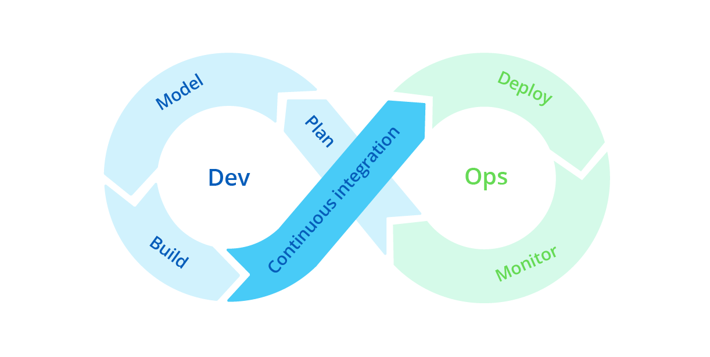
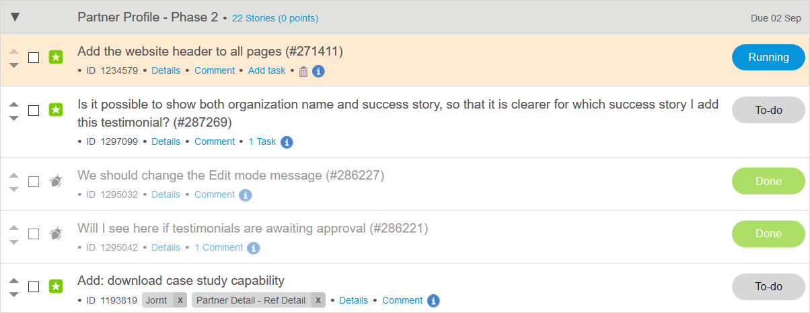
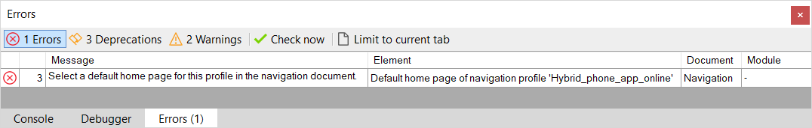
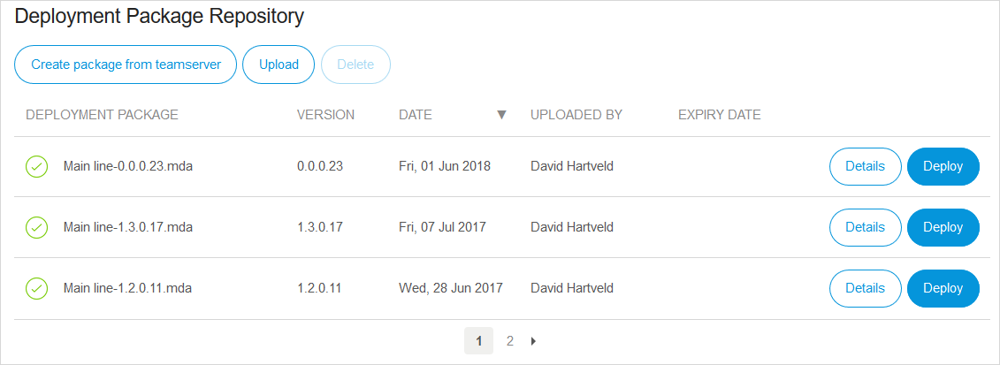
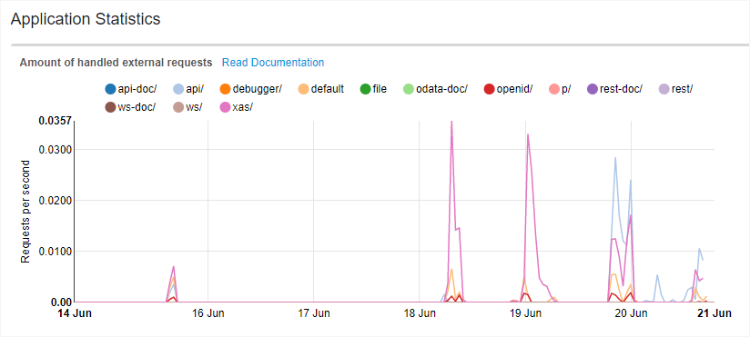

## 1 How Does Mendix Support DevOps? {#support-devops}

The Mendix Platform enables development teams to embrace the DevOps way of working. This means that  a single team can both develop applications and maintain and support those apps in production while adhering to enterprise requirements (for compliancy or high availability, for example).

With [one-click deployment](https://docs.mendix.com/developerportal/howto/deploying-to-the-cloud#5-deploying-a-free-app-to-the-mendix-cloud) and out-of-the-box monitoring for all apps, the Mendix Platform provides the basis for development teams to adopt DevOps practices. In addition, the Mendix [Platform APIs](https://apidocs.mendix.com/) enable development teams to complement the capabilities of the Mendix Platform with their third-party DevOps tools of choice.

Through the same APIs, teams can implement CI/CD pipelines on top of the Mendix Platform to fully automate their DevOps processes, including the build, test, and release steps. Documentation and reference implementations for the most commonly used tools are available (for details, see [Can I Use My Own DevOps Tools with Mendix?](#devops-tools) below).

To go deeper into how Mendix supports DevOps, see these featured questions:

* [How Does Mendix Support Continuous Integration and Delivery (CI/CD)?](cicd#support-cicd)
* [What Mendix Tools Are Available for Test Automation & Quality Assurance?](test-automation-qa#qa-tools)

## 2 Which DevOps Tools Does Mendix Provide Out of the Box?

Many tools and services considered standard for DevOps are either available out of the box with Mendix or are fully automated in the platform. For example, during the **Model** phase, app model [consistency checking](model-consistency) is done continuously while you are building your app model. And in the **Deploy** phase, the staging, configuration, and deployment of an app to test, acceptance, and production environments is only a matter of clicks in the Mendix Developer Portal.

### 2.1 Planning Phase

Mendix makes it easy to manage the requirements of different stakeholders for your apps. In the [Mendix Developer Portal](https://sprintr.home.mendix.com/), development teams can set up their app project backlogs. As part of the DevOps process, a team regularly schedules user stories from their backlog to improve their operational processes.

For more details on how Mendix helps development teams to manage their requirements and project backlogs, see [Agile Project Management](requirements-management).

### 2.2 Modeling Phase {#modeling-phase}

During development, Mendix helps development teams to efficiently develop (or *model*) high-quality application models. An app model is continuously checked for consistency errors while the user is working in the Mendix Desktop Modeler or Web Modeler. These consistency checks ensure model integrity and immediately catch many of the mistakes users can make.

Compared to other development tools, this makes users more efficient and reduces the number of accidentally introduced regressions. For more details, see [Consistency Checks](model-consistency).

To ensure that the apps being developed have consistently high-quality app models with limited technical debt, development teams use the [Mendix Application Quality Monitor (AQM)](https://docs.mendix.com/aqm/) to continuously monitor the quality of their app models. AQM provides development teams with deep insight into the technical quality of their app models, so that they can stay in control of technical debt.  For more details, see the section [Quality Monitoring](quality-monitoring#quality-monitoring) in *App Build Creation*.

For further information on developing Mendix apps, see [Developing in Mendix](developing-in-mendix).

### 2.3 Building Phase

Mendix users commit the changes they make to their app models to the Mendix Team Server, which is a fully fledged and managed version control system based on Subversion. From any commit on any branch, you can create a deployment package. This is then stored in the Mendix Deployment Package Repository, where developers can manage all Mendix artifacts.

For details on how to version your app models, create deployable artifacts, and manage those artifacts, see [App Build Creation](building-your-app).

### 2.4 Continuous Integration (CI/CD)

Continuous integration and continuous delivery (CI/CD) is supported both in the Mendix Developer Portal and via the platform APIs. The platform APIs enable [integrating with external tools](#devops-tools) to build a delivery pipeline using products like Jenkins and Selenium coupled with container technologies like Cloud Foundry, Kubernetes, and Docker.

As part of the CI pipeline, testing can be fully automated. To implement unit tests, you can use the [UnitTesting module](https://appstore.home.mendix.com/link/app/390/), which is available in the Mendix App Store. In addition, testers and developers alike can use the [Mendix Application Test Suite](https://docs.mendix.com/ats/), a Selenium-based test service for automated UI testing. Third-party testing tools and services like Selenium, JMeter, and Gatling can also be integrated in the CI pipeline.

For more information, see [Continuous Integration](cicd) and [Testing](test-automation-qa). And for details on using third-party testing tools, see the section [How Does Mendix Support Third-Party Testing Tools?](test-automation-qa#third-party) in *Test Automation & Quality Assurance*.

### 2.5 Deploying Phase

During development with the Desktop Modeler, you can run your application locally on your machine while you are experimenting with the development of new features. And in addition to publishing apps in the Mendix Cloud, you can run your app locally when you do not want to share your app with others stakeholders yet.

<video controls src="attachments/run-locally.mp4">VIDEO</video>

From both the Desktop Modeler and Web Modeler, you can easily publish your app directly in the Mendix Cloud with a single click. This immediately makes the app available as a Free App for up to 10 users, either for development or production use.

<video controls src="attachments//MA_SandboxDeployment.mp4">VIDEO</video>

Once the development team is satisfied with the version of the app that is running in development, the Mendix Developer Portal allows users to quickly stage the app to the test and acceptance environments before it is finally released to the production environment.

Deployment operations can be easily automated by the development team through [platform APIs](https://apidocs.mendix.com/) and with third-party CI/CD tools like Jenkins, GitLab-CI, or Visual Studio Team Services.

For more details, see [Operations, Deployment, and Release](ops-deployment-release).

### 2.6 Monitoring Phase

The Mendix Platform provides out-of-the-box monitoring capabilities that give insight into the health and status of all your Mendix apps running in the Mendix Cloud. Development teams will find that the essential [trend graphs](https://docs.mendix.com/developerportal/operate/trends-v4), [alerting functionality](https://docs.mendix.com/developerportal/operate/monitoring-application-health), and [live logging](https://docs.mendix.com/developerportal/operate/logs) features make it very easy to operate and monitor Mendix apps after deployment.

Developers can do advanced problem diagnosis and performance monitoring of their Mendix apps with [Mendix Application Performance Monitor (APM)](https://docs.mendix.com/apm/).

For an overview of the features available for development teams to run apps with enterprise-grade service levels, see [Monitoring](monitoring-alerts).

## 3 Can I Use My Own DevOps Tools with Mendix? {#devops-tools}

Development teams that like to use third-party tools for certain tasks can integrate those with the Mendix Platform through the [Mendix Platform APIs](https://apidocs.mendix.com/). For example, continuous integration services like [Visual Studio Team Services](https://github.com/mendix/azure-kubernetes-cicd-reference-impl-vsts), [Jenkins](https://github.com/mendix/azure-kubernetes-cicd-reference-impl), or  [GitLab-CI](https://about.gitlab.com/features/gitlab-ci-cd/) can be easily configured as CI pipeline orchestrators on top of the Mendix Platform.

You can use application performance management services like [Datadog](https://www.datadoghq.com/), [New Relic](https://docs.mendix.com/howto/monitoring-troubleshooting/manage-application-performance-with-new-relic), and [AppDynamics](https://docs.mendix.com/howto/monitoring-troubleshooting/manage-application-performance-with-appdynamics) to monitor and manage the performance of Mendix apps.

For more details, see [CI/CD](cicd) and [Monitoring Solutions & Alerts](monitoring-alerts).
