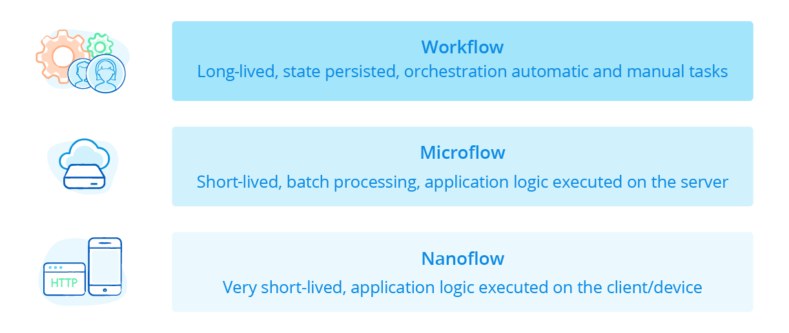
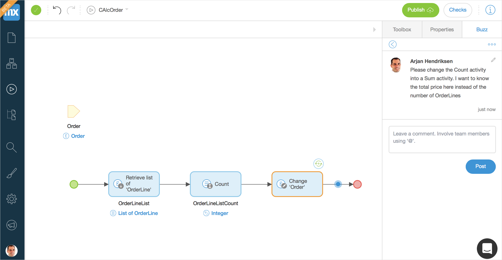
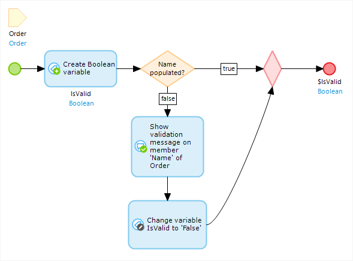

## 1 How Can I Add Logic to My App?

Application logic is created in Mendix in the form of nanoflows and microflows. These are visual ways of expressing what traditionally ends up in functions or methods of programming code. In other words, microflows and nanoflows allow you to easily and visually add complex business logic to the processes in your application without having to write code.

The following table presents the differences between nanoflows and microflows along with the use cases applicable to each:

| Use Case                                                     | Nanoflows                | Microflows                                                 |
| ------------------------------------------------------------ | ------------------------ | :--------------------------------------------------------- |
| Run on                                                       | Client (browser/device)  | Server                                                     |
| Language                                                     | JavaScript               | Java /Scala                                                |
| Offline mobile apps                                          | Supported                | Not available                                              |
| Security                                                     | Executed in user context | Default executed in system context (user context possible) |
| Transactions                                                 | Every call a transaction | Single transaction                                         |
| Execution of actions in the client (for example, close page) | Directly                 | After microflow is executed                                |

## 2 How Can I Make Sure the Logic Fits My Business Needs?

Mendix is all about the collaboration between business and IT, and the visual nature of microflows and nanoflows, business-minded users can gain insight into how an application is designed. That means all extended development team members can have the necessary discussions about what the logic should do.

Mendix Studio has review capabilities built in, which business users can utilize to review specific microflows describing the business logic. While reviewing that logic, such users can inspect what the logic does in a familiar visual language. They can also add comments on the microflow to describe the changes required to meet business requirements. This results in a very short feedback loop, leading to better products and lower costs.

{}

{}

## 3 How Do I Build Client-Side Logic?

Nanoflows are used to build client-side logic (for example, mobile app logic). Using nanoflows makes it possible to support offline logic and low latency, which results in super fast apps that are offline-capable. For detailed information, see the section [How Does Mendix Support Client-Side Logic?](../app-capabilities/front-end#support-client-side-logic) in *Front-End*.

In addition, Mendix provides a mechanism for extending the front-end with custom logic and visualization via the creation of custom widgets. Learn more in the section [How Can I Extend the Mendix Front-End?](../app-capabilities/front-end#extend) in *Front-End*.

## 4 How Do I Build Server-Side Logic?

Microflows and business rules are used to build server-side logic, because microflows allow you to express the logic of your application. A microflow can perform actions like creating and updating objects, showing pages, making choices, and connecting to external systems.

A microflow is composed of the following element types:

* **Events** represent the start and end points of a microflow and the special operations in a loop
* **Input parameters** provide the microflow with input from its context
* **Activities** are actions that are executed in a microflow
* **Connectors** can be downloaded from the [Mendix App Store](https://appstore.home.mendix.com) to connect your app to other systems
* **Flows** form the connection between elements
* **Splits** enable making choices and merging different paths again
* **Error handlers** can be set on an activity, split, or loop to define how to handle an error

For more information, see [Microflows](https://docs.mendix.com/refguide/microflows) in the *Mendix Studio Pro Guide*.

{}

{}

A rule is a special kind of microflow and can be used to express business rules. A rule has to return a Boolean or enumeration, and it can be used in a split to make a decision based on that result. The idea is that complicated decisions can be consolidated in rules and reused in various places in the application.

## 5 How Can I Add Custom Code to My Application?

On the server side, Mendix provides out-of-the-box microflow logic and integration features based on REST, OData, and SOAP web services. This means that there is not often a need for custom code. If you do need to extend the microflow logic with your own (via a library call or an external service call that exposes via Java), Mendix Studio and Mendix Studio Pro allow you to build Java logic that can be used directly from within the IDEs.

For more details, see the following sections:

* [How Can I Use My Own Custom Code in Server-Side Logic?](#custom-code) below
* [Where Can I Use the Openness & Extensibility Provided by Mendix?](../enterprise-capabilities/openness-api-sdk#where) in *Openness (API & SDK)*
* [Make Custom Widgets how-to's](https://docs.mendix.com/howto/extensibility/widget-development) about how to develop UI extensions and custom Mendix widgets for adding app-specific UI and JavaScript logic to pages
* [Writing Code in a Low-Code World](https://www.mendix.com/blog/writing-code-in-a-low-code-world/)

### 5.1 How Can I Use My Own Custom Code in Server-Side Logic? {#custom-code}

Integration with a third-generation programming language (in this case, Java) is one of the key strengths of the Mendix model-driven development approach. This is particularly useful in those rare situations where you are unable to achieve your desired results using microflows alone, or where you have an existing investment in Java/Scala code and skills that you would like to leverage in your application models. Mendix Studio Pro is integrated with Eclipse to support you in making code extensions to the models. The Mendix debugging facilities are fully integrated into Eclipse, providing you the same debugging capabilities with the referred Java code as any other part of the running application.

{}

{}

In essence, you are never limited by the reach of a specific DSL and can always resort to the use of custom Java functions. Custom Java functions can be called from within a model, and the output can be used directly. The interface of each action (which equals a Java function) is also defined within the model. The name, parameters, and return values are all declared in Mendix Studio Pro. Mendix Studio and Mendix Studio Pro generates a Java template class for each action, which is the hook where custom code can be added.

Whenever the interface definition in the app is renamed or refactored, the Java class template automatically changes without losing any of your custom code. Changes are also automatically caught by the Mendix Platform’s built-in consistency checker, which raises consistency errors in the custom code early in the development process. This ensures that the Java code will compile and the app extensions are consistent with the model before deployment takes place, saving valuable time during development iterations.

A professional developer has complete freedom to extend with any Java construct, allowing them to leverage any open-source or proprietary library as needed. Within this custom code, an extensive API can be used for the core of the runtime engine. This is a low-level API that enables, among other things, reflective programming patterns.

Java extensions are fully managed by the Mendix Platform across the entire application lifecycle, including versioning, compilation, and packaging for deployment. Java actions provide an elegant way of building new microflow functionality that can be consumed by non-Java developers. Once your Java action is complete, right-click it to expose it as a native action inside Mendix Studio Pro's **Toolbox**. This will make it easily discoverable by all the developers in the app project.

For more information about how to use Java code in a Mendix app, see [Java Programming](https://docs.mendix.com/refguide/java-programming) in the *Mendix Studio Pro Guide*.

## 6 How Do I Debug in Mendix?

Mendix Studio Pro ensures the intrinsic quality, security, and technical consistency of applications built with the Mendix Platform through the approach and mechanisms described in [Model Consistencies](model-consistency).

As a result, debugging and issue testing are primarily needed on a functional level. The advantage here is that, through extensive quality and consistency checking, non-technical domain experts can develop robust and sophisticated apps.

For more details on Mendix's built-in debugging tools, see [Debugging Facilities](debugging).

## 7 What Error Handling Options Does Mendix Offer? {#error-handling-options}

Sophisticated error handling is supported in Mendix through the definition of error handlers in microflows. Error handlers allow you to gracefully manage errors in the logic (such as timeouts) or unexpected results from a service call or database access according to your requirements.

The Mendix Platform is transaction-based, which means that executed logic can either complete and finish the transaction or throw an error. In the case of an error, you have the option to roll back the entire transaction (meaning, associated objects will be rolled back to their original state) or to not roll back. In both cases, you can add error handling logic to the microflow, which will be executed after the transaction.

This error handling process ensures consistency across a Mendix app.

<video controls  src="attachments/error-handling.mp4">VIDEO</video>
## 8 How Can I Reuse Logic?

The following features in Mendix Studio and Mendix Studio Pro make logic reuse easy:

* Existing **microflows** and rules can be called from any other microflow or page context in the Mendix app project. Mendix has refactoring tooling built in that makes it easy to extract logic from an existing microflow into a new microflow containing a well-defined interface of input parameters and a return type. The logic is then fully reusable from any other context.
* You can reuse your existing **Java libraries and custom code** in the app logic.
* **Reusable logic** can be grouped in modules and exported to the [Mendix App Store](https://appstore.home.mendix.com). From there, it can be shared as public or private (meaning, company internal) content with other app projects.
* The Mendix **App Store** contains many reusable microflows and microflow connectors that can be downloaded into your app model. This eliminates the need for reinventing the logic for each project. The [Community Commons Function Library](https://appstore.home.mendix.com/link/app/170/) module from the App Store is a great example of shared community best practices.
