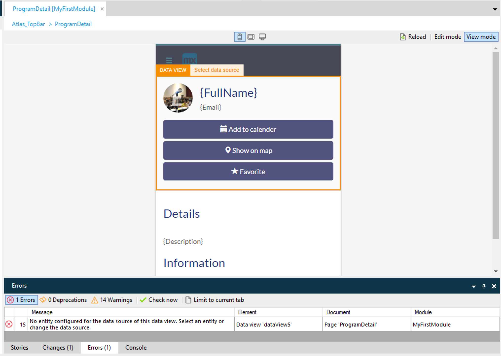
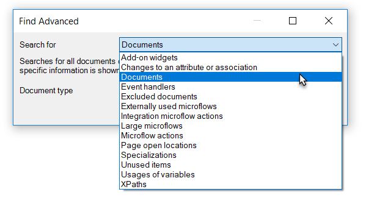
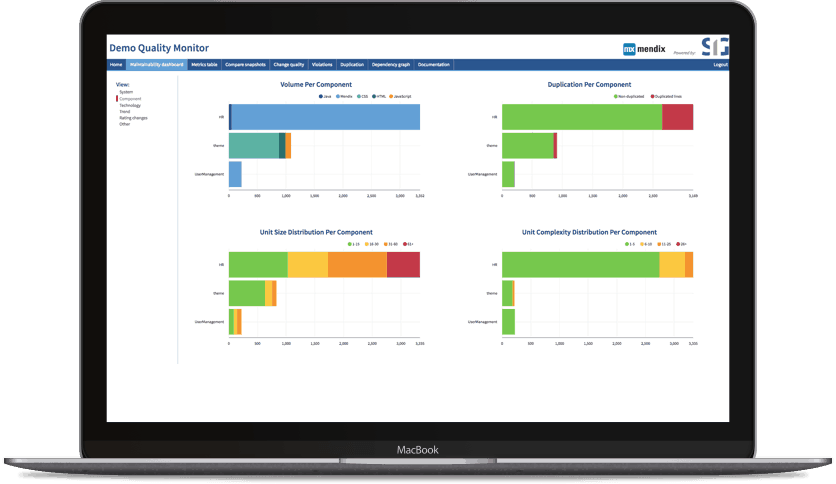
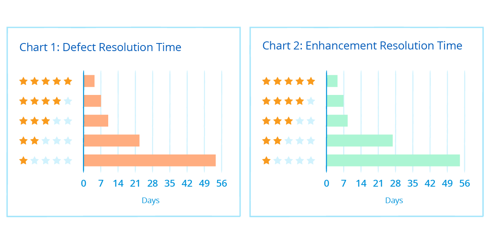
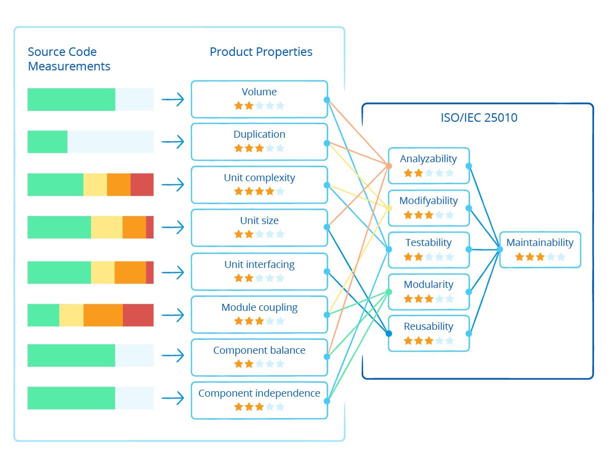
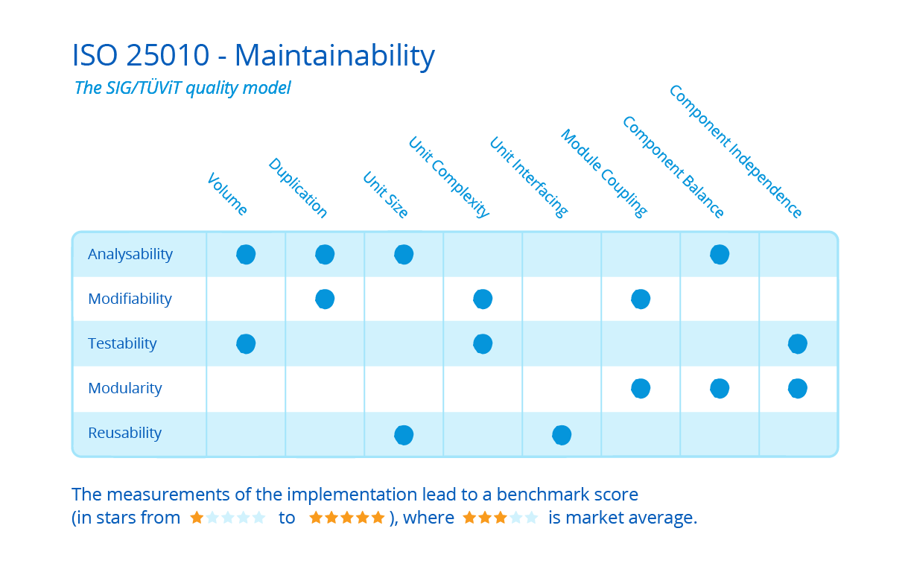

## 1 How Does Mendix Ensure the Quality and Consistency of Applications in the Development Phase?

The Mendix Desktop Modeler ensures the intrinsic quality and consistency of applications built with the Mendix Platform through the approach and mechanisms described below.

### 1.1 Consistency Checks {#consistency-checks}

Mendix typically performs 10–20 times more consistency checks than what compilers check in traditional programming platforms. As a result, testing is primarily needed on a functional level. The advantage is that through extensive quality and consistency checking, non-technical domain experts can develop robust and sophisticated apps.

Consistency checks are divided into three categories: errors, warnings, and deprecations. When a new attribute has been added to an app, for example, Mendix will check if all the security configurations and access rules have been configured properly. If not, this will result in an error with user guidance on what the issue is and how to solve it. Errors need to be solved before the developer is able to run the app again. This guarantees that at anytime, the app is consistent on logical level.

At the same time, Mendix offers professional developers possibilities to make their own trade-offs when deviating from the recommendations that result from the checks. For example, a warning regarding the performance of a certain query may be ignored, as the user has the context about the frequency of this query to be triggered.

### 1.2 Single Modeling Environment

All the application models in Mendix are managed in a single environment. Mendix checks the completeness and consistency of the entire model. This way, Mendix guarantees that the model does not contain technical inconsistencies once deployed. In fact, the system will not allow deployment of the model until inconsistencies are resolved.

{}

{}

### 1.3 Pattern Recognition

Mendix performs analysis to detect patterns that may cause issues for applications running in production. For example, incomplete decision trees or the use of a variable in a flow that is not used elsewhere are detected, and warnings are given prior to publishing the model.

### 1.4 Regression Analysis

The same mechanism is used to perform regression checks, making it easy to analyze the impact of changes on the model. Examples regression checks utilized by Mendix are “where used” analysis, which highlights where commits are performed on data objects, and the detection of queries that may compromise performance.

The intrinsic quality and consistency checking mechanisms in Mendix are key contributors to high-productivity development.

### 1.5 Model Refactoring

The Mendix Modeler has extensive support for model refactoring. For example, when the user refactors the name of a page or a microflow variable, the Modeler will propagate the refactoring in all model parts, keeping the model consistent. Such refactoring is automatically and consistently propagated throughout the whole model.

When the refactoring requires a conscious decision by the user (for example, adding an additional input parameter to a microflow signature), the model consistency checks provide the user direct feedback on which parts of the model require further action before the the application can be deployed again.

## 2 How Does Mendix Make Sure Data Access Rights Are Also Respected in the User Interface and APIs?

Data access rights are an integral part of the Mendix model, which means that these data access rights are propagated throughout the whole application. Accordingly, the Mendix user does not have to write additional custom security logic on every application entry point.

For example, when write rights are limited to only the administrator role on a specific entity in the domain model, the data security rights are also respected in the user interface and service APIs. This means that the ability to edit functionality like an edit button is automatically disabled for user roles that have no write access rights.

## 3 Which Analysis Tools Are Available to Improve the Quality of the Model?

In addition to integrated model analysis and consistency checks, the Mendix Desktop Modeler has a **Find Advanced** feature that can be used to analyze and find all kinds of model elements (for example, unused documents, large microflows that need refactoring, and an overview of all the microflows using specific integration types).

{}

{}

## 4 How Can I Apply Automated Quality Assessments? {#aqm}

The Mendix Platform contains an integrated automated quality governance tool called Application Quality Monitor (AQM). The Mendix AQM offers a dashboard that provides instant insight into the quality of the application models that you are building.

This industry-first cloud service leverages the Mendix metadata-based Model API, performing static analysis of application models by a best-of-breed engine from our integration partner [Software Improvement Group (SIG)](https://www.sig.eu/) against the ISO 25010 industry standard for maintainability.

{}

{}

### 4.1 How Can I Reduce Lifecycle Cost?

According to Gartner, one of the top four mistakes organizations make when implementing bimodal is failing to maintain a disciplined focus on refactoring and managing technical debt. This means that the benefit of greater agility can turn into a maintenance nightmare in the long run.

Mendix addresses this challenge by providing a unique cloud service that helps users prevent technical debt. AQM provides you with the proper guardrails to protect against that debt and solidifies Mendix’s promise of speed throughout the entire lifecycle of your applications.

There is a strong correlation between the maintainability rating of an application and the effort put forth to handle issues and implement enhancements. Issue resolution time increases exponentially as quality drops. The following charts show that issue resolution times for defects and enhancements get exponentially longer with each level of decrease in source code quality:

*Source for charts above: Bijlsma, Ferreira, Luijten, and Visser: ["Faster Issue Resolution with Higher Technical Quality of Software"](https://www.sig.eu/wp-content/uploads/2016/10/Faster_Issue_Resolution_With_Higher_Technical_Quality_of_Software.pdf). N.d. June 26, 2018.*

### 4.2 What Is the Mendix Application Quality Rating and ISO Standard for Maintainability?

Mendix application models have been mapped by experts from SIG on the ISO 25010 standard for software quality. This service measures key aspects of app maintainability against a set of parameters while benchmarking your application against a database of thousands of projects on a scale of 1–5.

AQM rates your application and highlights any potential issues that should be addressed. The diagrams below demonstrate that AQM does not measure your application against Mendix standards, but rather against a true industry standard for expertly defined best practices in the execution of your development.

