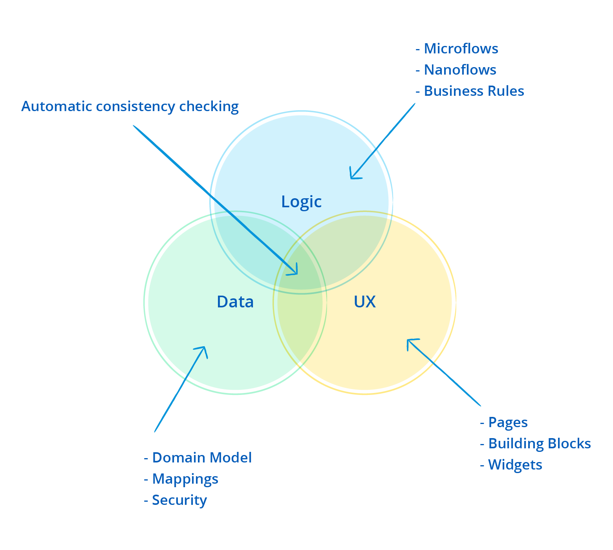

## 1 How Does Mendix Ensure the Quality & Consistency of Apps in the Development Phase?

The Mendix Desktop Modeler ensures the intrinsic quality and consistency of applications built with the Mendix Platform through the approach and mechanisms described below.

### 1.1 Consistency Checks {#consistency-checks}

Mendix typically performs 10–20 times more consistency checks than what compilers check in traditional programming platforms. As a result, testing is primarily needed on a functional level. The advantage is that through extensive quality and consistency checking, non-technical domain experts can develop robust and sophisticated apps.

Consistency checks are divided into three categories: **errors**, **warnings**, and **deprecations**. For example, when a new attribute has been added to an app, Mendix checks if all the security configurations and access rules have been configured properly. If not, this will result in an error with user guidance on what the issue is and how to solve it. Errors need to be solved before you can run the app again. This guarantees that the app is always consistent on logical level.

At the same time, Mendix offers professional developers the possibility to make their own trade-offs when deviating from the recommendations that result from the checks. For example, a warning regarding the performance of a certain query may be ignored, as the user has the context about the frequency of this query to be triggered.

{}

{}

Here are some examples of consistency checking on the Mendix Platform:

* The Modeler prevents the deployment of an app that has an input field connected to a wrongly-typed attribute or to an attribute that no longer exists (for example, a text box connected to a Boolean attribute).
* Mendix automatically hides navigation menu options from the user that lead to pages for which the current user does not have sufficient rights.
* The Modeler shows an error if the user with a given role can navigate to a page that displays entities and/or attributes that are inaccessible to users of that role due to security settings.
* When defining data retrievals in your application, Mendix validates whether the resulting database queries are both syntactically and semantically correct and will execute successfully against the database.

The implication for testing is that these consistency checks can point out or prevent defects that could easily slip through in non-Mendix development efforts. This results in fewer defects to deal with. In some instances, these checks also work proactively (for example, when you change the name of an attribute, the Modeler adjusts all references to this attribute). This again reduces the chances of defects slipping into your model.

### 1.2 Single Modeling Environment

All the application models in Mendix are managed in a single environment. Mendix checks the completeness and consistency of the entire model. This way, Mendix guarantees the model does not contain technical inconsistencies once deployed. In fact, the system will not allow deployment of the model until inconsistencies are resolved.

{}

{}

### 1.3 Pattern Recognition

Mendix performs analysis to detect patterns that may cause issues for applications running in production. For example, the platform checks for incomplete decision trees or the use of a variable in a flow that is not used elsewhere, and warnings are given prior to publishing the model.

### 1.4 Regression Analysis

The same mechanism is used to perform regression checks, making it easy to analyze the impact of changes on the model. Examples regression checks utilized by Mendix include a “where used” analysis, which highlights where commits are performed on data objects, and the detection of queries that may compromise performance.

The intrinsic quality and consistency checking mechanisms in Mendix are key contributors to high-productivity development.

### 1.5 Model Refactoring

The Mendix Modeler has extensive support for model refactoring. For example, when the user refactors the name of a page or a microflow variable, the Modeler will propagate the refactoring in all model parts, keeping the model consistent. Such refactoring is automatically and consistently propagated throughout the whole model.

When the refactoring requires a conscious decision by the user (for example, adding an additional input parameter to a microflow signature), the model consistency checks provide direct feedback on which parts of the model require further action before the the application can be deployed again.

## 2 How Does Mendix Make Sure Data Access Rights Are Respected in the UI & APIs?

Data access rights are an integral part of the Mendix model, and these data access rights are propagated throughout the whole application. Accordingly, the Mendix user does not have to write additional custom security logic on every application entry point.

For example, when write rights are limited to only the administrator role on a specific entity in the domain model, data security rights are also respected in the user interface and service APIs. This means that the ability to edit functionality like an Edit button is automatically disabled for user roles that have no write access rights.

## 3 Which Analysis Tools Are Available to Improve the Quality of the Model?

In addition to integrated model analysis and consistency checks, the Mendix Desktop Modeler has a **Find Advanced** feature that can be used to analyze and find all kinds of model elements (for example, unused documents, large microflows that need refactoring, and an overview of all the microflows using specific integration types).

{}

{}
