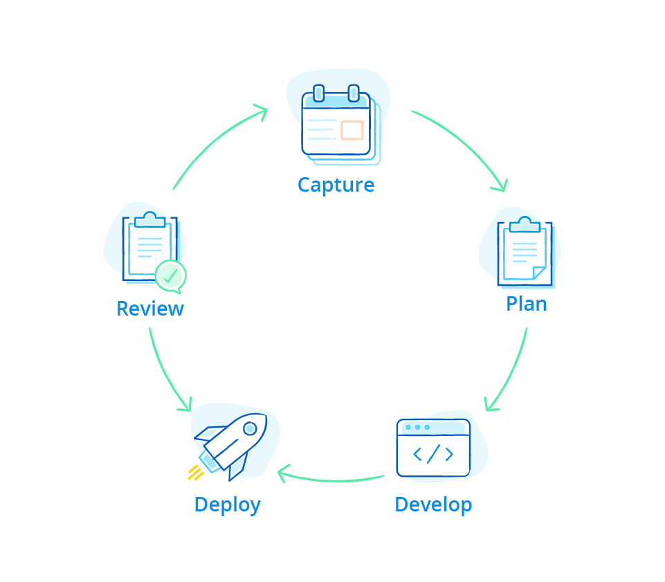

Capturing and managing requirements using Agile methodologies is critical to the success of any software development lifecycle. It enables cross-functional teams to close the feedback loop by working collaboratively and iteratively; accelerating the development process towards better/faster business outcomes. 

{}[**Add video when available**]{}

## How Does Mendix Support Requirements Management?

Mendix provides support for requirements management through the SCRUM methodology. Using integrated story definition, backlog management, sprint and release planning and velocity mapping, teams can curate a backlog of user stories into sprint plans for development. The Platform APIs provide integration hooks to draw requirements from third-party tools to integrate with your existing requirements planning software. 

For details, see [How Does Mendix Support Requirements Management?](requirements-management#requirements-management).

## How Does Mendix Support Feedback Management?

Feedback is a crucial element of the core Mendix platform allowing team members to interact continuously across the SDLC. From integrated buzz and embedded interactive chat that links to software assets and updates, to feedback management which enables testers and users to report feedback directly from the app itself, Including screenshots and context. Feedback is turned in to user stories and allocated to the backlog to complete the loop to begin the iterative development cycle.

For details, see the section [How Does Mendix Support Feedback Management?](feedback-management#feedback-management)

## How Can I Integrate Mendix with Third-Party Project Management Tooling?

Mendix is a fully open and extensible platform; this includes platform APIs that allow integration with your existing tools. One such integration hook is our Stories API which enables external requirements managed using products like Jira, to synchronise with your Mendix project, allowing you to take full advantage of our complete SDLC, automated testing and feedback management tools.

For details, see [How Can I Integrate Mendix with Third-Party Project Management Tooling?](requirements-management#tooling).

## Read More

* [Requirements Overview](requirements-overview)
* [Collaboration Channels](collaboration-channels)
* [Requirements Management](requirements-management)
* [Feedback Management](feedback-management)
