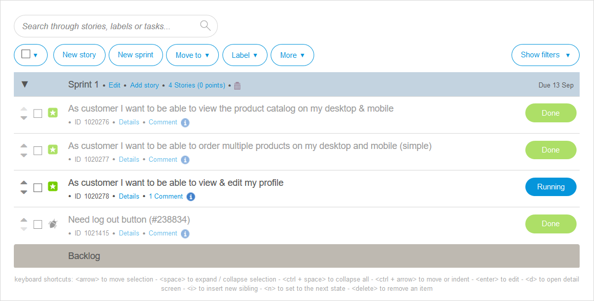

## 1 How Is Requirements Management Positioned in Mendix?

{}[**Note from Adam: this needs to be divided into at least 2 pages when all content is written. David, can you divide this? - for example, Requirements Management & Feedback Management, Requirements Management & Active Stakeholder/Team Involvement, etc. **]{}

{}[**David: Discuss: Stakeholder _involvement_ or _engagement_?]**]{}

{}[**David: Discuss: Stakeholder _involvement_ or _engagement_?]**]{}

{}[**David: Discuss: Agile _project_ or _requirements_ management?]**]{}

Requirements management is a critical part of the application development lifecycle. Mendix helps to shorten the feedback loop between development teams and users as well as all other stakeholders in order to drive project success, lower costs, and decrease time-to-market.

Mendix enables development teams to adopt an Agile approach based on Scrum in which they collaborate closely with internal and external stakeholders in short iterative development cycles. The Mendix Platform supports this way of working out of the box through the following key functionalities:

* Development teams can [capture, refine, and prioritize requirements](#requirements-management) for their applications in the Mendix Developer Portal with a full-fledged user-story and task backlog management tool
* Users and other stakeholders can review apps and [provide feedback](#feedback-management) to the development team so that apps can be quickly improved, both during development and after go-live
* All the stakeholders of the app under development can be [actively involved](#stakeholder-involvement) in the development process through different channels

Mendix helps development teams shorten the feedback loop between themselves, end-users, and key stakeholders so that development is effective and efficient. This in turn leads to greater success in the delivery of app projects, lower development costs, and shortened time- to-market.

When development activities on the Mendix Platform extend to a large number of teams, some organizations require more advanced project management tools and services. For this scenario, the Mendix Platform provides APIs for [integration with third-party tools and services](#tools).

## 2 How Does Mendix Support Agile Requirements Management? {#requirements-management}

Mendix enables development teams to adopt a Scrum-based development approach through easy-to-use backlog management features, [feedback gathering and management tools](#feedback-management), and [rapid deployment](devops-overview#support-devops) to testing, acceptance, and production environments.

The development team can [involve users and other stakeholders](#stakeholder-involvement) through multiple channels. Preview versions of apps can be rolled out to end-users through the [Mendix mobile app](https://docs.mendix.com/refguide/getting-the-mendix-app). Those end-users can provide feedback through the [Mendix Feedback Widget](https://appstore.home.mendix.com/link/app/199/). The development team can communicate with users through Buzz messages for each feedback item. Finally, end-users and other stakeholders can actively take part in the conversation through the Developer Portal and the Mendix mobile app.

When development scales up to larger numbers of teams, advanced project management is often desirable. Mendix supports [integration with third-party project management tools and services](#tooling) in order to facilitate organizations with setting up appropriate development project management structures.

<video controls src="attachments/agile/MCA_FullAgileLifecycle-2.mp4">VIDEO</video>

The [Mendix Developer Portal](https://docs.mendix.com/developerportal/) is the central hub for requirements management for applications developed with Mendix. It provides full-fledged user-story and task management in a flexible backlog management interface.

{}

{}

User story refinement is made even easier through the specific Buzz message threads available under each story. You can post update messages, which are centrally visible for all team members and stakeholders in the Developer Portal Buzz.

{}

{}

Any updates to the conversation on the **Story Details** page are also pushed to the central Buzz wall and the [Mendix Mobile app](https://docs.mendix.com/refguide/getting-the-mendix-app). All the users involved in the conversations receive notifications by email.

{}[**Screenshot of Buzz in Mendix Mobile app**]{}

This integrated experience enables engaging stakeholders in the development process in order to effectively capture and validate requirements. With the Mendix Developer Portal, the Mendix mobile app, and the notifications system, the Mendix Platform provides stakeholders a unified interface for all of your ongoing development activity and enables you to actively take part in that process.

## 3 How Does Mendix Support Feedback Management? {#feedback-management}

Collecting feedback from users and other stakeholders, prioritizing the feedback, and acting on crucial items is essential to the success of application delivery projects, both during development and after go-live. Mendix provides a [Mendix Feedback Widget](https://appstore.home.mendix.com/link/app/199/) that empowers the end-users of an app to submit feedback from the context of the app itself. Feedback items are submitted through the widget into the [Feedback](https://docs.mendix.com/developerportal/collaborate/feedback) section of the app project in the Developer Portal. This allows end-users to very easily provide valuable feedback to the development team on the app under development.

<video controls src="attachments/agile/OE_FeedbackAPI_CreateFeedback-1.mp4">Provide the development team with feedback from any app</video>

The development team can review and triage feedback items in the **Feedback** section of the Developer Portal. They can communicate with the submitter of the feedback item through messages on the Buzz thread under the item.

{}

{}

In this way, the Mendix Platform enables development teams to fully integrate user feedback into their natural development cycle. By integrating selected feedback as user stories into the backlog, the team can schedule these user stories as part of their sprint planning. At the end of every sprint, when the active sprint is closed and the next sprint is opened, all the feedback items that were scheduled as user stories are closed, and status change notifications are sent to the respective submitters.

End-users can keep track of submitted feedback through the Developer Portal and post updates and replies to questions. As with all Buzz activity, email notifications are sent when someone replies to your post. Users can quickly open the Developer Portal from those emails, or just reply by email to post a response.

This functionality enables a very fast feedback loop between the development team, key end-users, and other stakeholders, in turn enabling quick improvement of the app under development.

## 4 How Can I Manage My Team's Backlog?

In the Mendix Developer Portal, each development team can find their user story backlog in the project space for their app. There, the team can review user stories, prioritize them, and schedule them for sprints.

On the [Stories](https://docs.mendix.com/developerportal/collaborate/stories) page in the Developer Portal, users can easily schedule user stories in sprints by dragging them from the backlog into a sprint. Stories can be prioritized within the sprint by dragging them into the correct spot in the story list.

<video controls  src="attachments/agile/story-sprint.mp4">VIDEO</video>

User stories can be labeled with, for example, the epics under which the stories belong. This means that both within the backlog and in scheduled sprints, user stories can be easily identified as belonging to a certain set of stories. This enables the development team to group stories together across sprints, so that they can stay in control of their backlog and scheduled stories.

{}[**Screenshot of Stories page with several stories categorized into 2-3 epics through the use of colored labels**]{}

## 5 How Can I Integrate Mendix with Third-Party Project Management Tooling? {#tooling}

Mendix provides full-featured requirements-and-feedback management out of the box. The Mendix Platform provides a complete feature set for many use cases. For requirements capture, feedback collection, and social collaboration, the platform provides development teams with the tools they need to quickly get started and deliver successful apps.

If you are working on a large with many teams and you find the Mendix Platform does not provide enough functionality out of the box to enable cross-team project and delivery management, you can integrate with third-party project management tools and services such as Jira and Trello. Mendix provides a set of [Story](https://docs.mendix.com/apidocs-mxsdk/apidocs/stories-api) and [Feedback](https://docs.mendix.com/apidocs-mxsdk/apidocs/feedback-api) APIs to connect these tools and services to the Mendix Platform.

{}[**Video with integration with Jira from legacy guide**]{}

{}**[David: Discuss: Should we say the following?]**{}

Mendix recommends that teams starting with Mendix for the first time leverage all the functionality available as part of the platform in order to bring your first application into production in the least possible time, without dependencies on external tools and services. The next step can be to integrate with a third-party project management tool or service of choice, but this is not necessary for the successful delivery of your first app.

## 6 How Can I Integrate My Existing User Feedback Tracking System with Mendix?

**[Add content.]**

## 7 How Does Mendix Enable Active Stakeholder Involvement in Requirements Management? {#stakeholder-involvement}

The Mendix Developer Portal is the starting point for the development of Mendix projects with Agile methodologies. Each app has its own central project space, where the development team and their stakeholders can collaborate. This project space provides [backlog management](#requirements-management), sprint planning and [user feedback management](#feedback-management), development-oriented [DevOps features](devops-overview), and a central social channel, which is the [Buzz](https://docs.mendix.com/developerportal/).

Once development is underway, it is crucial to engage stakeholders in the development process. The Mendix Platform provides various channels of engagement for different stakeholders.

### 7.1 Involvement via the Mendix Developer Portal

The [Mendix Developer Portal](https://docs.mendix.com/developerportal/) is the central hub for project management and collaboration. This is usually the place where Product Managers, Product Owners, and similar roles spend their time specifying user stories, reviewing feedback, prioritizing the backlog, and providing their input to the development team through the Buzz.

### 7.2 Involvement via the IDE

As developer are usually found working with the [Desktop Modeler](app-development#desktop-modeler) or the [Web Modeler](app-development#web-modeler), user stories from the active sprint and Buzz are available in the Modelers as well.

### 7.3 Involvement via the Mendix Mobile App

The [Mendix mobile app](https://docs.mendix.com/refguide/getting-the-mendix-app) enables development teams to closely collaborate with stakeholders on app development in general and mobile app development in particular.

The Mendix mobile app enables developers to [preview and test their app](../app-capabilities/mobile-apps#mxapp-preview) on their device. From there, they can also [share the app](../app-capabilities/mobile-apps#mxapp-share) with other developers, key end-users, and stakeholders, which can in turn provide feedback through the Feedback Widget. End-users can preview apps under development with the Mendix mobile app  as well as follow the Buzz.

Anyone collaborating on app development with Mendix—whether you are a developer, product manager, key end-user, or another stakeholder—can easily take part in the conversation around the development of the app at any time with the Buzz functionality in the Mendix mobile app.

{}[**Add  phone wrapper**]{}

### 7.4 Involvement via Email Notifications

All the users involved in a Mendix application project receive relevant and timely email notifications for Buzz and other updates of interest. This includes responses to submitted feedback items and status changes such as feedback items that are completed.

{}[**Screenshot of email notificaiton for buzz update**]{}

### 7.5 The Central Buzz

All of the above channels are bundled together through the central Buzz in the Developer Portal. This is where you can post messages from the context of your project activity. For example, user stories and feedback items each have their own Buzz thread. All the updates posted are visible in the Developer Portal and the Mendix mobile app in a central Buzz stream.

## 7 Reporting & Dashboards

## 8 Release Management

**[Add content: Notifications to stakeholders when sprint is closed & release is done]**

## 9 Traceability & Auditability

## 10 How Can I Manage the Access of Different Users to My App Project Resources?

App development project resources are centrally managed from the Mendix Developer Portal with an advanced role-based access control model. Users can have different roles, which can be configured to allow users different levels of access to project resources. For example, some users might be allowed to make changes to the product backlog, while others might get access to the app model in the Team Server repository.

By default, Mendix provides a set of sensible user roles, such as Scrum Master, Business Engineer, Product Owner, Application Operator, and End User. These roles can be modified to suit your particular organization's access management requirements.

For more information, see [Roles Within the Company and Apps](https://docs.mendix.com/developerportal/general/roles) in the Mendix documentation.

### 10.1 Inviting Team Members

New team members can be easily invited to the development team. Users are authorized for this action based on their user role as part of the role-based access control model.

<video controls src="attachments/agile/DO_InviteUserToProject-1.mp4">Inviting a user to your app team</video>

<!--
## OLD CONTENT

Note: Exact list of questions is WIP.

* For teams
  * Which team roles are supported? [new]
     * Business Engineer, Scrum Master, Product Owner, End User
* Project backlog mgmt
 * Does Mendix support Agile project management? [From: Mendix Development Experience, What Developer Teams Need]
 * How can I manage requirements for my Mendix apps? [new]
* Planning
 * How can I create & review delivery plans for my Mendix team? [new]
* Feedback
 * How can I gather feedback from users so that I can improve my app? [new]
 * How can I manage feedback? [From: Mendix Development Experience, What Developer Teams Need]
* Integration with third-party tools (APIs)?
 * How do I use my own project management tooling with Mendix, like JIRA?
 * Can I integrate my existing user feedback tracking system with Mendix? [Was: Does a feedback API exist to allow users to provide feedback in an app?]
* Other
 * Document mgmt
  * Can I manage all my project artifacts in Mendix? [new]

-->
