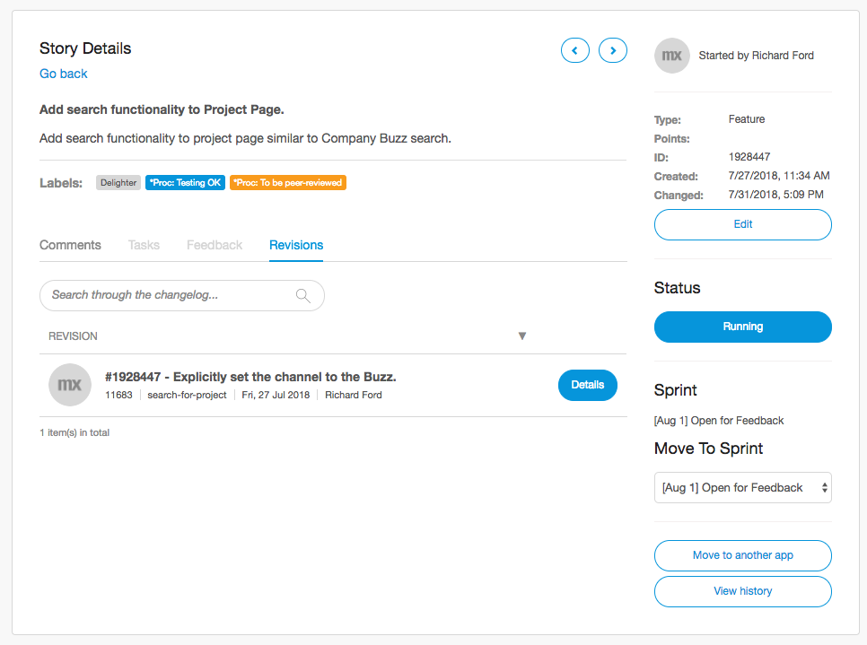
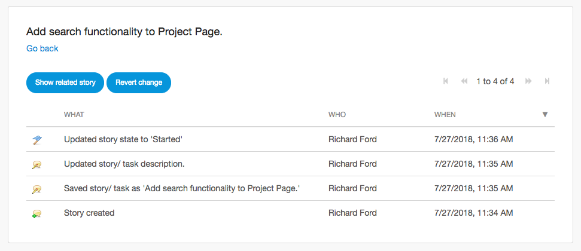

## 1 How Does Mendix Support Agile Requirements Management? {#requirements-management}

Mendix enables development teams to adopt a Scrum-based development approach through easy-to-use [backlog management](#backlog) features, [feedback gathering and management tools](feedback-management#feedback-management), and [rapid deployment](devops-overview#support-devops) to testing, acceptance, and production environments.

The development team can [involve users and other stakeholders](collaboration-channels#stakeholder-involvement) through [multiple channels](collaboration-channels). Preview versions of apps can be rolled out to end-users through the [Mendix mobile app](https://docs.mendix.com/refguide/getting-the-mendix-app). Those end-users can provide feedback through the [Mendix Feedback Widget](https://appstore.home.mendix.com/link/app/199/). The development team can communicate with users through Buzz messages for each feedback item. Finally, end-users and other stakeholders can actively take part in the conversation through the Developer Portal and the Mendix mobile app.

When development scales up to larger numbers of teams, advanced project management is often desirable. Mendix supports [integration with third-party project management tools and services](#tooling) on top of Mendix Requirements Management functionality in order to facilitate organizations with setting up appropriate development project management structures.

<video controls src="attachments/agile/MCA_FullAgileLifecycle-2.mp4">VIDEO</video>

The [Mendix Developer Portal](https://docs.mendix.com/developerportal/) is the central hub for requirements management for applications developed with Mendix. It provides full-fledged user-story and task management in a flexible backlog management interface.

User story refinement is made even easier through the specific Buzz message threads available under each story. You can post update messages, which are centrally visible for all team members and stakeholders in the Developer Portal Buzz.

{}

{}

Any updates to the conversation on the **Story Details** page are also pushed to the central Buzz wall and the [Mendix Mobile app](https://docs.mendix.com/refguide/getting-the-mendix-app). All the users involved in the conversations receive notifications by email.

{}[**Screenshot of Buzz in Mendix Mobile app**]{}

This integrated experience enables engaging stakeholders in the development process in order to effectively capture and validate requirements. With the Mendix Developer Portal, the Mendix mobile app, and the notifications system, the Mendix Platform provides stakeholders a unified interface for all of your ongoing development activity and enables you to actively take part in that process.

## 2 How Can I Manage My Team's Backlog? {#backlog}

In the Mendix Developer Portal, each development team can find their user story backlog in the project space for their app. There, the team can review user stories, prioritize them, and schedule them for sprints.

On the [Stories](https://docs.mendix.com/developerportal/collaborate/stories) page in the Developer Portal, users can easily schedule user stories in sprints by dragging them from the backlog into a sprint. Stories can be prioritized within the sprint by dragging them into the correct spot in the story list.

<video controls  src="attachments/agile/story-sprint.mp4">VIDEO</video>

User stories can be labeled with, for example, the epics under which the stories belong. This means that both within the backlog and in scheduled sprints, user stories can be easily identified as belonging to a certain set of stories. This enables the development team to group stories together across sprints, so that they can stay in control of their backlog and scheduled stories.

## 3 How Can I Integrate Mendix with Third-Party Project Management Tooling? {#tooling}

Mendix provides full-featured requirements-and-feedback management out of the box. The Mendix Platform provides a complete feature set for many use cases. For requirements capture, feedback collection, and social collaboration, the platform provides development teams with the tools they need to quickly get started and deliver successful apps.

If you are working on a large with many teams and you find the Mendix Platform does not provide enough functionality out of the box to enable cross-team project and delivery management, you can integrate with third-party project management tools and services such as Jira and Trello. Mendix provides a set of [Story](https://docs.mendix.com/apidocs-mxsdk/apidocs/stories-api) and [Feedback](https://docs.mendix.com/apidocs-mxsdk/apidocs/feedback-api) APIs to connect these tools and services to the Mendix Platform.

{}[**Video with integration with Jira from legacy guide**]{}

Mendix recommends that teams starting with Mendix for the first time leverage all the functionality available as part of the platform in order to bring your first application into production in the least possible time, without dependencies on external tools and services. The next step can be to integrate with a third-party project management tool or service of choice, but this is not necessary for the successful delivery of your first app.

## 4 How Does Mendix Provide Insight into Sprint Status and Progress?

Development teams and their stakeholders can track the current status of the team in the sprint on implementation of user stories through the Scrum Board in the Development Portal. Story state (To-do, Running or Done) is set by the team for each user story as they progress and this is represented on the Scrum Board:

Burndown charts provide insight into progress of the sprint:

These reports give insight into progress on implementation of business requirements. For advanced project management functionality, development teams can set up [integrations with third-party project management tools](#tooling).

## 5 How can changes made to application models be traced back to requirements?

Developers can commit changes made to their application models with a reference to user stories defined for those aplications in the Developer Portal. This enables development teams to go back and check for commits why a change was made. Alternatively, developers can review the changes associated with a user story.

For more details, see the section on how [user stories can be cross-referenced with Team Server commits](version-control#cross-reference).

## 6 How can I audit which changes have been made to requirements? 

All changes made to user stories are recorded in an audit trail for future reference. This audit trail shows which user made changes, and allows for rollback as well. 

