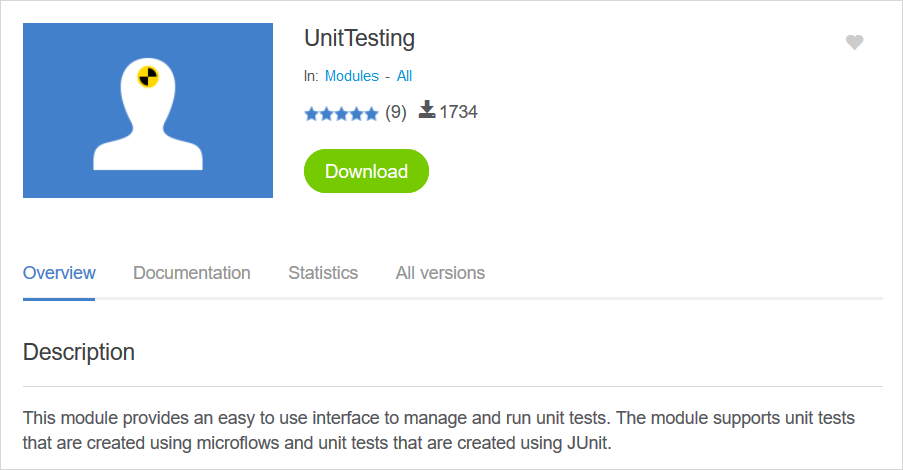
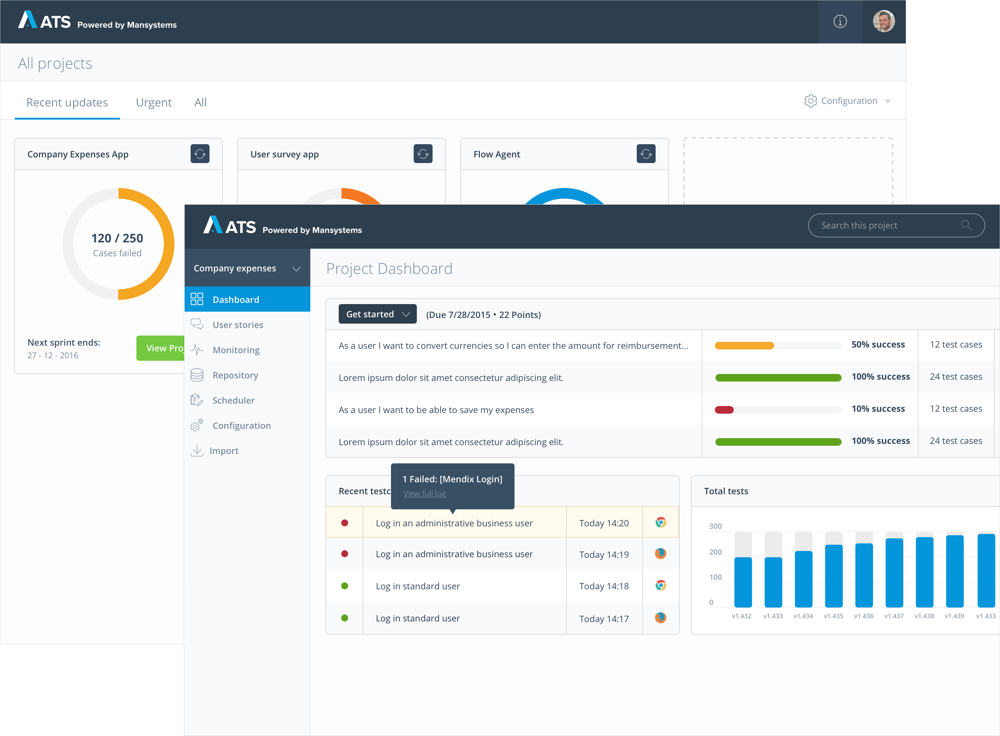
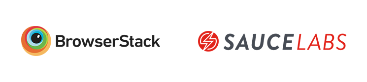
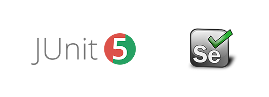

## 1 What Mendix Tools Are Available for Test Automation & Quality Assurance? {#qa-tools}

The Mendix Platform provides development teams with an extensive toolset and extension points to set up quality assurance via efficient test automation.

Mendix apps are built from standard components that are already pre-tested by Mendix. The internal consistency of a custom application model that a development team builds on top of these components is continuously checked by Mendix Studio and Mendix Studio Pro. The goal of this is to catch common modeling mistakes and issues early in development. For more details, see  [How Does Mendix Ensure the Quality of My Apps?](#ensure) below.

During development, the [Mendix Application Quality Monitor (AQM)](https://docs.mendix.com/aqm/) provides insight into the quality of the application models that you are building. Dashboards provide high-level details and allow you to drill down at the microflow level. For more details, see the section [What Tools Are Available for Quality-Monitoring Mendix Apps?](quality-monitoring#quality-monitoring) in *Quality Monitoring*.

With standard components, you can develop complex business logic as part of your applications. To test the business logic in your application, you can use a combination of unit tests and automated functional acceptance tests to create an end-to-end test suite for your apps. For more information, see [How Can I Unit Test My Mendix Apps?](#unit-test) and [What Tools Does Mendix Offer for Functional Testing?](#tools-functional) below.

Developers can also use third-party test tools and services with Mendix. For details, see [How Does Mendix Support Third-Party Testing Tools?](#third-party) below.

All the testing tools provided by Mendix integrate easily into CI/CD pipelines. Read more in the [CI/CD](cicd) chapter.

## 2 How Does Mendix Ensure the Quality of My Apps? {#ensure}

In Mendix, application functionality is defined at a higher level of abstraction than that of most other software development platforms and languages. This reduces the likelihood of defects and required testing efforts, because the Mendix Platform can perform many automated checks for you.

Mendix helps you in three main ways:

* Enforcing consistency within your application model
* Deploying your application model consistently
* Testing all of the standard Mendix components itself

There are more ways in which the Mendix Platform reduces the likelihood of defects and costly mistakes, but the main ways Mendix makes your testing life easier should help you get a better understanding of what to test and what not to test.

These three main ways are explained below in detail.

### 2.1 Enforcing Consistency Within Your Application Model

Mendix Studio and Mendix Studio Pro continuously monitor whether the entirety of the application model is internally consistent. For example, the microflow activities and page elements you define need to be consistent with the domain model. Mendix Studio and Mendix Studio Pro will show an error and prevent the deployment of an application that does not pass the consistency checks.

For more information, see [Model Consistency](model-consistency).

### 2.2 Deploying Your Application Model Consistently

When an application is started, the Mendix Platform [ensures that the underlying database structure matches the domain model defined within your application model](../app-capabilities/data-storage). Since consistency within your domain model is also guaranteed (see above), the database structure that is deployed is consistent with all the data usage of your application.

For example, a text box in your application not only has a corresponding string attribute in the data model, but also a corresponding string (-equivalent) field in the underlying SQL database.

The implication for testing is that it is not necessary to test whether data committed in a Mendix application actually ends up correctly in the underlying SQL database.

### 2.3 Testing Standard Mendix Components

If you envision Mendix as a toolkit with which you build your own apps, you can rest assured that your tools will work as advertised. Our internal quality assurance team rigorously tests whether standard Mendix components work as intended and continue to do so across platform releases.

For example, a text box connected to a string attribute of a certain maximum length will never accept a value that exceeds this length.

The implication for testing is that you can be assured your testing is scoped towards your own logic, not just validating Mendix components. In this sense, you do not need to test the toolset, only the house you have chosen to build with it.

## 3 How Can I Unit-Test My Mendix Apps? {#unit-test}

The Mendix Platform supports the implementation of unit tests. These tests are built using microflows and the [UnitTesting](https://appstore.home.mendix.com/link/app/390/) module available from the Mendix App Store. Tests are run either every time there is a new build of the application or at a scheduled time.

{}

{}

## 4 What Tools Does Mendix Offer for Functional Testing? {#tools-functional}

With the Mendix Platform, you can automate your functional tests for the user stories you are developing and reduce the overall cost of testing to less than 10% of your project budget. The Mendix [Application Test Suite (ATS)](https://docs.mendix.com/ats/) offers a suite of tools for embedding testing in your application lifecycle. These tools are built in Mendix, on top of Selenium.

{}

{}

ATS integrates into the Mendix Platform to enable viewing all the user stories and writing test cases against them. You do not need any knowledge of Selenium or testing frameworks to write test cases. The browser recorder will save every interaction and generate the necessary Selenium scripts.

<video controls src="attachments/DO_CreatingATestCaseandStep.mp4"></video>

Test cases can be executed against different browsers and multiple devices using either [Browserstack](https://www.browserstack.com/) or [Saucelabs](https://saucelabs.com/).

Test cases are run when there is a new deployment, either based on a schedule or triggered manually. The tool also allows for bulk testing by uploading data from Microsoft Excel.

## 5 How Does Mendix Support Third-Party Testing Tools? {#third-party}

The Mendix Platform provides an open and extensible toolset, which can be extended to support any number of third-party testing tools. Mendix supports the [Selenium](https://www.seleniumhq.org/) and [JUnit](https://junit.org/) testing frameworks. Mendix customers have also built testing suites using other third-party testing tools.

## 6 How Can I Link My User Stories & Test Cases to Model Revisions?

When committing changes to an application, developers can select the user stories that are covered in that specific revision. This information is then stored with the revision and held in Team Server for future use in audit processes. This helps in the testing process.

User stories can be synchronized with ATS, wherein testers can build specific functional tests cases against each user story. This process enables teams to automate functional testing within the CI/CD pipeline. For details on how to do this, see [How to Link Test Cases & Test Suites to User Stories](https://docs.mendix.com/ats/howtos/ht-version-2/connect-stories-to-testcases-2) in the *ATS Guide*.

For more information on the traceability of changes to application models against the requirements captured in user stories, see the section [How Do I Cross-Reference User Stories and Application Change Commits?](version-control#cross-reference) in *Version Control and Multi-User Development*.
