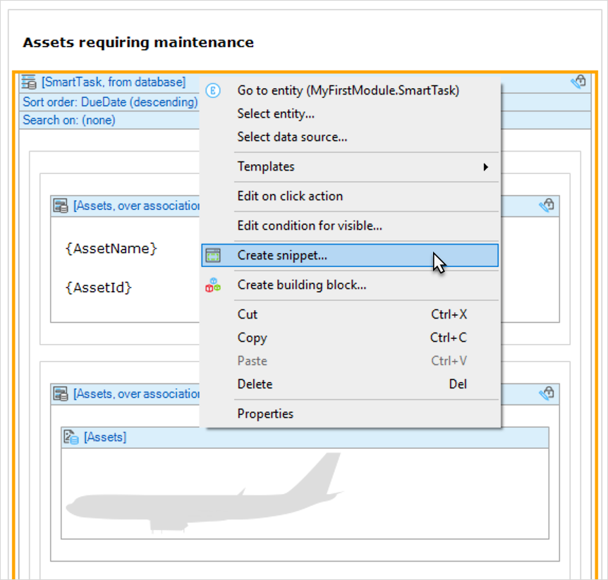
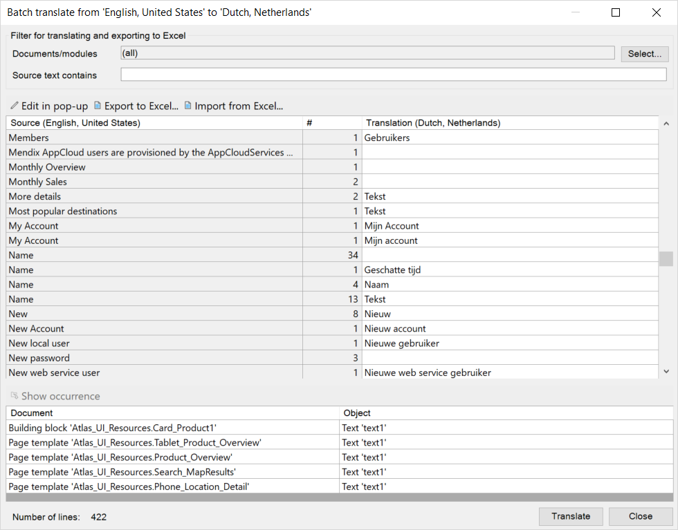

## 1 How Can I Build Pages & Forms in Mendix? {#build-pages}

Mendix has a visual page editor in Mendix Studio and Mendix Studio Pro that can be used to build both dynamic and static pages (for example, a dashboard page containing a report overview, or a registration form for a mortgage application). An app built in Mendix can support multiple app profile, so you can target multiple device types with device-specific app flows and page layouts while still reusing the underlying app logic and integrations.

The Mendix Platform supports mobile, tablet, and responsive profiles. For details on all the UI development capabilities that Mendix supports, refer to the various pages in the [UX & Multi-Channel Apps](../app-capabilities/ux-multi-channel-apps) chapter.

{}

{}

## 2 How Do I Build Reusable Page Elements?

Mendix employs multiple methods to support reuse on pages.

The first main method is to use layouts to define a default page structure with one or more content blocks. This makes it very easy to define pages with, for example, page-specific content combined with a shared header, a menu on the left side of the page, and a footer. All the pages sharing the same layout will be changed directly if the layout elements are adapted, so there is no need to duplicate elements into the other pages.

The second main method is to use snippets to define groups of widgets that will be referred to from multiple pages. This way, the model is stored in one location, and you need to adapt the group of widgets, you can easily do this in that location. To make reuse effortless, we have a one-click **Create snippet** feature that transforms a group of widgets into a snippet.

{}

{}

## 3 How Can I Provide Company-Branded Templates & Styling to My Projects? {#private-templates-styling}

Mendix provides a rich set of [Atlas UI](https://atlas.mendix.com/) resources out of the box based on a beautiful theme with page templates and building blocks. These resources make it simple to kick-start your first project.

Atlas UI can be tuned or even fully replaced by your company-branded and company-specific set of UI resources. Company-specific resources can contain a theme, layouts, page templates, and building blocks that are fully compliant with your company's design standards and best practices. These UI resources can be published in a Mendix Private App Store in order to make them available for all of your company's apps. Such resources can thus be used immediately and updated when necessary, which makes branding, reuse, and standardization easy and low-cost.

For more information on how to start building you own set of UI resources, see the [Atlas UI how-to's](https://docs.mendix.com/howto/front-end/atlas-ui/index) in the Mendix Documentation.

## 4 How Does Mendix Support Multilingual Apps? {#multi-lingual}

Delivering applications that support multiple languages (internationalization) is an essential capability for any low-code platform. Using translatable texts (for example, labels, button names, and menu items) that are tracked and stored in your app projects, you can quickly make applications multilingual and translate content between languages.

<video controls  src="attachments/LanguageTranslate-1.mp4">VIDEO</video>

Each application has a base development language that be selected at the outset of the project. Once selected, all new app-specific texts are added to this language's library, along with the default platform language texts.

The advantage of the model-driven development approach in Mendix is that all system- and application-level messages are automatically included for translation.

Full Unicode (double-byte characters) character sets, support is provided that enables apps to support Chinese, Cyrillic languages, and right-to-left (RTL) languages such as Arabic. Different calendars can also be used within applications.

For the international rollout of applications, Mendix supports the use of multiple languages in parallel for an application running in production. By default, the application will be presented to the user in the language that is defined in their user profile.

For translation, Mendix Studio Pro provides the following tools:

* **Batch replace** – for ensuring the consistency of labels in the default language in your application
* **Batch translate** – for translating all the labels in your application from the source language to the destination language batch-wise (after having translated the individual labels)
* **Language operations** – for handling a set of labels in one quick operation (for example, copying all US English labels to UK English labels, whereafter individual labels can be adjusted)

{}

{}
