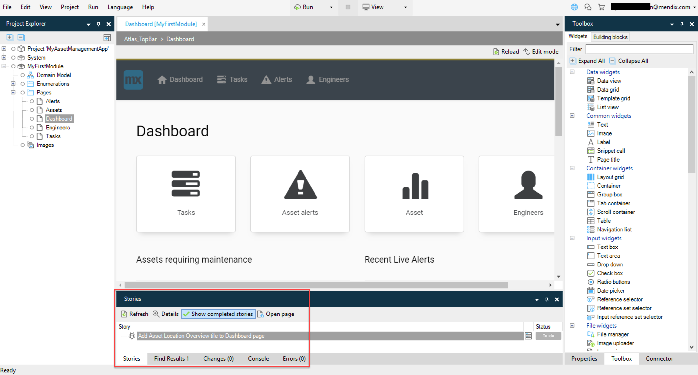

## 1 How Does Mendix Support Multi-User Development? {#multi-user}

To accomplish this, the Desktop Modeler and Web Modeler combine multi-user development across different skill levels. When a user creates a new set of pages and associated assets using the Web Modeler, it will be built in a branch line. When the app project is synchronized with the Desktop Modeler, the branch can be merged at the request of the developer in the Modeler.  From that point on, control of the model is handed over to the developer, effectively blocking access by other users until the merges are committed back to the Team Server and the developer releases the lock.

This process ensures that across the continuum of a user’s application, changes can be controlled and managed by experienced low-code developers.

## 2 How Does Version Control Work in Mendix?

Mendix supports the use of a centralized version control repository based on Subversion (SVN). Every project built using the Mendix Platform comes with a version control system called [Team Server](https://docs.mendix.com/refguide/team-server-faq). Team Server uses SVN technology and enables multiple developers to work on the same project, continuously merging model changes into revisions held inside the version control repository.

This diagram presents the Mendix version control architecture:

Developers can manage revisions and conflicts as well as create branch lines, which can be merged back to mainline branch as required. Every change in the platform is recorded and compared against other revisions to detect conflicts and manage updates. Users are invited to app projects via the [Developer Portal](https://sprintr.home.mendix.com/index.html) and assigned security roles, which allow them appropriate access rights to the models held in Team Server.

## 3 How Do I Cross-Reference User Stories and Application Change Commits? {#cross-reference}

Mendix provides an integrated development experience between the Team Server versioning repository, the Project Dashboard, and the Web and Desktop Modelers. The integration of the Mendix Team Server version repository with both the Project Dashboard and Desktop Modeler has the following significant advantages:

* It provides team members with an integrated way to track requirements throughout the whole development and delivery cycle. When you start working on your application, you just open the Mendix Desktop Modeler to see the user stories planned for the current sprint and start working on them.
* When team members commit application model changes to the Team Server from within the Desktop Modeler, they can select the user stories they have been working on. The Team Server will automatically create links between these user stories and the model changes made, providing a way to navigate from commits to the associated requirements.
* End-users can provide feedback straight from the user interface of the app, and this feedback can be transferred into a user story. As a developer, you can directly go to the form mentioned in the metadata of the feedback and implement the requested change.
* Team members can start discussions in the Web Modeler and the app project Buzz on implemented features (for example, on a dashboard page or business logic in a microflow).

	

	From these discussions, new user stories can be created and implemented in the Desktop Modeler. When linking the model commits to the user story, the full feedback cycle is ready and also cross-referenced.

	

## 4 How Do I Use My Own SVN Repository Instead of the Mendix Team Server? {#ts-on-prem}

Next to the default central Mendix Team Server versioning repository, you can choose to configure your own on-premise SVN repository instead as versioning repository for your projects.

For details on setup, see [How to Work with an On-Premises Version Control Server](https://docs.mendix.com/howto/collaboration-project-management/on-premises-svn-howto).

## 5 How Does Mendix Support Branching and Merging?

A development project always starts with a single development line, which is called the "main line." This is the development line that will lead within the development process.

A deployment from the main line must contain all the (released) functions of the application. In addition to the main line, a project can have multiple branch lines. Branches are made from a specific commit (revision) to the main line or a branch line. Creating a branch means that a copy is made of the selected revision that will be used as the starting revision for the new development line. This enables the developer to change the model in an isolated line. In most cases, a branch line is used for solving issues in a released version of the application at the same time as ongoing development continues in the main line. This allows for new development in the main line without the release of functionality that has not been finalized or tested. After you create a branch and solve the issue (or create a new large feature), it is possible to merge these changes with the main line.

Thanks to Mendix's model-driven development approach, merging models takes place with a higher level of accuracy than merging code. This is because Mendix understands the semantics of the models. This results in fewer conflicts, and if conflicts do arise, they can be resolved in the Mendix Desktop Modeler through the consistency checking mechanisms described above.

Mendix supports creating and merging branches in the Mendix Team Server versioning repository. Next to this, it is possible to tag specific revisions with a release label. This allows teams to use industry patterns, like release branches and feature branches. By default, the  Mendix deployment pipelines also use revision tagging to label version revisions with specific deployment pipeline moments. This can be used for auditing and version rollback purposes.

{}[**The videos below will be remade and are to be used in this section as determined by Roald, please work into the content**]{}

<video controls src="attachments/DO_CreateBranchLine.mp4">VIDEO</video>

<video controls src="attachments/DO_MergeToBranchLine.mp4">VIDEO</video>

## 6 Which Version Repository APIs Are Available for Custom Versioning Integrations?

The Versioning functionality is exposed through an API in the Mendix Team Server versioning repository so that it can be called by other platform services or external applications. For example, a “get latest commit” call to the Team Server versioning repository API for an app project will return the latest revision of the artifacts for the project.

## 7 How Does Mendix Support Version Diffing?

The Desktop Modeler has build-in diffing support on the application model this results in the fact that when the developer retrieves changes from the versioning repository for all application Documents like Pages, Microflows, Integrations etc, both version are compared. The Desktop Modeler determines whether there are no no conflicting changes and them will automatically merge the two versions. The resulting changes can always be reviewed before committing the latest version to the versioning repository again. The developer has full control on the process.

When the changes result in a conflict, for example when you've changed a Page which has been deleted by another developer, the Desktop Modeler will provide feedback that this has to be resolved first. For more information about conflict resolution capabilities, see the respective paragraph about this topic.

## 8 How Can I Review Changes Made by Other Developers After Performing an Update?

When retrieving new updates from the Mendix Team Server versioning repository in the Mendix Desktop Modeler, the Developer has full control over which changes to accept or revert. After the update, all changes are merged into the local model. When there is a merge conflict between the changes made by the Developer and the update from the Mendix Team Server, the Developer receives an overview of all the merge conflicts. This information can be used to determine whether the local change should be used or the change from the Team Server.

At all times, the Developer is in control of which changes and merge conflicts are accepted. Changes can be reverted to the original version before committing the final version to the Mendix Team Server again.

## 9 What Are the Conflict Resolutions Capabilities in the Mendix Desktop Modeler?

The Desktop Modeler has built-in support for conflict resolution by showing detailed information about what the differences between two versions of a document are (for example, when you edit a list on a page, then someone else from the team deletes the list from that page).

The document involved is marked as conflicted, and you can see the reason for the conflict in the Desktop Modeler. Based on this detailed information, you can resolve the conflict by choosing "my version" or "their version" of the document.

In addition to document-related conflicts, the Desktop Modeler can also handle conflicts at the level of the project. You can resolve a project conflict by choosing "my version" or by deleting the documents or folders involved.

Here are two examples:

* One developer deletes a document and another makes a change inside that document
* Both developers move a document, but they move it to different places in the project tree

If a whole folder (or module) was deleted and another developer changes a document inside that folder, the folder is restored locally and also marked as conflicted. This way you know that the intention was to delete that folder, but it was restored to show the context of the changed document.

## 10 How Can I Resolve Conflicts in External Files like Java Classes, Widgets, and Images?

By default the Mendix Modeler will do also a diff comparison on external files like Java classes. When there are new versions or files have been deleted this will directly be handled by the Desktop Modeler itself.

For additional diffing or conflict resolution on external files external SVN tools, like Tortoise SVN can be used.

