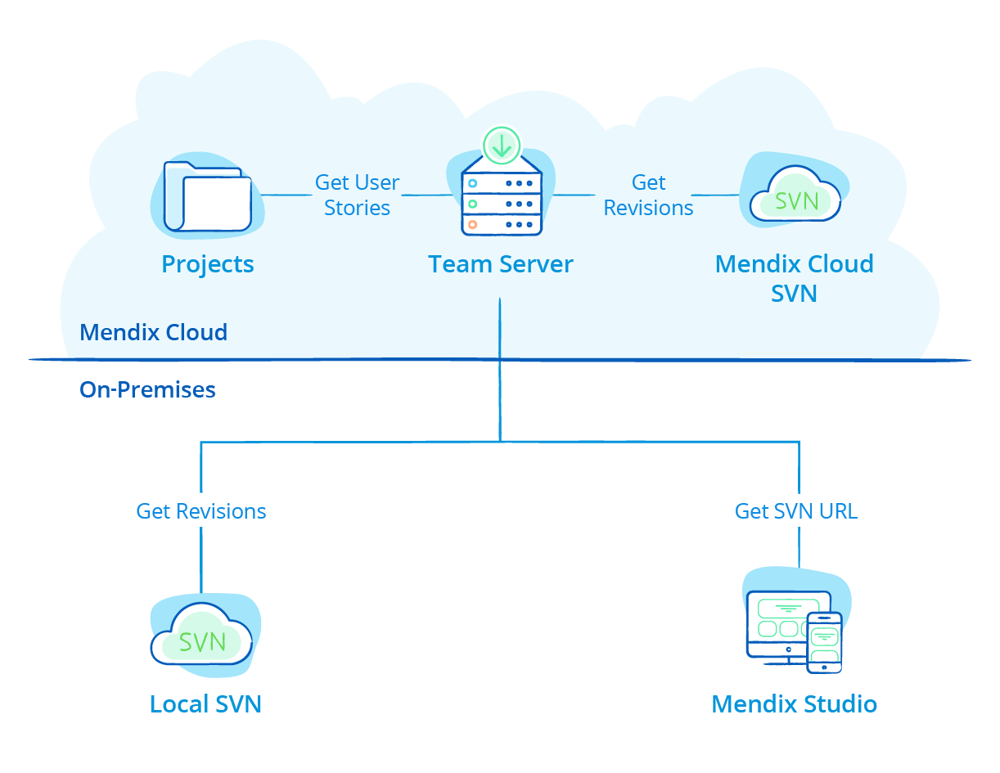
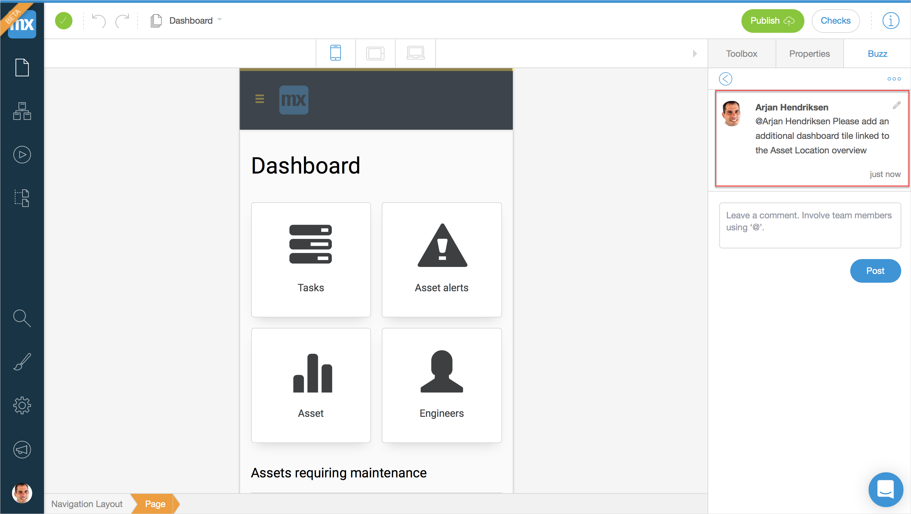
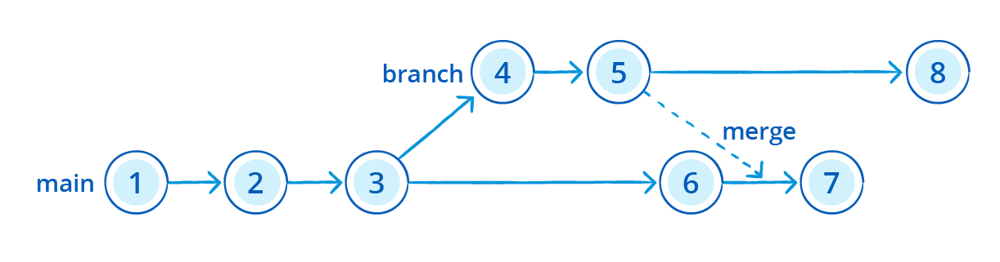

## 1 How Does Mendix Support Multi-User Development? {#multi-user}

Mendix Studio Pro and Mendix Studio combine multi-user development across different skill levels. Team members can choose Mendix Studio or Mendix Studio Pro, depending on their needs. More information can be found in [App Development](app-development).

At the start of a project, all team members can work together on the main line of the version control repository. Mendix Studio Pro users can share app updates with the rest of the team using the update and commit pattern via the version control repository. All changes made by team members using Mendix Studio will be shared via the version control repository when the Mendix Studio Pro user requests an update from the version control repository.

Assigning a dedicated branch for team collaboration using Mendix Studio provides full control over which changes are made in Mendix Studio.

For example, when a Business Developer creates a new set of pages and associated assets using Mendix Studio, the new app version can be shared in a branch line. Business users (for example, a Business Analyst) can then use Mendix Studio to review and change the content of app. When finished, the branch can be merged at the request of the Business Developer in Mendix Studio Pro. This provides the developer full control over the model changes. Effectively, this ensures that experienced developers on the the team control which elements are merged back from the branch.

For more details, see [Collaborative Development](https://docs.mendix.com/refguide/collaborative-development) in the *Mendix Studio Pro Guide*.

## 2 How Does Version Control Work in Mendix?

Mendix supports the use of a centralized version control repository based on Subversion (SVN), which is the [Mendix Team Server](https://docs.mendix.com/refguide/team-server-faq). Every project built using the Mendix Platform comes with the Team Server version control system. The Team Server uses SVN technology and enables multiple developers to work on the same project, continuously merging model changes into revisions held inside the version control repository.

This diagram presents the Mendix version control architecture:

Developers can manage revisions and conflicts as well as create branch lines, which can be merged back to a mainline branch as required. Every change in the platform is recorded and compared against other revisions to detect conflicts and manage updates. Users are invited to app projects via the [Developer Portal](https://sprintr.home.mendix.com/index.html) and assigned security roles, which allow them appropriate access rights to the models held in Team Server.

## 3 How Do I Cross-Reference User Stories & Application Change Commits? {#cross-reference}

Mendix provides an integrated development experience between the Team Server versioning repository, the application Project Dashboard, and Mendix Studio and Mendix Studio Pro. The integration of the Mendix Team Server version repository with both the app Project Dashboard and Mendix Studio Pro has the following significant advantages:

* It provides team members with an **integrated way to track requirements** throughout the whole development and delivery cycle. When you start working on your application, you just open Mendix Studio Pro to see the user stories planned for the current Sprint and start working on them.
* When team members commit app model changes to the Team Server from within Mendix Studio Pro, they can **select the user stories they have been working on**. The Team Server will automatically create links between user stories and the model changes made, providing a way to navigate from commits to the associated requirements.
* End-users can provide **feedback straight from the user interface of the app**, and this feedback can be transferred into a user story. As a developer, you can directly go to the form mentioned in the metadata of the feedback and implement the requested change.
* Team members can start **discussions** in Mendix Studio and the app project Buzz on implemented features (for example, on a dashboard page or business logic in a microflow).

{}

{}

From these discussions, new user stories can be created and implemented in Mendix Studio Pro. When linking the model commits to the user story, the full feedback cycle is ready and also cross-referenced.

{}

{}

## 4 How Do I Use My Own SVN Repository Instead of Mendix Team Server? {#ts-on-prem}

Next to the default central Mendix Team Server versioning repository, you can choose to configure your own on-premises SVN repository instead as a versioning repository for your projects.

For details on setup, see [How to Work with an On-Premises Version Control Server](https://docs.mendix.com/howto/collaboration-requirements-management/on-premises-svn-howto) in the *Mendix Studio Pro How-to's*.

## 5 How Does Mendix Support Branching and Merging?

A development project always starts with a single development line, which is called the main line. This is the development line that will lead within the development process.

A deployment from the main line must contain all the (released) functions of the application. In addition to the main line, a project can have multiple branch lines. Branches are made from a specific commit (revision) to the main line or a branch line. Creating a branch means that a copy is made of the selected revision that will be used as the starting revision for the new development line. This enables the developer to change the model in an isolated line. In most cases, a branch line is used for solving issues in a released version of the application at the same time as ongoing development continues in the main line. This allows for new development in the main line without the release of functionality that has not been finalized or tested. After you create a branch and solve the issue (or create a new large feature), it is possible to merge these changes with the main line.

Thanks to Mendix's model-driven development approach, merging models takes place with a higher level of accuracy than merging code. This is because Mendix understands the semantics of the models. This results in fewer conflicts, and if conflicts do arise, they can be resolved in Mendix Studio Pro through the consistency checking mechanisms described above.

Mendix supports creating and merging branches in the Mendix Team Server versioning repository. Next to this, it is possible to tag specific revisions with a release label. This allows teams to use industry patterns, like release branches and feature branches. By default, the Mendix deployment pipelines also use revision tagging to label version revisions with specific deployment pipeline moments. This can be used for auditing and version rollback purposes.

This video shows how you can manage branch lines in Mendix Studio Pro:

<video controls src="attachments/DO_CreateBranchLine1.mp4">VIDEO</video>

And this video presents how you can merge changes:

<video controls src="attachments/DO_MergeToBranchLine.mp4">VIDEO</video>

## 6 Which Version Repository APIs Are Available for Custom Versioning Integrations?

The Mendix versioning functionality is exposed through an API in the Team Server repository so that it can be called by other platform services or external applications. For example, a **get latest commit** call to the Team Server versioning repository API for an app project will return the latest revision of the artifacts for the project.

## 7 How Does Mendix Support Version Diffing?

Mendix Studio Pro has built-in diffing support on the application model. This means that when the developer retrieves changes from the versioning repository for all the app documents (like pages, microflows, and integrations), both versions are compared. Mendix Studio Pro checks that there are no conflicting changes and then automatically merges the two versions. The resulting changes can always be reviewed before committing the latest version to the versioning repository again. The developer has full control of the process.

When the changes result in a conflict (for example, you change a page which had been deleted by another developer), Mendix Studio Pro will provide feedback that this conflict has to be resolved first. For more information about conflict resolution capabilities, see the section [What Are the Conflict Resolution Capabilities in Mendix Studio Pro?](#conflict-res) below.

## 8 How Can I Review Changes Made by Other Developers After Performing an Update?

When retrieving new updates from the Mendix Team Server in Mendix Studio Pro, the developer has full control over which changes to accept or revert. After the update, all the changes are merged into the local model. When there is a merge conflict between the changes made by the developer and the update from the Mendix Team Server, the developer receives an overview of all the merge conflicts. This information can be used to determine whether the local change should be used or the change from the Team Server.

At all times, the developer is in control of which changes and merge conflicts are accepted. Changes can be reverted to the original version before committing the final version to the Team Server again.

## 9 What Are the Conflict Resolutions Capabilities in Mendix Studio Pro? {#conflict-res}

Mendix Studio Pro supports conflict resolution by showing detailed information about what the differences between two versions of a document are (for example, when you edit a list on a page, then someone else from the team deletes the list from that page). When a document is marked as conflicted, you can see the reason for the conflict in Mendix Studio Pro. Based on this detailed information, you can resolve the conflict by choosing "my version" or "their version" of the document.

In addition to document-related conflicts, Mendix Studio Pro can also handle conflicts at the level of the project. You can resolve a project conflict by choosing "my version" or by deleting the documents or folders involved.

Here are two examples:

* One developer deletes a document and another makes a change inside that document
* Both developers move a document, but they move it to different places in the project tree

If a whole folder (or module) was deleted and another developer changes a document inside that folder, the folder is restored locally and also marked as conflicted. This way you know that the intention was to delete that folder, but it was restored to show the context of the changed document.

## 10 How Can I Resolve Conflicts in External Files like Java Classes, Widgets & Images?

By default, Mendix Studio and Mendix Studio Pro also perform a diff comparison on external files like Java classes. When there are new versions or files have been deleted, this is directly handled by Mendix Studio Pro itself.

For additional diffing or conflict resolution on external files, external SVN tools like Tortoise SVN can be used.
