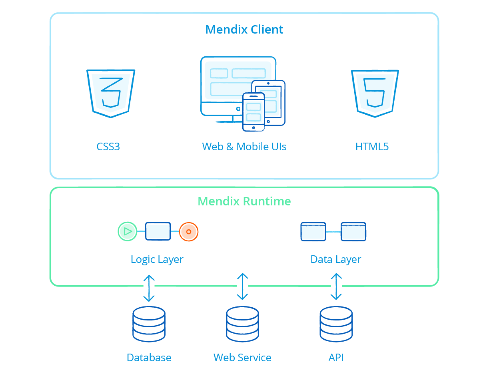

## 1 How Is Security Handled in a Mendix Application?

Before understanding how security is handled in a Mendix application, it is important to understand the [Mendix Runtime architecture](architecture-principles#runtime).

In a Mendix application, the UI layer is implemented in the Mendix Client as JavaScript libraries running in the browser. For hybrid mobile applications, the UI layer runs in a native Cordova container. The logic and data layers are implemented in the Mendix Runtime (the Mendix Runtime itself is developed in Java and runs on a Java virtual machine).

Within the Mendix Client, we implement measures against JavaScript-based security threats such as cross-site scripting. This prevents other websites and web applications running in the same browser from obtaining sensitive information from the Mendix app (for example, cookies).

What is more, the Mendix Runtime addresses server-side security threats, such as SQL injection and code execution. By default, a request originating from any client (including the Mendix Client) is perceived as untrusted.

Mendix app developers do not need to take technical security aspects into consideration when building Mendix apps, as the platform handles this as a service. Of course, this does not mean that developers do not have to consider security at all. Application-level authorization and access rights need to be configured in the application model by the developer. This is because most technical security aspects can be solved generically, and the business rules and requirements that are the prerequisites for access to data can be different for each application and business.

Each operation within the Mendix Runtime is called an “action.” The Mendix Runtime provides many predefined actions, such as triggering and executing workflows and evaluating business rules. To prevent any bypasses of the technical security mechanisms, these actions are implemented on the lowest levels of the Mendix Runtime, and they cannot be changed by app developers.

The core interface of the Mendix Runtime (which is responsible for the execution of any action) has a security matrix that contains all executable actions and data access rules per user role. The data access rules are applied at runtime when a query is sent to the database. This ensures that only data within the boundary of the access rule constraint is retrieved.

## 2 How Is Application Security Defined in Mendix?

Out of the box, Mendix provides role-based user access to applications built with the platform. Applications in Mendix consist of one or more modules. A module typically has a functional scope (for example, items, customers, orders) and is self-contained so that modules can be reused in multiple applications. Due to the distinction between applications and modules, security aspects are defined on both levels. Application-level security settings apply to all the modules within the application. Module-level settings are specific to each module.

Mendix application security is defined according to the parameters described below.

### 2.1 How Is App-Level Security & App Model Consistency Defined in Mendix?

The Mendix Platform supports configurable integrity checks for security on all the relevant aspects of applications deployed on the platform. Mendix checks the consistency of the security settings as well. For example, a person who is allowed to see a certain UI element that lists data from a table must also be authorized to view the data associated with that UI element.

Depending on the stage of development, application and integrity checks can be applied more or less stringently. This is advantageous in development and prototype contexts to avoid unnecessary activities regarding consistency and security in the preproduction stage. The security levels **Off** and **Prototype / demo** are only allowed for apps deployed to a development and/or local test environment, not for deployments in production environments. Deployment to the Mendix Cloud (except for Free Apps) requires the **Production** security level and the complete configuration of all security settings.

{}[**Video below will be remade and is to be used in this section as determined by Roald, please work into the content**]{}

<video controls src="attachments/DM_ProjectSecurity.mp4">VIDEO</video>

### 2.2 How Can I Define User Roles for My App?

An end-user of your application is assigned one or more user roles by an administrator or is provisioned automatically from a (third-party) identity and access management solution that can be integrated with the app. The user then gets all the access rights that these user roles represent.

Within a user role, it is possible to assign user management rights for this particular role as well, so that users assigned to this role can then manage access rights for other users with the selected role. This feature is relevant for supporting a delegated administration concept.

Every user role has one or more module roles. Module roles define a role on a module level (for example, “order entry” or “approver”). This means that users with that user role have all the access rights defined for those module roles. An end-user of your application only sees the user roles and not the module roles, so only user roles can be assigned to an end-user, while module roles are assigned to user roles. A user role aggregates multiple access rights on data, pages, and microflows (logic) from the module roles.

What is more, Mendix supports logging in to applications by anonymous users through the configuration of a specific role for this purpose.

For further details, see the section [How Are User Roles Assigned to Users in My App?](#user-roles-assigned) below.

### 2.3 How Can I Define a Password Policy?

Password policies can be defined flexibly (for example, by configuring the password strength, character sets allowed/prescribed, and password expiry policies). A password policy can also be defined by the organization when implementing SSO authentication using, for example, SAML or OpenID.

Additionally, two-factor authentication can be enabled within the Mendix Cloud for sensitive activities. Two-factor authentication can also be added anywhere within a Mendix application to further secure access to the app or parts of the app.

For further details, see the section [How Are Passwords Stored in My Mendix App?](#password) below.

### 2.4 How Configurable Is File Access in Mendix?

The access rights for file storage and use of images in Mendix applications are fully configurable.

## 3 How Is Data-Level & UI-Level Security Defined in Mendix?

Each Mendix application model consists of various modules that are self-contained. Data-level and UI-level security for pages, microflows (which execute actions), entities, and data sets is defined in each module itself.

The sections below describe how this level of security is configured in Mendix apps.

### 3.1 How Do Module Roles Work in My Mendix App Model?

Mendix distinguishes module roles from user roles so that the module along with its roles can be reused in different applications and/or published to the [Mendix App Store](https://appstore.home.mendix.com/index3.html).

### 3.2 How Can I Define Module-Level Security Settings?

At the module level, security logic is separated from application logic. This allows for easy accessibility as well as the maintenance and validation of security settings even by less technical users. All the security settings are managed from the Mendix Desktop Modeler in order to define access rights for the elements described below.

This video presents the various module-level security settings that are available:

<video controls src="attachments/DM_ModuleSecurity.mp4">VIDEO</video>

### 3.3 How Does Mendix Protect the Pages of My App?

Page access defines which application pages users with a certain module role can access. The navigation items (menu bars and buttons) are optimized so that they only show items that direct to the pages to which the user has access.

Page access takes the shape of a matrix showing pages and module roles. For each combination, the user can indicate whether or not the module role has access to the page. This information can also be edited within a page using the **Visible for** property .

<video controls src="attachments/ModuleSecurity.mp4">VIDEO</video>

### 3.4 How Is Business & Process Security Defined in My Mendix App?

Microflows are used to visually define business and process logic. Microflow access defines which microflows can be executed by users with a certain module role. The navigation items (menu bars and buttons) are optimized so that they only show microflows to which the user has access.

Microflow access is managed within a matrix of microflows and module roles. For each combination, the user can indicate whether or not the module role has access to the microflow.

This information can also be edited within a microflow using the **Allowed roles** property.

### 3.5  How Is App Data Encapsulated Securely in Mendix?

Entity access defines for each module role whether users with this role are authorized to create, read, update, and delete objects of the entity. Entity access is configured with access rules that apply to entities. Each access rule in turn applies to a (set of) module role(s). The access rules of an entity define what a user is allowed to do with objects of the entity. Users can be allowed to create and delete objects as well as view and edit member values. A member is an attribute or an association of an entity.

Furthermore, the data sets of objects available for viewing, editing, and removing, which can be limited by means of an XPath constraint. Every access rule is applicable to one or more module roles. An access rule grants certain access rights to those roles. Rules are additive, which means that if multiple access rules apply to the same module role, all the access rights of those rules are combined for that module role. This feature is applied, for example, when applications are configured for multi-tenant usage.

{}[**Video below will be remade and is to be used in this section as determined by Roald, please work into the content**]{}

<video controls src="attachments/DM_XPathSecurity.mp4">VIDEO</video>

## 4 How Is Security Handled at the Mendix Data Layer?

The core interface of the Mendix Runtime (which is responsible for the execution of any action) has a security matrix that contains all the executable actions and data access rules per user role. The data access rules are applied at runtime when a query is sent to the database. This ensures that only data within the boundary of the access rule constraint is retrieved.

## 5 How Does My Mendix Application Handle Known Security Threats?

To gain full security for a Mendix application, you need to explicitly give access to forms, entities, and microflows before an end-user can access them. By default, no end-user can access anything. To make it easier to create prototypes and demos, there are security levels that require fewer security settings than are needed for a production system.

The Mendix Runtime and the Mendix Client have out-of-the-box security measures that protect your Mendix applications against known security threats (including but not limited to SQL Injection, XSS, CSRF, and broken authentication). These security measures undergo a monthly external penetration testing.

## 6 Does My Mendix Application Comply with the OWASP Top 10?

The Mendix Runtime protects your application and data according to your model, wherein the Mendix Cloud handles security at the infrastructural level. The Mendix Runtime takes care of most known security threats (OWASP top 10) out of the box, as the functionality where most common security mistakes take place is abstracted away from developers. Mendix has compiled a [few best practices](https://docs.mendix.com/howtogeneral/bestpractices/best-practices-security-and-improvements-for-mendix-applications) to keep your Mendix application safe from attackers.

## 7 How Does My Mendix Application Support Multi-Tenancy?

Mendix offers out-of-the-box support for developing multi-tenant applications. Multi-tenant apps in Mendix share the same database, application logic, and user interface. Application logic can be extended with tenant-specific logic, and the UI can be styled per tenant.

Tenants are defined by identifying companies in the Mendix identity management module MxID. The company/tenant ID is used to do the following:

* Define a tenant-aware object model for the application. Tenant-level access to domain objects is configured using XPath definitions. This restricts access to those application object instances for the company to which the end-user belongs.
* Define tenant-specific microflows and configure access rights to implement tenant-level application and process logic.
* Apply tenant-specific styling of the UI by making the CSS dependent on the companies defined in the MxID.

Tenants can be custom defined in the application as well by using identifiers like division, country, and site.

## 8 Which Identity Management Solutions Can I Use in My Mendix Application?

Mendix offers MxID (which is a user management and provisioning service) as part of Mendix Cloud. MxID is built on the Mendix Platform and thus inherits all security measures from the platform. MxID provides an administration portal for the management of user access and authentication.

## 9 How Are Permissions Assigned with My Application?

Apart from the company profile and settings, Mendix supports the definition of Company Admins who can assign permissions to users following a delegated administration concept. One or more administrators can be identified per tenant who, in turn, can perform certain administrative tasks in the tenant according to the permissions granted.

## 10 How Are User Roles Assigned to Users in My App? {#user-roles-assigned}

Based on policy rules, users are assigned a user role within an application. MxID automatically reads the user roles from the application.

## 11 How Can My Mendix App Integrate with Third-Party Identity Management Solutions?

The built-in security role and authentication mechanisms in the Mendix Runtime support integration with other third-party identity managers (such as Microsoft Active Directory and SAP IDM) using protocols like LDAP or Kerberos.

## 12 How Are Users &  Services Authenticated When Accessing My Mendix App?

The authentication of users and services accessing Mendix apps is handled through MxID by default. MxID applies the OpenID standard.

### 12.1 How Does My Mendix App Support Single Sign-On?

The Mendix Runtime also supports SSO standards like SAML 2.0 and OpenID and provides APIs to other authentication mechanisms that might be implemented by customers, such as implementing two-factor authentication (for example, via text message codes or tokens).

Like user management and provisioning, authentication can also be integrated with third-party identity and access management solutions.

### 12.2 How Are Passwords Stored in My Mendix App? {#password}

Passwords in Mendix can only be stored in a hashed format. Mendix supports multiple hashing algorithms.

### 12.3 How Does Mendix Support Locking an Account After Failed Login Attempts?

If a user fails to log in with the correct password three times, the user account is blocked automatically for a minimum of 10 minutes.

An administrator can manually override such a block by resetting the password.

### 12.4 how Does Mendix Authenticate System and Service Interfaces Using Web Services, REST Services, & APIs?

System and service interfaces must also be authenticated in the context of the attached role. The default option for this is through a username and password, but other options like tokens are also possible. Authorization for APIs is derived from the authorizations defined in the application model.

For authentication, Mendix supports the following technical implementations:

* HTTP authentication
* Web service security standards
* Custom defined authentication mechanisms including Java

These options make it possible to apply identity propagation.

## 13 What Kind of Encryption Is Available in My Mendix Application?

Besides the default encryption at rest and in transit, users are able to implement column encryption or uploaded file encryption. Column and uploaded file encryption are supported out of the box via the [Encryption](https://appstore.home.mendix.com/link/app/1011/) module from the Mendix App Store using AES encryption.
