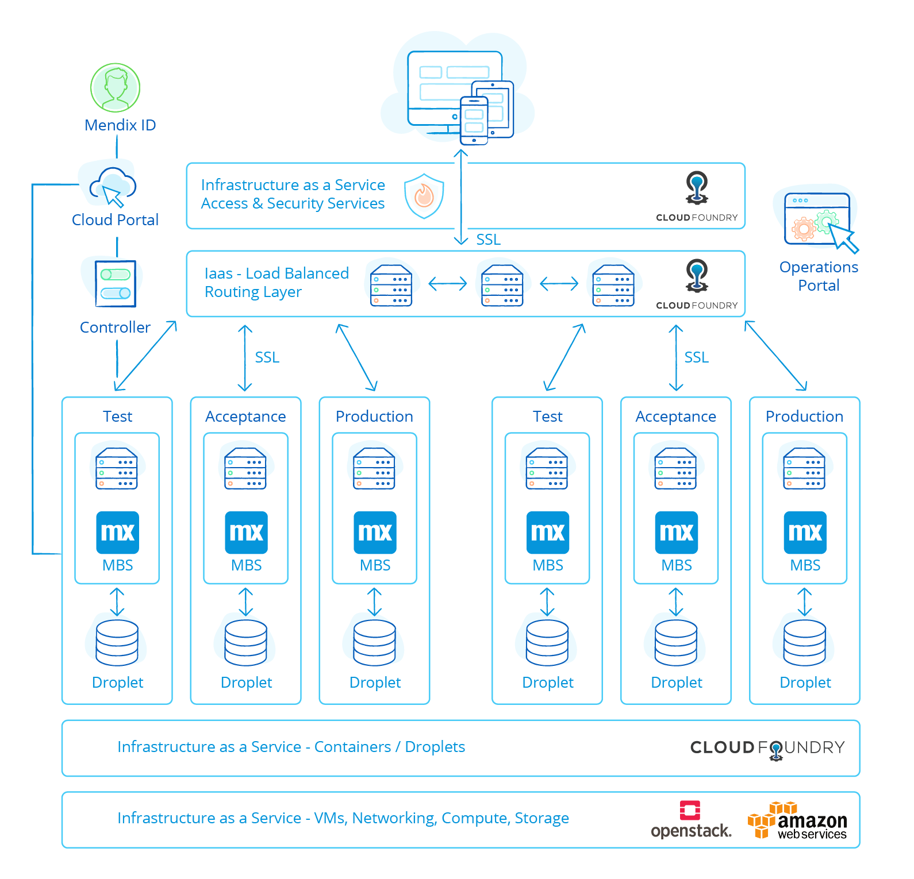

## 1 What Does the Mendix Platform Architecture Look Like?

Mendix enables companies to build, integrate, deploy, and maintain web and mobile applications faster and with better results, effectively reducing time-to-value.

The architecture of the Mendix Platform is focused on the vision to help our customers achieve that goal. Our view is that the next-generation app platform should address the fundamental challenges of app delivery by focusing on the following key aspects:

* Business & IT collaboration
* Model-driven development
* App-delivery cycle
* Cloud
* Openness

### 1.1 Business & IT Collaboration

Too often, IT projects are challenged in terms of cost override, scope creep, long timelines, and misaligned end-user expectations. According to the Standish Group, this is the case for 94% of large IT projects. Of those that fail altogether, 71% do so because of poor requirements management.

{}[**The numbers were taken from a Mendix whitepaper written by Hans, ask for source of numbers**]
{}

The Mendix vision is to truly align business and IT and foster collaboration throughout the complete lifecycle of the application, from requirements gathering to the development, deployment, and management of the apps. Collaboration also calls for a highly iterative approach and instant feedback mechanisms at every stage of the lifecycle. We at Mendix believe that the speed of development and a better time-to-value is critical for meeting business goals.

This philosophy has driven fundamental choices in the Mendix Platform architecture, especially regarding how apps are developed in Mendix and the extent to which the platform supports the full application lifecycle.

### 1.2 Model-Driven Development

In order to involve business users in the design and development of applications at a level where they can actively participate, Mendix fully adopts a visual model-driven development (MDD) approach. MDD provides an excellent communication mechanisms for aligning business and IT stakeholders, thereby ensuring greater quality and more successful outcomes.

MDD has emerged as one of the leading approaches for enabling rapid collaborative development. Because it uses visual models for defining application logic, process flows, and user interfaces, MDD empowers both developers and business users to rapidly build applications without the need for labor-intensive low-level coding. Consequently, MDD is significantly faster than traditional programming languages like C# and Java.

The Mendix Platform interprets models in the runtime, which means that the model is actually the application. As opposed to approaches where a visually-modeled design would actually generate code (for example, Java or .Net), the Mendix model interpretation approach has the following significant advantages:

* Application changes can be accommodated more easily. In addition, since the model is the application, Mendix safeguards compatibility of the application and the model.
* Extending models with custom code is controlled more elegantly, as the model is aware of the custom code and includes it in consistency checks, in contrast to the insertion of custom code into generated code. Mendix’s model-interpretation approach solves the fundamental round-trip problem of code generation, whereby changes in the model would conflict with custom-code extensions.
* Monitoring and analyzing application behavior in the runtime can be set up more dynamically and flexibly versus defining monitor parameters beforehand.
* Debugging and solving problems becomes easier for the developer, as they do not have to understand how the generated code relates to the visual model. Debugging and problem-solving are done on the model, not on the generated code.
* Not having custom changes in generated code means the technical architecture of the platform can be modernized without impacting your model. This means it is easier and cheaper to benefit from technical innovation.

Considering that a significant portion of the total cost of ownership (TCO) of applications actually comes after initial go-live, the Mendix approach to MDD and model interpretation translates to substantial savings in cost of ownership. In the context of building systems of differentiation and innovation that require agility and flexibility for application changes, it is essential to realize those benefits beyond the initial development phase.

### 1.3 The App Delivery Cycle

While MDD is a key architectural choice, the Mendix closed-loop approach to application delivery is equally important in aligning business and IT for fruitful collaboration. The complete app delivery cycle is natively supported in the Mendix Platform through the following factors:

* Design – Mendix supports the direct capture of requirements and allows teams to refine and prioritize user stories; estimate, plan, and monitor SCRUM sprints; and manage releases
* Build – applications are built through visual model-driven development, which promotes communication, readability, productivity, quality and short iterations
* Deploy – Mendix’s one-click deployment allows for the seamless provisioning and management of apps in the cloud, including staging to test, acceptance, and production environments
* Manage – all applications can be managed from a single dashboard, ensuring availability, security, performance, and scalability
* Iterate – feedback can be given on design artifacts like UIs and can include end-user input on live applications, which can all be used in the next change cycle of design-build-deploy-manage
* Collaborate – the Mendix Platform comes with a social collaboration environment and instant feedback mechanisms, and [Mendix Buzz](https://sprintr.home.mendix.com/) in the Developer Portal enables all stakeholders to communicate and collaborate through the whole lifecycle of the project

### 1.4 Cloud

Our focus on shortening time-to-value for app delivery does not stop at the development stage. The Mendix Platform has a cloud-native architecture, designed conform to the 12-factor best practices, and optimized for deployment on cloud infrastructure. As the cloud deployments are fully standardized and automated, we eliminate all the traditional hassle of infrastructure and deployment management. Mendix provides easy self-service access for administrators to manage users, configurations, one-click app deployment, and monitoring dashboards.

Customers benefit from our continuous innovation to improve the Mendix Platform for cloud deployment. Our pursuit to optimize the standard configuration and minimize the platform footprint translates to cost efficiencies, which are passed on to our clients.

Furthermore, we take care of all the non-functional aspects of apps regarding security, performance, scalability, and auditability. For example, because of the stateless nature of the Mendix Runtime, all your apps can be easily scaled to run on multiple instances. An example like this allows our customers to focus 100% on serving the needs of their business.

### 1.5 Openness

A core design principle for the Mendix Platform is to leverage open standards. Mendix adopts opens standards to support the seamless integration of the platform and applications built on the platform, and to support the exchange of design artifacts. For example, the application domain model in Mendix is based on UML, the process and application logic model is based on BPMN, and the UI model leverages HTML5 and CSS3. On the platform level, a variety of standards like OpenID for identity management, REST and SOAP for web service integration, and SAML for user-authentication are adopted.

In addition, Mendix supports two main levels of APIs:

* Application-level APIs – every application built using the Mendix Platform has powerful API options, and every element of the application model can be easily provided as part of the API through REST or SOAP services
* Platform-level APIs – the core platform functionality is accessible through APIs, which allows developers to access and integrate Mendix with other tools and applications (for example, build-and-deploy APIs to support continuous integration)

## 2 Which Technologies Are Behind the Mendix Platform? {#technologies}

Mendix uses best-of-breed standard technologies to run your applications. We select technologies for the Mendix Platform based on the following guiding principles:

* The fit for cloud architecture – to support scalability, high availability, and agility, the technologies used in the platform should be a good fit for cloud architecture
* Flexibility – the technology should fit well within any organization and be portable across different deployment platforms – whether you choose to run on-premises, in a private cloud, or on a public cloud, Mendix should not limit you
* Future-focused – Mendix want you to benefit from new innovations, not be stuck in the past, so you should be able to use any channel available to connect to customers, deploy to containers, organize your development using microservices, and use the latest cognitive technologies to provide your end-users with the best apps

### 2.1 Platform Architecture

The Mendix Platform is a completely integrated application platform-as-a-service (aPaaS) offering for designing, building, deploying, and managing enterprise apps.

The platform is accessible for developers and administrators through the Developer Portal, which provides access to apps as well as services for development, operations, and administration of apps and app services. The platform includes an [App Store](https://appstore.home.mendix.com/index3.html) that features hundreds of publicly available building blocks to speed up development. The Mendix App Store can be configured for private use as well, so that apps and building blocks can be shared across your organization. The platform features online collaboration amongst users through the Developer Portal.

{}[**Removed mendix-app-platform-overview.png because it is too outdated; UX may update**]{}

From a technology perspective, the platform components listed below are primarily implemented as Mendix apps.

#### 2.1.1 Developer Portal

The [Mendix Developer Portal](https://sprintr.home.mendix.com/) is a collaborative environment for the design, development, and deployment of apps. This web-based portal comes with online social collaboration features (via the **Buzz**), a notification service, and a directory of active members in your company who could be invited for participation in app projects as well as for social collaboration.

The Developer Portal is where you do most of your project planning and tracking according to the Scrum methodology. You can define sprints and stories, follow the progress, and see the velocity for your project.

#### 2.1.2 The Modelers

The [Desktop Modeler](https://docs.mendix.com/refguide/desktop-modeler-overview) and [Web Modeler](https://docs.mendix.com/refguide/web-modeler/overview-wm) are the multi-user modeling studios of the Mendix Platform. The general purpose of the Modelers is to provide an integrated, unified modeling space, where business analysts, and IT engineers can work closely together to model the various application elements.

#### 2.1.3 Team Server

The Team Server is the central repository for managing and versioning application models. Team Server is written as an extension on top of Subversion (SVN), a widely adopted open-source software configuration management system.

For more information, see [Version Control & Multi-User Development](../app-lifecycle/version-control).

#### 2.1.4 Build Server

The Build Server creates deployment packages from artifacts (such as models, style sheets, and custom Java classes) in the app project on the Team Server, where all the application artifacts are versioned and stored in project folders. The Build Server is triggered by the Cloud Portal or from the Mendix Runtime. The Build Server also performs package validation and determines if the specific build is a deployable package.

#### 2.1.5 MxID

MxID is a user-management and provisioning service that applies the OpenID standard. It can be integrated with active directory and single sign-on (SSO) protocols.  MxID provides a login server for the Developer Portal, which is the central access portal for Mendix apps. Furthermore, MxID provides an administration portal for the management of companies and app users.

#### 2.1.6 Cloud Portal

The [Cloud Portal](../app-capabilities/multi-cloud-overview#cloud-portal) enables you to manage users, environments, and configurations as well as to deploy apps to the cloud with a single click and manage and monitor their performance. The Cloud Portal is the interface to the deployment services layer in the platform. Mendix also offers a Cloud Portal for deploying to [SAP Cloud](../app-capabilities/deploy-with-partners#running-sap-cloud) and [IBM Cloud](../app-capabilities/deploy-with-partners#ibm-cloud).

#### 2.1.7 App Store

The [Mendix App Store](https://appstore.home.mendix.com/index3.html) is a public marketplace for apps and application building blocks. This App Store can also be configured to serve as a private enterprise app store, so that end-users and business managers can discover what apps are accessible to them within their organization.

For more information, see [App Store & Component Reuse](../app-lifecycle/app-store-reuse).

### 2.2 Cloud Architecture {#cloud-architecture}

The Mendix Runtime supports deployment on Windows and Linux OS. However, we are seeing the increased adoption of container-based deployment technology like Docker, Kubernetes, and Cloud Foundry, both on-premises (private cloud) and hosted (public cloud). The Mendix Cloud uses Cloud Foundry on AWS as the infrastructure to run your applications.

Deployment on a cloud platform mainly consists of deploying one or more runtime components in containers, them configuring how these components should run and to which services they should connect. The technical aspects of configuring the container and the runtime are handled by the Mendix buildpack.

The main component to be deployed in any situation is the Mendix Runtime, which runs on a Java virtual machine. This runtime has been designed for use in containers and cloud platforms. One major aspect of this is that it follows the [Twelve-Factor Methodology](#twelve). For cloud deployment the following are essential:

* Statelessness – the Mendix Runtime is designed to be a stateless process, ensuring easy scaling and high availability
* External configuration – when deploying your app in a cloud, dependencies like a database and file storage will be automatically provisioned, and upon starting the runtime, it will be configured to use these

Next to the Mendix runtime process, the container will also be configured to run supporting processes to enable monitoring and operations.

### 2.3 App Architecture

The runtime for your applications is composed of these three main components:

* Runtime – the scalable server component responsible for executing your logic and storing and retrieve your objects
* Web client – the web interface displayed in the end-user's browser is handled by the web client
* Mobile client – the user interface of your mobile app is managed by the mobile client

#### 2.3.1 Runtime {#runtime}

The Mendix Runtime interprets and executes the models of your apps. The runtime has a 12-factor-compatible design using industry-leading Java and Scala technologies.

{}[**Note: image should be redone based on the components below**]{}

The runtime consists of the following components:

* Platform core – responsible for the correct startup and shutdown of your application and loading the required libraries and extensions
* Object cache – handles the creation and removal of objects
* Session manager – manages the creation of user sessions and the cleanup of logged-out or abandoned sessions
* HTTP server – included in the Mendix Runtime to handle requests from the web and mobile client and to handle service requests
* Microflow engine – executes your microflows and microflow activities
* Data layer – persists and retrieves objects from your application database
  * Also responsible for creating and updating the database structures required to persist your data: the data layer supports a large number of different databases, and data is stored using common data model design best practices (for details, see the section [What Databases Does Mendix Support?](../app-capabilities/data-storage#database-support) in *Data Storage*)
* Integration layer – handles incoming and outgoing service requests for web services, REST APIs, app services, and OData
* Client API – responsible for communication with web and mobile clients; the API is used to retrieve data, persist data changes, and execute microflow logic
* Configuration API – this JSON API is used by the Cloud Portal and container buildpack to configure the runtime
* Monitoring API – this JSON API is used by the Cloud Portal and container buildpack to retrieve monitoring metrics
* Custom APIs – this Java APIs is used to extend the Mendix Runtime (for example, with microflow activities or entity listeners)

#### 2.3.2 Web

The web client is designed using a single-page architecture, wherein a single JavaScript web page is loaded into the browser that will then update the page and interact with the Mendix Runtime as required by the actions of the user. This may include retrieving parts of the web page as well as retrieving and storing data.

The client is predominantly implemented using HTML5, CSS with Sass and Bootstrap, and the React framework. For more information, see [Web Client Settings](https://docs.mendix.com/refguide/custom-settings#9-web-client-settings).

#### 2.3.3 Mobile

Mobile applications use the same HTML5-, CSS-, and React-based client architecture, but they are deployed using Apache Cordova. This framework enables mobile apps built using state-of-the-art web technologies to offer a great mobile user experience:

* Accessibility – apps can be discovered in the standard device app store, installed on mobile devices, and be opened via an icon
* Offline availability – because the application is installed on the mobile devices (including all required resources and potentially cached data), end-users can use your Mendix app offline, and relevant app data is cached in a SQLite database on your device
* Support for native functionality – Apache Cordoba enables JavaScript applications to use native device functionality – this enables you to, for example, benefit from all the sensors available in your mobile device, like the camera and microphone

For more details on Mendix mobile device support, see [Mobile Apps](../app-capabilities/mobile-apps).

## 3 What Does the Mendix Cloud-Native Architecture Look Like? {#cloud-native}

Seeing how the goals of cloud-native and Mendix align, it is not surprising that the Mendix architecture complies with most of the best practices of cloud-native architecture.

The goal of cloud-native architecture is to be able to scale out to many applications and nodes while supporting the needs of organizations for speed and flexibility when delivering new functionality.

### 3.1 Core Aspects {#cloud-native-architecture}

The following aspects are core to a cloud native architecture:

* Agile and DevOps – Collaboration in small cross-functional teams ensures speed and business agility. By employing Agile and DevOps practices, teams have all the skills to develop, deploy, and operate the functionality for which they are responsible.

* Deployment standardization – Containers enable you to deploy your application in any cloud, in an automated fashion, and to ensure quality, repeatability, and speed. Deployment standardization enables a small DevOps team to handle anything related to operations.
* Microservices – Microservices offer a software architecture that is best aligned with small Agile DevOps teams. This architecture is best capable of benefitting from the qualities of containers.

The above aspects are enabled on the Mendix Platform, along with the following:

* Support for the full system development lifecycle (SDLC) throughout the platform means Agile DevOps teams can collaborate on requirements, development, testing, deployment, and operations while the ease-of-use and integrated nature of all the tools ensure your Agile DevOps teams can stay limited in size.

* Mendix uses Cloud Foundry as the default target PaaS, and Cloud Foundry uses containers to provision and scale application environments. The Mendix Platform uses a single container configuration method both for Cloud Foundry and for Docker and Kubernetes, which provides you with a standardized multi-cloud container deployment strategy. On top of this, Mendix enables you to easily build, test, deploy, and scale your applications. DevOps teams can do this through the Mendix Cloud Portal web interface, or use Cloud APIs to automate the deployment of an entire landscape of Mendix apps.

* Mendix is well-suited for small Agile teams to build microservices applications, and different types of integrations can be used to create a landscape of collaborating microservices. Many microservice landscapes use REST heavily, which is well-supported in Mendix. What is more, every REST API that you create in Mendix is automatically documented using OpenAPI.

### 3.2 Runtime {#runtime}

From a runtime perspective, the Mendix Runtime runs your applications within the context of a cloud-native architecture. The most important aspect of this is that the Mendix Runtime has been designed to be completely stateless. All the state that is relevant to all the processes executing your application is shared through a shared database. This means that the Mendix Runtime can easily be scaled by adding or removing runtime instances. It also ensures resilience and high availability, as user requests can be handled by any of the available runtime instances. This is completely transparent to your app's end-users.

### 3.3 Support for Twelve-Factor Methodology {#twelve}

The [Twelve-Factor App](https://12factor.net/) methodology is a set of best practices for cloud-native applications. The sections below describe how Mendix conforms to these requirements.

#### 3.3.1 Codebase

By default, the source code for every app you create with Mendix is stored in the Mendix Team Server code repository. When you deploy an application, a package is created based on your model as stored in the Team Server. This package is then deployed to your different environments like test, acceptance, and production.

#### 3.3.2 Dependencies

All the dependencies (like modules and libraries) used by your app's modules are part of the app model. This means that no implicit dependencies to tools exist in your environment. This ensures reliable deployments.

#### 3.3.3 Configuration

Configuration needs are defined in your application model through constants. These values can be specified at deployment time in your environment, or through APIs called in your CICD pipeline. The actual configuration values are never part of your model, which means that the same deployment package can be deployed in any test, acceptance, or production environment without changing the app model.

#### 3.3.4 Backing Services

All external requirements (like the database to store your application data) and services to be called from your application can be configured at deployment time. Like the previous requirements, this ensures that the same tested deployment package can be used in any situation, with any backing service, without model changes.

#### 3.3.5 Build, Release, Run

If it was possible to change code in a production environment, the scaling of your application would become unpredictable and unreliable. It would also make debugging and problem-solving harder. To avoid this problem, the Mendix Platform clearly separates the build and run stages.

In the Mendix Developer Portal, you first have to build a package from your model, which can then be deployed to your environments. If you want to make a code change in production, you have to modify your model then build a new package. Mendix also provides APIs to build and deploy your applications, so you can incorporate this approach in your custom CICD pipeline.

#### 3.3.6 Processes

The Mendix Runtime is designed to be completely stateless. It shares data through a database, ensuring easy scalability and resilience.

#### 3.3.7 Port Binding

To ease the scaling and running of the same app in different environments, the app should be self-contained (meaning, where it listens for client requests should be configurable). Mendix apps can be configured in this way, enabling the underlying PaaS (for example, Cloud Foundry) to easily scale the number of containers hosting your app.

#### 3.3.8 Concurrency

Mendix uses a combination of Java threads and processes to scale to the demand of your end-users. The Twelve-Factor Methodology stresses the need to scale via processes; otherwise, you will be limited in your scaling requirements to the maximum of what one Java virtual machine (JVM) can support (vertical scaling). By also supporting process scaling, extra resources can always easily be added (horizontal scaling).

#### 3.3.9 Disposability

Mendix Runtime instances can be stopped and started as required. In a multi-instance environment, users will usually not notice if one runtime instance is restarted. The benefit of this is that horizontal scalability is simpler and faster, and deployment of new versions or new configuration becomes faster.

#### 3.3.10 Development/Production Parity

To guarantee quality, apps deployed in testing environments should behave similarly in production environments. In the Mendix Cloud, all environments are provisioned in the same way. The only differences are configuration, data, and your application. Data can be moved between environments through backup and restore to ensure testing with representative data.

#### 3.3.11 Logs

Mendix Cloud uses the Cloud Foundry firehose to collect all the log events from all your applications. This can be viewed and filtered in the Mendix Cloud Portal.

{}**[Beta: stream these log events into 3rd party event viewers like datadog]**{}

#### 3.3.12 Admin Processes

To avoid synchronization issues, the Twelve-Factor Methodology advises shipping admin code with application code. Mendix enforces this practice, so the only code that will run in your app environment is code that is part of your app. This means that you need to make admin code part of the model. Users often implement this with admin logic in an admin page by either implementing a microflow to run after the app has started or creating APIs to trigger admin actions.

#### 3.3.13 Three More Best Practices

In addition to the above 12 factors, Mendix has recently incorporated the three other best practices that have been added to the methodology:

* Telemetry – The Mendix cloud provides you with the basics for understanding the health of your application, from container resource usage to database and application activity. You also have access to application logs and events.
* Security – Role-based authorization is provided out-of-the-box with every Mendix application. You can define application roles, module roles, and use these roles for all the parts of your application (on data, logic, pages, and APIs).
* APIs – Most apps built these days are part of a larger solution. This means that they either use existing services, offer functionality to other services, or both. Regardless, it is crucial to have good APIs that are easy to build and use. Mendix offers extensive support for building and consuming APIs. Any API you define in Mendix is automatically accompanied by documentation in the form of an OpenAPI document.

## 4 How Does the Mendix Architecture Enable Scalability & Performance?{#scalability-performance}

The Mendix architecture is based on a stateless runtime. Due to its stateless nature, additional resources can be easily added as required to support increasing user or processing numbers. Every user request and every transaction can be handled by any one of the runtime instances available. If your performance needs require you to handle more transactions or user requests, you can simple add another runtime instance to handle part of the processing.

The stateless aspect of the Mendix Runtime is achieved by moving all relevant changed data to the client, so your data is either committed to the database or kept track of in the client. Whenever one of the runtime instances needs data that is not yet saved, the data is sent from the client to the runtime. For more details, see [Dirty State in a Cluster](https://docs.mendix.com/refguide/clustered-mendix-runtime#9-dirty-state-in-a-cluster).

This design does not just ensure scalability, it also benefits performance. This is because it ensures that most of the data used by the user is available in the browser, thereby avoiding a roundtrip to the runtime, or worse, to the database to fetch data needed in the page used by the user.

For more info, see the section [How Does the Mendix Runtime Implement a Stateless Architecture?](#stateless-runtime-architecture) below and revisit section [3 What Does the Mendix Cloud-Native Architecture Look Like?](#cloud-native).

## 5 How Does the Mendix Architecture Enable High Availability? {#high-availability}

The stateless Mendix architecture benefits scalability and performance as well as availability and robustness. If you are using multiple runtime instances, user requests can be handled by any one of the instances. If one instance is too busy or unavailable, another instance will transparently handle the user request.

To ensure runtime instances are always running, Mendix relies on the underlying platform. Both Cloud Foundry (which includes [SAP Cloud](../app-capabilities/deploy-with-partners#running-sap-cloud) and [IBM Cloud](../app-capabilities/deploy-with-partners#ibm-cloud)) and Kubernetes will automatically ensure that the configured amount of instances is running. If one of the instances goes down, the platform will automatically restart the instance.

What is more, high availability can be realized in both container- and server-based installations:

* For details on a server-based installation, see [How to Configure High Availability](https://docs.mendix.com/deployment/on-premises/high-availability) in the Mendix documentation
* For a container-based setup, a container framework like Cloud Foundry or Kubernetes will provide the high availability out of the box - for details, see [How to Run Mendix on Kubernetes](https://docs.mendix.com/deployment/docker/run-mendix-on-kubernetes)

## 6  How Does the Mendix Runtime Implement a Stateless Architecture? {#stateless-runtime-architecture}

To ensure scalability, performance, and high availability, Mendix has implemented a stateless runtime. This means that any runtime instance available can handle a user request, regardless of any previous requests or subsequent requests.

To achieve this, runtime instances have state for the duration of a user request. At the end of a request, all the committed state will be saved to the client. All the uncommitted state will be returned to the client, along with all other data that the client needs.

For more information, see [Clustered Mendix Runtime](https://docs.mendix.com/refguide/clustered-mendix-runtime) in the Mendix Reference Guide.
