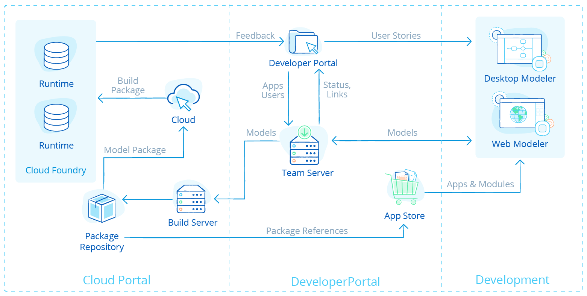

# 1 What are the key architectural principles behind the Mendix platform?

## 1.1 Model-Driven Development

Model-driven development (MDD) has emerged as one of the leading approaches for enabling rapid application development. Because it uses visual models for defining application logic, process flows, and user interfaces, MDD empowers both developers and business users to rapidly build applications without the need for labor-intensive low-level coding. Consequently, it’s significantly faster than traditional programming languages like C# and Java. In order to involve business users in the design and development of applications to a level where they can actively participate, we have fully adopted a visual MDD approach. MDD provides an excellent communication mechanism to align business and IT stakeholders, thereby ensuring greater quality and more successful outcomes.

## 1.2 Microservices, Containers and Deployment Standardization

Microservices offer a software architecture that is best aligned with small Agile DevOps teams. This architecture is best capable of benefitting from the qualities of containers. Containers enable you to deploy your application in any cloud, in an automated fashion, and to ensure quality, repeatability, and speed. Deployment standardization enables a small DevOps team to handle anything related to operations.

## 1.3 Statelessness

Modern Web-scale apps leverage stateless architectures as a means for supporting greater scalability and resilience. Statelessness supports horizontal scalability by allowing additional resources to be easily added as required to support increasing user or processing loads. Every user request and every transaction can be handled by any one of the runtime instances available. If your performance needs require you to handle more transactions or user requests, you can simply add another runtime instance to handle part of the processing. As state is managed outside the runtime, resiliency can also be increased by more readily failing over from one run-time instance to another.

## 1.4 Openness

Openness is a fundamental architectural requirement of any modern app platform, allowing apps to readily coexist and leverage other apps and app services, as well as to allow the platform itself to fit within your IT landscape and support your core development processes and standards.

## 1.4 Twelve-Factor App Principles

While not strictly a set of architectural principles, the [Twelve-Factor App](https://12factor.net/) methodology (originally developed by the Heroku team) is a set of best practices whose purpose is to avoid a set of common systemic mistakes involved in building cloud-native apps. 

# 2 What are the key components of the Mendix platform and their architecture?

The Mendix Platform is a completely integrated application platform-as-a-service (aPaaS) offering for designing, building, deploying, and managing enterprise apps. The platform is accessible for developers and administrators through the Developer Portal, which provides access to apps as well as services for development, operations, and administration of apps and app services. The platform includes an [App Store](https://appstore.home.mendix.com/index3.html) that features hundreds of publicly available building blocks to speed up development. The Mendix App Store can be configured for private use as well, so that apps and building blocks can be shared across your organization. The platform features online collaboration amongst users through the Developer Portal.

The below diagram provides an overview of the key components of the Mendix Platform.

## 2.1 Key Platform Modules and Services

### 2.1.1 Developer Portal

The [Mendix Developer Portal](https://sprintr.home.mendix.com/) is a collaborative environment for the design, development, and deployment of apps. This web-based portal comes with online social collaboration features (via the **Buzz**), a notification service, and a directory of active members in your company who could be invited for participation in app projects as well as for social collaboration.

The Developer Portal is where you do most of your project planning and tracking according to the Scrum methodology. You can define sprints and stories, follow the progress, and see the velocity for your project. The is hosted on the Mendix public cloud running on AWS.

### 2.1.2 The Modelers

The [Desktop Modeler](https://docs.mendix.com/refguide/desktop-modeler-overview) and [Web Modeler](https://docs.mendix.com/refguide/web-modeler/overview-wm) are the multi-user modeling studios of the Mendix Platform. The general purpose of the Modelers is to provide an integrated, unified modeling space, where business analysts, and IT engineers can work closely together to model the various application elements. The Desktop Modeler runs locally on the developer’s computer, while the Web Modeler is hosted on the Mendix public cloud running on AWS.

### 2.1.3 Team Server

The Team Server is the central repository for managing and versioning application models. Team Server is written as an extension on top of Subversion (SVN), a widely adopted open-source software configuration management system. The Team Server may be hosted in Mendix Cloud or deployed on-premises.

For more information, see [Version Control & Multi-User Development](../app-lifecycle/3.5-version-control).

### 2.1.4 Build Server

The Build Server creates deployment packages from artifacts (such as models, style sheets, and custom Java classes) in the app project on the Team Server, where all the application artifacts are versioned and stored in project folders. The Build Server is triggered by the Cloud Portal or from the Mendix Runtime. The Build Server also performs package validation and determines if the specific build is a deployable package.

### 2.1.5 MxID

MxID is a user-management and provisioning service that applies the OpenID standard. It can be integrated with active directory and single sign-on (SSO) protocols. MxID provides a login server for the Developer Portal, which is the central access portal for Mendix apps. 

Furthermore, MxID provides an administration portal for the management of companies and app users.

### 2.1.6 Cloud Portal

The [Cloud Portal](../app-capabilities/8.1-multi-cloud-deployment-overview#cloud-portal) enables you to manage users, environments, and configurations as well as to deploy apps to the cloud with a single click and manage and monitor their performance. The Cloud Portal is the interface to the deployment services layer in the platform. Mendix also offers a Cloud Portal for deploying to [SAP Cloud](../strategic-partners/8.2-deploy-with-partners#running-sap-cloud) and [IBM Cloud](../strategic-partners/8.2-deploy-with-partners#ibm-cloud).

### 2.1.7 App Store

The [Mendix App Store](https://appstore.home.mendix.com/index3.html) is a public marketplace for apps and application building blocks. This App Store can also be configured to serve as a private enterprise app store, so that end-users and business managers can discover what apps are accessible to them within their organization.

For more information, see [App Store & Component Reuse](../app-lifecycle/3.7-app-store-reuse).

## 2.2 PaaS Framework and Multi-Cloud Deployment

Mendix uses Cloud Foundry as the default target PaaS, and Cloud Foundry uses containers to provision and scale application environments. The Mendix Platform uses a single container configuration method both for Cloud Foundry and for Docker and Kubernetes, which provides you with a standardized multi-cloud container deployment strategy. On top of this, Mendix enables you to easily build, test, deploy, and scale your applications. DevOps teams can do this through the Mendix Cloud Portal web interface, or use Cloud APIs to automate the deployment of an entire landscape of Mendix apps.

## 2.2.1 Microservices 

Mendix is well-suited for small Agile teams to build microservices applications, and different types of integrations can be used to create a landscape of collaborating microservices. Many microservice landscapes use REST heavily, which is well-supported in Mendix. What is more, every REST API that you create in Mendix is automatically documented using OpenAPI.

## 2.3 Mendix Clients

### 2.3.1 Web Client

The web client is designed using a single-page architecture, wherein a single JavaScript web page is loaded into the browser that will then update the page and interact with the Mendix Runtime as required by the actions of the user. This may include retrieving parts of the web page as well as retrieving and storing data.

The client is predominantly implemented using HTML5, CSS with Sass and Bootstrap, and the React framework. For more information, see [Web Client Settings](https://docs.mendix.com/refguide/custom-settings#9-web-client-settings).

### 2.3.2 Mobile

Mobile applications use the same HTML5-, CSS-, and React-based client architecture, but they are deployed using Apache Cordova. This framework enables mobile apps built using state-of-the-art web technologies to offer a great mobile user experience:

•            Accessibility – apps can be discovered in the standard device app store, installed on mobile devices, and be opened via an icon

•            Offline availability – because the application is installed on the mobile devices (including all required resources and potentially cached data), end-users can use your Mendix app offline, and relevant app data is cached in a SQLite database on your device

•            Support for native functionality – Apache Cordoba enables JavaScript applications to use native device functionality – this enables you to, for example, benefit from all the sensors available in your mobile device, like the camera and microphone

For more details on Mendix mobile device support, see [Mobile Apps](5.4-mobile-apps).

# 3 What is the Mendix Runtime and how does it support key architectural principles?

The Mendix Runtime executes your applications within the context of a cloud-native architecture. In this section we will have a look at the core components of the Mendix runtime and related capabilities, as well as take a deeper look at several important aspects of runtime execution.

## 3.1 Runtime 

The Mendix Runtime interprets and executes the models of your apps. The runtime has a 12-factor-compatible design using industry-leading Java and Scala technologies.

The runtime consists of the following components:

•            Platform core – responsible for the correct startup and shutdown of your application and loading the required libraries and extensions

•            Object cache – handles the creation and removal of objects

•            Session manager – manages the creation of user sessions and the cleanup of logged-out or abandoned sessions.

•            HTTP server – included in the Mendix Runtime to handle requests from the web and mobile client and to handle service requests

•            Microflow engine – executes your microflows and microflow activities

•            Data layer – persists and retrieves objects from your application database

•            Also responsible for creating and updating the database structures required to persist your data: the data layer supports a large number of different databases, and data is stored using common data model design best practices (for details, see section [9 What Databases Does Mendix Support?](../app-capabilities/6.1-data-storage#database-support) in *Data Storage*)

•            Integration layer – handles incoming and outgoing service requests for web services, REST APIs, app services, and OData

•            Client API – responsible for communication with web and mobile clients; the API is used to retrieve data, persist data changes, and execute microflow logic

•            Configuration API – this JSON API is used by the Cloud Portal and container buildpack to configure the runtime

•            Monitoring API – this JSON API is used by the Cloud Portal and container buildpack to retrieve monitoring metrics

•            Custom APIs – this Java APIs is used to extend the Mendix Runtime (for example, with microflow activities or entity listeners)

## 3.2 Model Execution

The Mendix runtime directly executes models, meaning that the model literally is the application—not an intermediary. As opposed to approaches where a visually-modeled design would actually generate code (for example, Java or .Net), our model interpretation approach has a number of unique characteristics and advantages. 

### 3.2.1 Change Management

Application changes can be accommodated more easily. In addition, since the model is the application, Mendix safeguards compatibility of the application and the model.

### 3.2.2 Custom Extensions

Extending models with custom code is controlled more elegantly, as the model is aware of the custom code and includes it in consistency checks, in contrast to the insertion of custom code into generated code. Mendix’s model-interpretation approach solves the fundamental round-trip problem of code generation, whereby changes in the model would conflict with custom-code extensions. Further, not having custom changes in generated code means the technical architecture of the platform can be modernized without impacting your model. This means it is easier and cheaper to benefit from technical innovation.

### 3.2.3 Monitoring

Monitoring and analyzing application behavior in the runtime can be set up more dynamically and flexibly versus defining monitor parameters beforehand.

### 3.2.4 Debugging

Debugging and solving problems becomes easier for the developer, as they do not have to understand how the generated code relates to the visual model. Debugging and problem-solving are done on the model, not on the generated code.

## 3.3 Stateless Implementation

To ensure scalability, performance, and high availability, Mendix has implemented a stateless runtime. This means that any runtime instance available can handle a user request, regardless of any previous requests or subsequent requests.

To achieve this, runtime instances have state for the duration of a user request. At the end of a request, all the committed state will be saved to the client. All the uncommitted state will be returned to the client, along with all other data that the client needs.

For more information, see [Clustered Mendix Runtime](https://docs.mendix.com/refguide/clustered-mendix-runtime) in the Mendix Reference Guide.

### 3.3.1 Performance Benefits

This design does not just ensure scalability, it also benefits performance. This is because it ensures that most of the data used by the user is available in the browser, thereby avoiding a roundtrip to the runtime, or worse, to the database to fetch data needed in the page used by the user.

### 3.3.2 How Does the Mendix Architecture Enable High Availability?

The stateless aspect of the Mendix architecture benefits as availability and robustness. If you are using multiple runtime instances, user requests can be handled by any one of the instances. If one instance is too busy or unavailable, another instance will transparently handle the user request. To ensure runtime instances are always running, Mendix relies on the underlying platform. Both Cloud Foundry (which includes [SAP Cloud](../app-capabilities/8.2-deploy-with-partners#running-sap-cloud) and [IBM Cloud](../app-capabilities/8.2-deploy-with-partners#ibm-cloud)) and Kubernetes will automatically ensure that the configured amount of instances is running. If one of the instances goes down, the platform will automatically restart the instance.

What is more, high availability can be realized in both container- and server-based installations:

•            For details on a server-based installation, see [How to Configure High Availability](https://docs.mendix.com/deployment/on-premises/high-availability) in the Mendix documentation

•            For a container-based setup, a container framework like Cloud Foundry or Kubernetes will provide the high availability out of the box - for details, see [How to Run Mendix on Kubernetes](https://docs.mendix.com/deployment/docker/run-mendix-on-kubernetes)

## 3.4 PaaS Framework and Multi-Cloud Deployment

Mendix uses Cloud Foundry as the default target PaaS, and Cloud Foundry uses containers to provision and scale application environments. The Mendix Platform uses a single container configuration method both for Cloud Foundry and for Docker and Kubernetes, which provides you with a standardized multi-cloud container deployment strategy. On top of this, Mendix enables you to easily build, test, deploy, and scale your applications. DevOps teams can do this through the Mendix Cloud Portal web interface, or use Cloud APIs to automate the deployment of an entire landscape of Mendix apps.

## 3.4.1 Microservices 

Mendix is well-suited for small Agile teams to build microservices applications, and different types of integrations can be used to create a landscape of collaborating microservices. Many microservice landscapes use REST heavily, which is well-supported in Mendix. What is more, every REST API that you create in Mendix is automatically documented using OpenAPI.

## 3.5 Mendix Clients

### 3.5.1 Web Client

The web client is designed using a single-page architecture, wherein a single JavaScript web page is loaded into the browser that will then update the page and interact with the Mendix Runtime as required by the actions of the user. This may include retrieving parts of the web page as well as retrieving and storing data.

The client is predominantly implemented using HTML5, CSS with Sass and Bootstrap, and the React framework. For more information, see [Web Client Settings](https://docs.mendix.com/refguide/custom-settings#9-web-client-settings).

### 3.5.2 Mobile

Mobile applications use the same HTML5-, CSS-, and React-based client architecture, but they are deployed using Apache Cordova. This framework enables mobile apps built using state-of-the-art web technologies to offer a great mobile user experience:

•            Accessibility – apps can be discovered in the standard device app store, installed on mobile devices, and be opened via an icon

•            Offline availability – because the application is installed on the mobile devices (including all required resources and potentially cached data), end-users can use your Mendix app offline, and relevant app data is cached in a SQLite database on your device

•            Support for native functionality – Apache Cordoba enables JavaScript applications to use native device functionality – this enables you to, for example, benefit from all the sensors available in your mobile device, like the camera and microphone

For more details on Mendix mobile device support, see [Mobile Apps](5.4-mobile-apps).

## 3.6 How are the Mendix Runtime and Mendix Platform deployed?

The Mendix Runtime supports deployment on Windows and Linux OS. However, we are seeing the increased adoption of container-based deployment technology like Docker, Kubernetes, and Cloud Foundry, both on-premises (private cloud) and hosted (public cloud). The public Mendix Cloud uses Cloud Foundry on AWS as the infrastructure to run your applications.

Deployment on a cloud platform mainly consists of deploying one or more runtime components in containers, them configuring how these components should run and to which services they should connect. The technical aspects of configuring the container and the runtime are handled by the Mendix buildpack.

The main component to be deployed in any situation is the Mendix Runtime, which runs on a Java virtual machine. This runtime has been designed for use in containers and cloud platforms. For cloud deployment the following are essential:

•            Statelessness – the Mendix Runtime is designed to be a stateless process, ensuring easy scaling and high availability

•            External configuration – when deploying your app in a cloud, dependencies like a database and file storage will be automatically provisioned, and upon starting the runtime, it will be configured to use these

Next to the Mendix runtime process, the container will also be configured to run supporting processes to enable monitoring and operations.

## 3.7 Support for Openness

A core design principle for the Mendix Platform is to leverage open standards and to make the platform itself open on all levels. Mendix adopts opens standards to support the seamless integration of the platform and applications built on the platform with any tooling or services within your IT landscape, and to support the exchange of design artifacts. For example, the application domain model in Mendix is based on UML, the process and application logic model is based on BPMN, and the UI model leverages HTML5 and CSS3. On the platform level, a variety of standards like OpenID for identity management, REST and SOAP for web service integration, and SAML for user-authentication are adopted.

In addition, Mendix supports two main levels of APIs:

•            Application-level APIs – every application built using the Mendix Platform has rich API options, and every element of the application model can be easily provided as part of the API through REST or SOAP services

•            Platform-level APIs – the core platform functionality is accessible through APIs, which allows developers to access and integrate Mendix with other tools and applications (for example, build-and-deploy APIs to support continuous integration).

## 3.8 Support for Twelve-Factor Cloud-Native Apps

While not strictly a set of architectural principles, the [Twelve-Factor App](https://12factor.net/) methodology is a set of best practices for cloud-native applications. The sections below describe how Mendix conforms to these requirements.

### 3.8.1 Codebase

By default, the source code for every app you create with Mendix is stored in the Mendix Team Server code repository. When you deploy an application, a package is created based on your model as stored in the Team Server. This package is then deployed to your different environments like test, acceptance, and production.

### 3.8.2 Dependencies

All the dependencies (like modules and libraries) used by your app's modules are part of the app model. This means that no implicit dependencies to tools exist in your environment. This ensures reliable deployments.

### 3.8.3 Configuration

Configuration needs are defined in your application model through constants. These values can be specified at deployment time in your environment, or through APIs called in your CICD pipeline. The actual configuration values are never part of your model, which means that the same deployment package can be deployed in any test, acceptance, or production environment without changing the app model.

### 3.8.4 Backing Services

All external requirements (like the database to store your application data) and services to be called from your application can be configured at deployment time. Like the previous requirements, this ensures that the same tested deployment package can be used in any situation, with any backing service, without model changes.

### 3.8.5 Build, Release, Run

If it was possible to change code in a production environment, the scaling of your application would become unpredictable and unreliable. It would also make debugging and problem-solving harder. To avoid this problem, the Mendix Platform clearly separates the build and run stages.

In the Mendix Developer Portal, you first have to build a package from your model, which can then be deployed to your environments. If you want to make a code change in production, you have to modify your model then build a new package. Mendix also provides APIs to build and deploy your applications, so you can incorporate this approach in your custom CICD pipeline.

### 3.8.6 Processes

The Mendix Runtime is designed to be completely stateless. It shares data through a database, ensuring easy scalability and resilience.

### 3.7.7 Port Binding

To ease the scaling and running of the same app in different environments, the app should be self-contained (meaning, where it listens for client requests should be configurable). Mendix apps can be configured in this way, enabling the underlying PaaS (for example, Cloud Foundry) to easily scale the number of containers hosting your app.

### 3.8.8 Concurrency

Mendix uses a combination of Java threads and processes to scale to the demand of your end-users. The Twelve-Factor Methodology stresses the need to scale via processes; otherwise, you will be limited in your scaling requirements to the maximum of what one Java virtual machine (JVM) can support (vertical scaling). By also supporting process scaling, extra resources can always easily be added (horizontal scaling).

### 3.7.9 Disposability

Mendix Runtime instances can be stopped and started as required. In a multi-instance environment, users will usually not notice if one runtime instance is restarted. The benefit of this is that horizontal scalability is simpler and faster, and deployment of new versions or new configuration becomes faster.

### 3.8.10 Development/Production Parity

To guarantee quality, apps deployed in testing environments should behave similarly in production environments. In the Mendix Cloud, all environments are provisioned in the same way. The only differences are configuration, data, and your application. Data can be moved between environments through backup and restore to ensure testing with representative data. 

### 3.8.11 Logs

Mendix Cloud uses the Cloud Foundry firehose to collect all the log events from all your applications. This can be viewed and filtered in the Mendix Cloud Portal.

### 3.8.12 Admin Processes

To avoid synchronization issues, the Twelve-Factor Methodology advises shipping admin code with application code. Mendix enforces this practice, so the only code that will run in your app environment is code that is part of your app. This means that you need to make admin code part of the model. Users often implement this with admin logic in an admin page by either implementing a microflow to run after the app has started or creating APIs to trigger admin actions.
