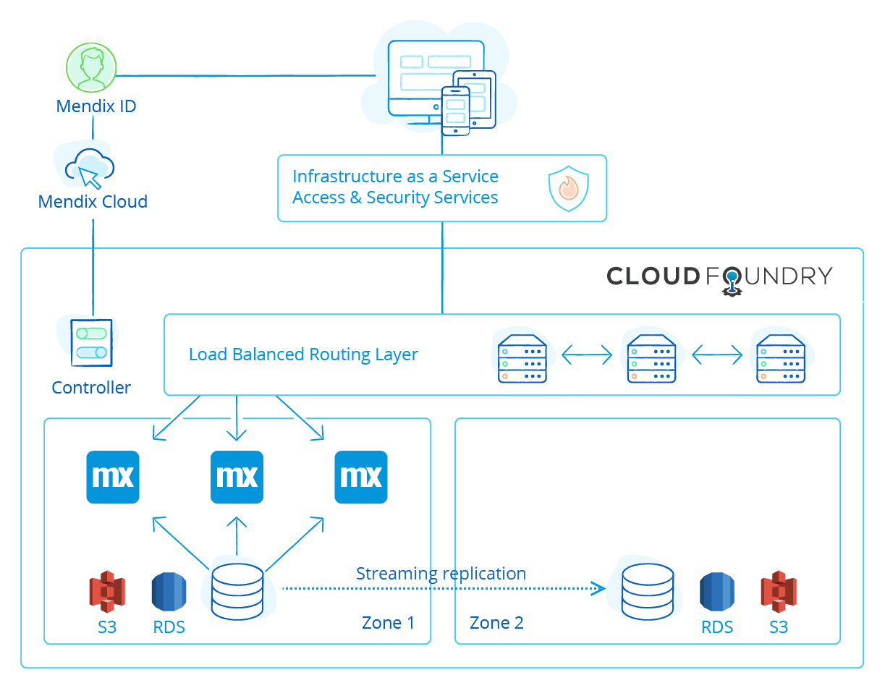
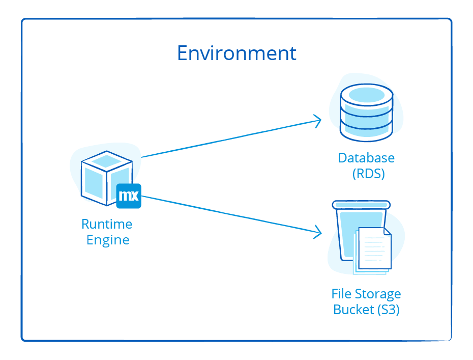
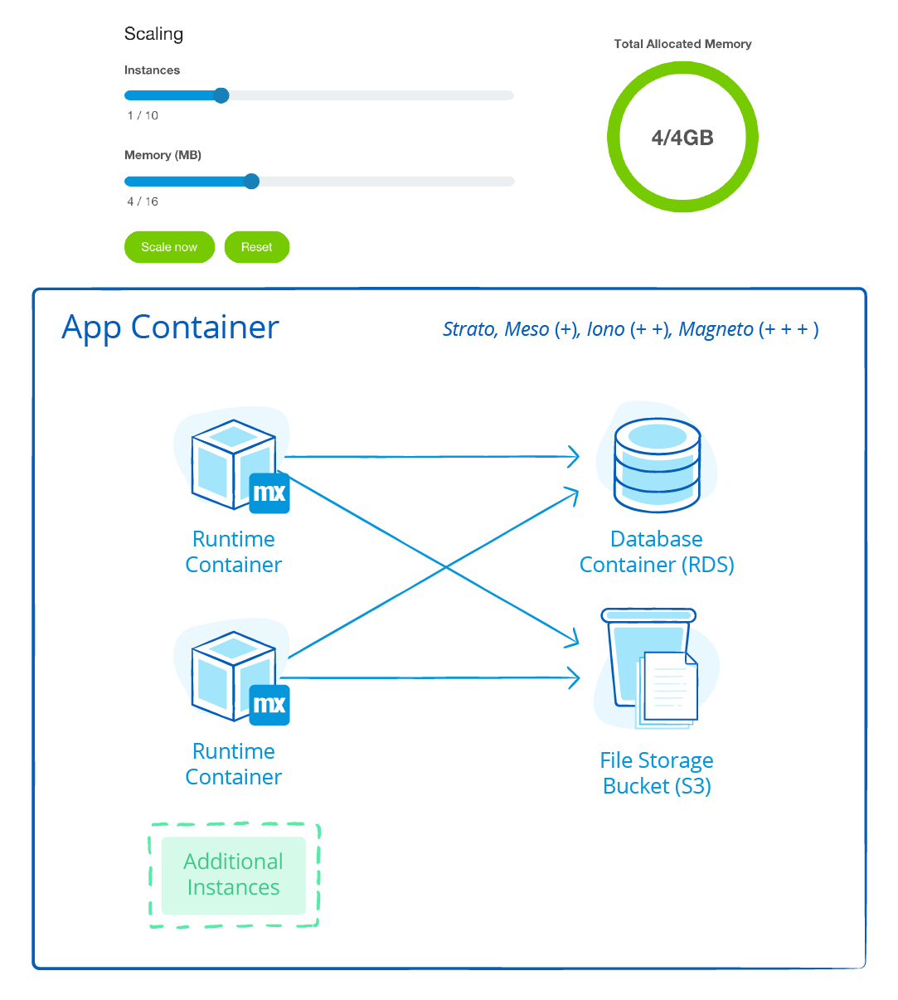
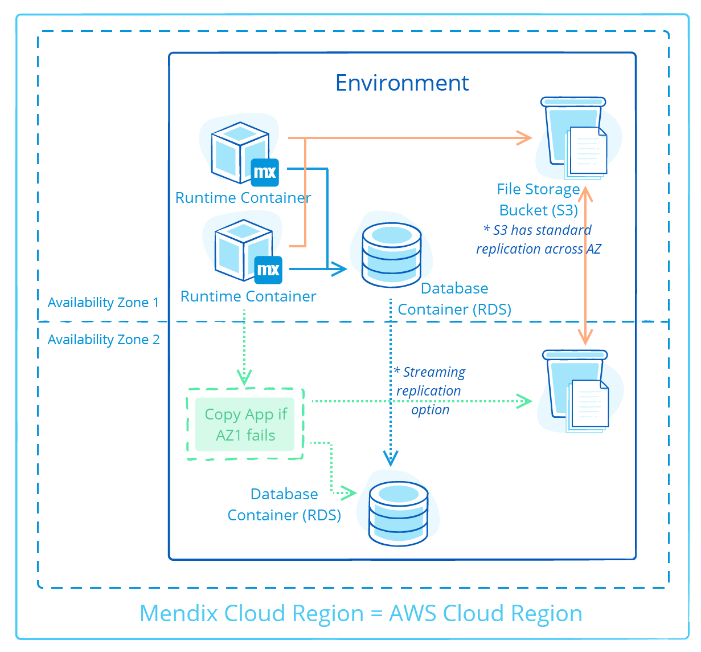
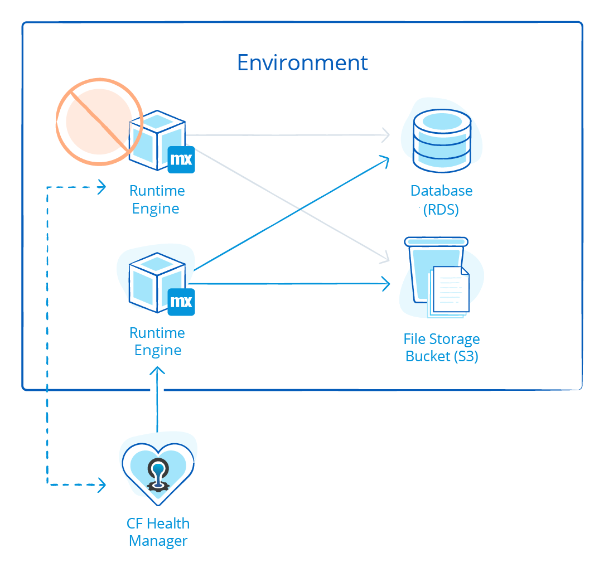

## 1 What Does the Mendix Deployment Architecture Look Like?

Mendix Cloud is a PaaS-based cloud offering based on Cloud Foundry technology that runs on the IaaS layer of Amazon Web Services. A Mendix application will run in a container provided by Cloud Foundry. A container in Cloud Foundry has standard support for horizontal and vertical scaling and auto-healing.

Scaling up and down can be done without any downtime, as it is just a matter of adding or removing containers.

The Mendix Cloud Foundry layer is deployed in multiple availability zones for each AWS region. An availability zone is a physical data-center location of AWS within a region.

A Mendix application needs a database and file storage to operate. In the Mendix Cloud, these aPaaS services are directly consumed from the AWS service layer. For the database, the Mendix Cloud makes use of RDS PostgreSQL, and for the file storage, it makes use of S3. Both of these services are Multi-AZ configured, so data is replicated across data centers.

{}

{}

## 2 Where Does Mendix Host My Application?

The Mendix Cloud can provide hosting facilities in the US, APAC, and the EU.

Mendix guarantees that the data will not leave the region, should your company require this.

For more information, see the [Multi-Cloud Overview](../app-capabilities/multi-cloud-overview).

## 3 How Is Application Isolation Organized?

Within the Mendix Cloud, the logical term “environment” is used to describe the application isolation. Each application runs in an environment, and is fully separated from other apps for computing, memory, and storage. A Mendix app runs on one or more Mendix Runtime Engine instances within the environment (where the environment is dedicated to a single application). Also, for each application, a dedicated database and S3 bucket is provisioned, in order to have full isolation on the data level as well.

{}

{}

## 4 How Does Mendix Cloud Offer High Availability? {#cloud-ha}

The Mendix Cloud offers high availability as an option to customers with an enterprise license. This ensures zero downtime in the case of a Mendix Runtime outage. Users are able to scale Mendix app environments using the Developer Portal. When more than one instance is selected, the app can continue to run if one instance fails.

{}

{}

## 5 How Does Mendix Provide Disaster Recovery? {#cloud-dr}

Mendix Cloud architecture keeps runtime engines and databases in the same availability zone (AZ) to minimize latency in database operations. It automatically applies failover to a geographically separate AZ if the current AZ fails.  New copies of your app will be started automatically in the new AZ. File storage buckets are automatically replicated by AWS across multiple AZs and, with Mendix Fallback options, the database can also be replicated automatically through streaming – or you can restore a backup to the new AZ.

All backups are copied to another region, but the data will not leave the continent, should your company require this.

{}

{}

## 6 How Does Mendix Cloud Provide Auto-Recovery & Auto-Healing? {#cloud-ar}

The Mendix Cloud enables auto-recovery and failover within the same availability zone, and the user load is balanced over two runtime engines. In the rare occurrence that a single runtime engine crashes, the other runtime engine automatically takes over all user requests while the Cloud Foundry Health Manager replaces the crashed runtime engine with a new runtime engine. Because of the stateless architecture of Mendix, end-users are not impacted in this scenario.

{}

{}
