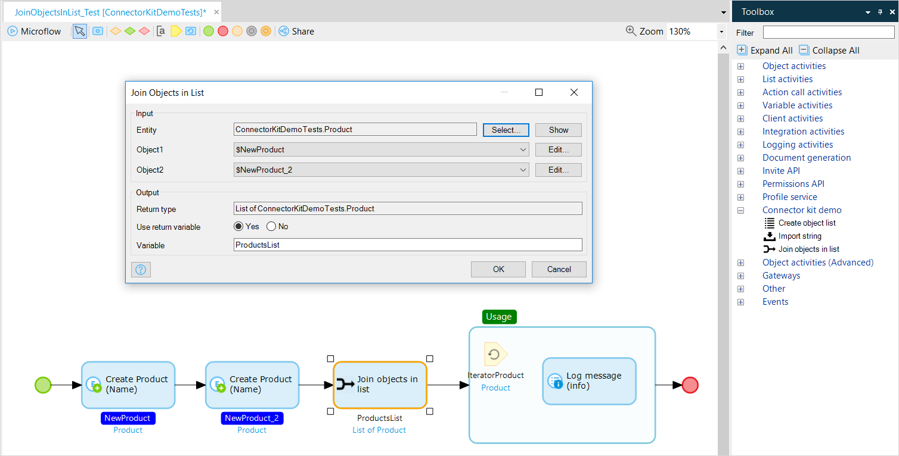

## 1 How Can I Extend the Functionality of the Mendix Platform? {#extend-functionality}

The Mendix Runtime can be extended in number of different ways. The sections below present details on extending via the Mendix Connector Kit, Java actions, JavaScript widgets, Java request handlers, and data storage.

### 1.1 Java Actions & Connector Kit {#connector-kit}

Java actions enable creating reusable microflow activities that you can use in any microflow. You can create Java actions specific to your application, and you can also bundle them in a module so that they can be reused in other projects and by other developers.

Java actions are often used to integrate with external systems (hence the term "connectors"), but you are not limited to the integration use case. In fact, you can do anything you can think of in Java, including using most existing (open-source) Java libraries. This enables you to provide plugins for any type of functionality you need.

To ensure your fellow team members and even external users can easily use custom Java actions, they are completely integrated into the microflow editor experience in Mendix Studio Pro. Other Mendix developers will not see the difference between a standard microflow activity and a custom Java action.

The following image is taken from an example used in [How to Build Microflow Actions Using the Mendix Connector Kit](https://docs.mendix.com/howto/extensibility/howto-connector-kit) in the *Mendix Studio Pro How-to's*. As you can see, the **Join objects in list** custom action looks like any other microflow activity, with an icon and user-friendly parameters:

{}

{}

All custom Java actions can be made available in the microflow toolbox, which eases discovery and use by non-technical Mendix users. In fact, users can just drag activities from the toolbox to their microflow without knowing that it is implemented as a custom Java action. To expose a Java action in the toolbox, just select the **Expose as microflow action** check box, as illustrated in this video:

<video controls src="attachments/OE_ExposeJavaActionAsMicroflowAction-1.mp4">VIDEO</video>

Within the Java action implementation, you can use the [Mendix Runtime APIs](https://apidocs.mendix.com/8/runtime/) to create a tight integration between the Mendix objects and your Java code.

For more information on using custom Java actions, explore this Mendix documentation:

* [How to Build Microflow Actions Using the Mendix Connector Kit](https://docs.mendix.com/howto/extensibility/howto-connector-kit)
* [How to Extend Your Application with Custom Java](https://docs.mendix.com/howto/logic-business-rules/extending-your-application-with-custom-java)
* [How to Use the Java API](https://docs.mendix.com/howto/logic-business-rules/java-api-tutorial)
* [Java Programming](https://docs.mendix.com/refguide/java-programming)
* [Mendix Java API](https://apidocs.mendix.com/8/runtime/)

### 1.2 Pluggable Widgets {#custom-widgets}

You can extend the [front-end](../app-capabilities/front-end) of your Mendix applications by building custom widgets based on JavaScript or TypeScript. For more information, see the [Pluggable Widgets](../app-capabilities/front-end#pluggable-widgets) section of *Front-End*.

### 1.3 Pluggable Actions {#custom-action}

For creating custom application logic, Mendix enables developers to build customs nanofow actions. These pluggable nanoflow actions (which are called JavaScript actions in Studio Pro) can be used to leverage device capabilities or perform any type of logic in the client. For more information, see the [Pluggable Nanoflow Actions](../app-capabilities/front-end#pluggable-widgets) section of *Front-End*.

### 1.4 Java Request Handlers

The Java Request Handler API enables you to create a custom HTTP endpoint implementation in Java. A request handler is basically a Java method that receives an HTTP request, uses the input, and then sends a response to the caller. This can be useful in many situations, such as custom authentication, deep links into specific pages, and custom protocol implementations. Implementation of the request handler is not limited to Java, as you can run Mendix microflows and activities from the Java implementation.

Please note that with the availability of native REST publishing, the need for custom Java request handlers has been greatly reduced.

### 1.5 Data Storage

All the query languages supported by Mendix can be used through a Java API. This includes XPath, OQL, and SQL:

* XPath can be used from Java via the [retrieveXpath](https://apidocs.mendix.com/8/runtime/com/mendix/core/Core.html#retrieveXPathQuery-com.mendix.systemwideinterfaces.core.IContext-java.lang.String-) methods
* OQL can be used from Java via the [retrieveOQL](https://apidocs.mendix.com/8/runtime/com/mendix/core/Core.html#retrieveOQLDataTable-com.mendix.systemwideinterfaces.core.IContext-com.mendix.systemwideinterfaces.connectionbus.requests.types.IGetRequest-) methods
	* OQL queries defined in your model in data sets can be accessed through the [createOQLTextGetRequestFromDataSet](https://apidocs.mendix.com/8/runtime/com/mendix/core/Core.html#createOQLTextGetRequestFromDataSet-java.lang.String-) method
* SQL can be used from Java via the [executeWithConnection](https://apidocs.mendix.com/8/runtime/com/mendix/datastorage/DataStorage.html) method

XPath and OQL are both portable, meaning their behavior will be identical no matter what database you use. SQL enables using all the features of your chosen database. One scenario for this is to use database-specific indexes to increase the performance of your queries.

You can use Mendix's Java APIs to register [entity event listeners](https://apidocs.mendix.com/8/runtime/com/mendix/core/actionmanagement/ListenersRegistry.html) for all your entities. This can be used to extract auditing information or to do a real-time export of all the data changes to an external system.

For more information, see this Mendix documentation:

* [XPath](https://docs.mendix.com/refguide/xpath)
* [OQL](https://docs.mendix.com/refguide/oql)
* [Using Mendix Query APIs to Build Reusable Microflow Actions](https://github.com/ako/QueryApiBlogPost)

## 2 How Can I Provide Reusable Connectors to Third-Party Services? {#connectors}

Generic connectors can be easily shared with other developers and companies. You can export a connector module from Mendix Studio and Mendix Studio Pro that can then be imported into other Mendix app projects. The connector module can also be uploaded to the Mendix App Store – either to the Public App Store so anyone can use it, or to your company's Private App Store so that only developers in your company can reuse it. For more information, see [How to Share App Store Content](https://docs.mendix.com/developerportal/app-store/share-app-store-content) in the *Mendix Developer Portal Guide*.

Connectors include everything you need to use them, like microflow activities, logic, domain models, Java code, and any required Java libraries. This complexity will not be visible to the users of your connector. They can simply drag your custom microflow activities from the toolbox into any microflow to use your connector.

Here is an example of a connector:

<video controls src="attachments/connector.mp4">VIDEO</video>

This video presents details on how to build a connector in Mendix:

{}

And for more information on building connectors, see [How to Build Microflow Actions Using the Mendix Connector Kit](https://docs.mendix.com/howto/extensibility/howto-connector-kit) in the *Mendix Studio Pro How-to's*.

## 3 What Tooling Does Mendix Integrate With? {#external-ides}

Mendix provides seamless integration with a number of tools that developers use:

* By selecting **Deploy for Eclipse** in Mendix Studio and Mendix Studio Pro, your Mendix app project will be made compatible with Eclipse,w hich means you can run and debug your app from Eclipse. You will also have access to the Java source code, where you can implement custom Java actions. For more information, see [Using Eclipse](https://docs.mendix.com/refguide/using-eclipse) in the *Mendix Studio Pro Guide* and [How to Debug Java actions](https://docs.mendix.com/howto/monitoring-troubleshooting/debug-java-actions) in the *Mendix Studio Pro How-to's*.
* Many Mendix developers use IntelliJ IDEA. IntelliJ enables you to import Eclipse projects, so by selecting **Deploy for Eclipse** in Mendix Studio and Mendix Studio Pro, you will also be able to do all your custom Java actions coding in IntelliJ.
* Widget developers can benefit from building [Pluggable Widgets](https://docs.mendix.com/howto/extensibility/pluggable-widgets).

## 4 What Open Standards Does Mendix Support?

Mendix strongly adopts open standards in order to support the seamless integration of the platform and applications built on the platform as well as to support the exchange of design artifacts.

This is a short overview of the open standards and technologies used in the Mendix Platform:

* Application data can be stored in a large number of mainstream relational database management systems. Mendix uses the SQL standard for defining and manipulating your domain model and data. Throughout the years, SQL has proven itself a flexible, multi-purpose, and future-proof data language. So much so, even NoSQL databases are embracing SQL as the default way to retrieve data.
* The Mendix Runtime is implemented using Scala and Java, and it runs on the Java Virtual Machine (JVM). Similar to SQL, the JVM offers a flexible, multi-purpose, and future-proof platform. Java enables us to run the Mendix Platform on a large number of systems and cloud platforms. The JVM runtime is flexible for a large number of programming languages. This enables combining a proven language like Java with the functional features of an innovative language like Scala.
* Mendix provides support for many open standards relevant for integration, including web services, SOAP, WSDL, XML Schema, REST, JSON, Swagger, OpenAPI, and OData.
* For the front-end, Mendix supports a number of open standards and also a number of de-facto standards, such as web pages being rendered using HTML5, CSS3, and React.
* Mendix has embraced best practices for software innovation management through Agile methodologies. The Mendix Platform provides the tools required for the most commonly used Agile methodology—which is Scrum—so that you can manage your Mendix application projects.
* For hosting, Mendix has embraced open and de-facto hosting technologies like Linux, Docker, Kubernetes, and Cloud Foundry.
