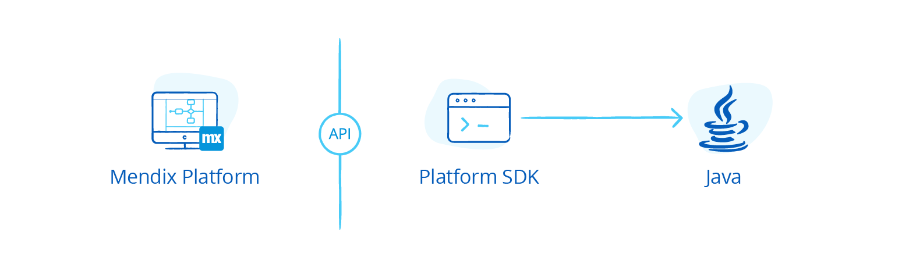

## 1 How Can I Avoid Being Locked In to the Mendix Platform? {#avoid-lockin}

At Mendix, we have put a lot of effort into opening up our platform in every way possible. We want to prevent you from being locked in, so that you have continued access to your data and models.

You own (via IP rights) all of your data and models, and you are free to do with them as you wish. Mendix helps you in the ways described below.

### 1.1 Exporting Your App Models {#export-model}

By using the [Mendix SDK](https://docs.mendix.com/apidocs-mxsdk/mxsdk/), you can programmatically access your application models. Of course, the SDK comes with [full documentation](https://apidocs.mendix.com/modelsdk/latest/index.html) of the models used to define your app. This enables you to automate a migration to alternative low-code platforms as well as to 3GL languages and platforms like Java and Hibernate.

By using the Mendix SDK, you can generate Java classes or SQL DDL statements from your domain models or Java code from your microflows. This means you can convert your models to any technology stack you wish.

### 1.2 Exporting Your Data {#export-data}

The data is the most valuable part of your application projects. You can always export your data, and there are different ways to do this. In the Mendix Cloud, you can download a backup of all the data in your app, including all the files that form the app. This means you can store the files somewhere else, or you can create a new database with your data. You can then convert the data to other databases or file formats.

## 2 What Other Project Resources Can I Reuse?

In addition to the application model, Mendix app projects consist of a number of other resources. These resources use technologies like HTML5, CSS, Sass, Bootstrap, and Java. The main goal of using these resources is to allow you to extend the platform as required (for example, by implementing custom microflow activities). Because these resources are based on commonly accepted modern technologies, they can be used by most developers.
