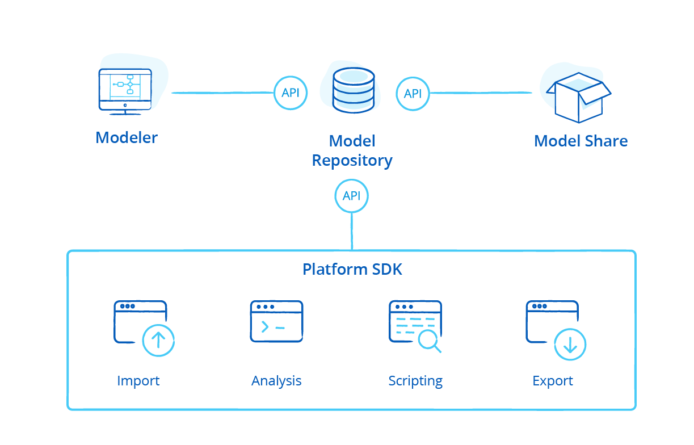

The Mendix Platform is open and extensible at every level, with an open model specification and tools provided for platform and app extensibility. Mendix apps are extensible with reusable components and custom code. And Mendix Platform APIs allow you to integrate with your existing requirements management tools, test automation suites, and CI/CD pipelines. 

{}

{}

{}[**Add video when available**]{}

## How Can I Avoid Being Locked in to the Mendix Platform?

We recognize the need for our customers to be able to migrate away from the Mendix Platform. Should they wish to do so, we offer the following options:

* **ESCROW** – grants you access to the source code of the platform in the event of insolvency on the part of Mendix
* **Access to your models (which you own)** — even if you cancel your subscription, you can use the rich visual content of your app models towards re-engineering in another platform or technology
* **Mendix Platform SDK** – enables you to programmatically access your models to automate the migration of your apps to other platforms and 3GL
* **App data stored inside an SQL database of your choice** — this is owned and accessible by you at all times

For more information on this important topic, see the section [How Can I Avoid Being Locked in to the Mendix Platform?](vendor-lockin#avoid-lockin) in *No Vendor Lock-In*.

## Where Can I Use the Openness & Extensibility the Mendix Platform Offers?

There are many occasions for using the openness and extensibility provided by the Mendix Platform. For example, you may have a specific need for a new UI widget or component, or you want to build a connector using the SDK for an external service or API. Perhaps your software engineers want to ensure that the quality of the models developed by business developers is of a high standard by building external scripts using the Model SDK to analyze them and automate updates. Or, you may need to leverage your existing investments in tools and technology, such as CI/CD pipelines and external requirements and project management tools.

For details, see [Where Can I Use the Openness and Extensibility the Mendix Platform Offers?](openness-api-sdk#where)

## How Can I Extend the Functionality of the Mendix Platform?

The Mendix Runtime can be extended using Java Actions that enable you to build reusable microflow activities, which are packaged as native actions and consumed by less technical developers from the Mendix Toolbox or App Store. For the front-end client, you can create custom JavaScript extensions for both web and mobile, including Cordova plugins.

Explore this topic more in [How Can I Extend the Functionality of the Mendix Platform?](extensibility#extend-functionality).

## Read More

* [No Vendor Lock-In](vendor-lockin)
* [Openness (API & SDK)](openness-api-sdk)
* [Extensibility](extensibility)
