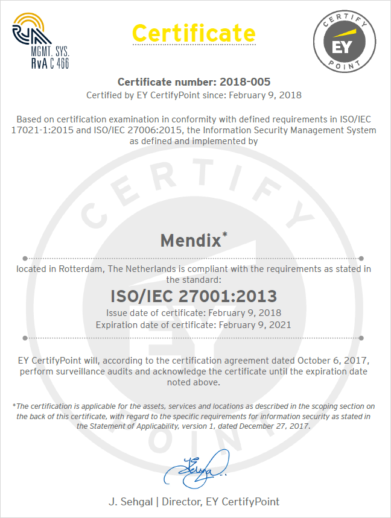

## 1 How Is Information Security Organized in Mendix? {#security-organized}

Mendix has implemented an information security management system (ISMS) according to the ISO/IEC 27001 standard. The basis of this ISO standard is the development and implementation of a rigorous security program, which includes the development and implementation of an ISMS and requires that Mendix does the following:

* Systematically evaluate our information security risks, taking into account the impact of threats and vulnerabilities
* Design and implement a comprehensive suite of information security controls and other forms of risk treatment to address security risks
* Utilize an overarching management process to ensure that the information security controls meet our needs on an ongoing basis

## 2 Which Third-Party Security Certifications & Assurance Reports Does Mendix Have? {#security-certifications}

Mendix complies with various third-party security certifications and assurance reports. These are described below.

### 2.1 ISO/IEC 27001 Certification

Mendix is certified to be compliant with the [ISO/IEC 27001](https://www.iso.org/isoiec-27001-information-security.html) standard with all Annex A controls in scope. ISO/IEC 27001 is a key international standard for security management that specifies security management best practices and comprehensive security controls.

{}

{}

### 2.2 ISAE 3000 Type II & ISAE 3402 Type II Assurance Reports

[ISAE 3000](http://www.ifac.org/publications-resources/international-standard-assurance-engagements-isae-3000-revised-assurance-enga) and [ISAE 3402](http://isae3402.com/ISAE3402_overview.html) are international assurance standards on controls at a service organization. Mendix holds an ISAE 3000 Type II and an ISAE 3402 Type II report, which discloses how Mendix security controls have been managed over the past year.

### 2.3 SOC 1 Type II, SOC 2 Type II & SOC 3 Type II Assurance Reports

[SOC 1](https://www.aicpa.org/interestareas/frc/assuranceadvisoryservices/aicpasoc1report.html), [SOC 2](https://www.aicpa.org/interestareas/frc/assuranceadvisoryservices/aicpasoc2report.html), and [SOC 3](https://www.aicpa.org/interestareas/frc/assuranceadvisoryservices/aicpasoc3report.html) are American assurance standards on controls at a service organization. Mendix holds an SOC 1 Type II report, SOC 2 Type II report, and SOC 3 Type II report disclosing how Mendix security controls have been managed over the past year.

### 2.4 PCI DSS Level 1 Service Provider Attestation of Compliance

Mendix is certified to be compliant with the [PCI DSS](https://www.pcisecuritystandards.org/document_library) standard as a Level 1 Service Provider, which is the highest certification a PCI DSS service provider can get.

### 2.5 Cyber Essentials (UK)

Mendix is certified to be compliant with [Cyber Essentials](https://www.cyberessentials.ncsc.gov.uk/). The Cyber Essentials scheme addresses the most common internet-based threats to cyber security. For more details, see [Further Scheme Information](https://www.cyberessentials.ncsc.gov.uk/further-scheme-information).

### 2.6 CSA STAR Certification

[CSA STAR](https://cloudsecurityalliance.org/star/#_overview) is a program for security assurance in the cloud. STAR consists of three levels of assurance based upon a comprehensive list of cloud control objectives.

Mendix has completed the CSA STAR level one self-assessment, which is available upon request.

## 3 What Security Controls Does Mendix Have in Place for Its Employees?

All Mendix employees are required to provide a government-certified background check (certificate of good conduct) and are bound by strict confidentiality obligations that are embodied within a confidentiality agreement. Furthermore, Mendix has implemented a security awareness program for all employees. Mendix security staff holds industry standard certifications, including but not limited to CISSP, CCSP, and CISM.

## 4 Who Is the Owner of Data in a Mendix App?

The Mendix customer has ownership of the data and intellectual property of their Mendix applications, as stated by Mendix master agreements and end-user agreements.

For more information, see [Exporting Your Data](no-vendor-lockin#export-data) in *No Vendor Lock-In*.

## 5 Who Has Access to My Data?

All access to customer data is under the control of the customer. Access to customer data by Mendix personnel is strictly prohibited by administrative controls and is only authorized after explicit customer approval.

## 6 How Often Does Mendix Perform Risk Assessments?

As required by the Mendix ISO/IEC 27001 certification, risk assessments are performed at least annually and when significant changes occur. The Mendix risk program systematically examines information security risks, taking account of threats, vulnerabilities, and impacts.

## 7 Does Mendix Securely Wipe My Data After Contract Termination?

After contract termination, all applicable application environments are securely destroyed, including backups.

## 8 Does Mendix Have a Disaster Recovery Program?

Disaster recovery and business continuity is part of the Mendix security framework. To ensure that customer services can be resumed after a disaster, Mendix has developed a disaster recovery procedure. This procedure is tested on a quarterly basis. Additionally, Mendix offers disaster recovery services that include high availability across multiple availability zones, horizontal scaling of app environments, and auto-recovery in the event of an unexpected outage.

For more information on the Mendix Cloud architecture, see [Cloud Architecture](../enterprise-capabilities/cloud-architecture).
