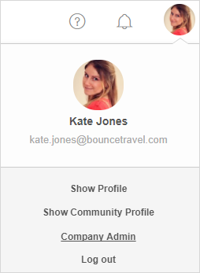

## 1 How Does the Mendix Platform Manage My Identities?

As part of the Mendix Cloud, Mendix provides a user management and provisioning service called MxID. Because it is built on the Mendix Platform, MxID inherits all the security measures from the platform. MxID also provides an administration portal for the management of user access and authentication.

## 2 How Can I Administer My Company Within the Mendix Platform?

Apart from the company profile and settings, Mendix supports the definition of **Company Admins**, who can assign permissions to users following a delegated administration concept. One or more administrators can be identified per tenant who, in turn, can perform administrative tasks in the tenant according to the permissions granted.

## 3 How Can I Administer My Project Within the Mendix Platform?

The Mendix Developer Portal allows administrators to manage users (defined in MxID) and configure role-based user access to environments to deploy and manage apps. The Developer Portal security interface is integrated into the app project dashboard, so you have a 360° view of all the access rights for a specific person within the context of an app. Mendix enforces the segregation of duties between (at least) the developer and application administrator, whose roles are both safeguarded using personal accounts. Mendix will not allow you to configure a general management account, to ensure that all actions are traceable to a person.

For more information, see [Company & App Roles](https://docs.mendix.com/developerportal/company-app-roles/) in the *Mendix Developer Portal Guide*.

## 4 How Does the Mendix Platform Support Multi-Factor Authentication?

Two-factor authentication can be enabled within the Mendix Cloud for sensitive activities. It can also be added anywhere within a Mendix application to further secure access to the app or parts of the app.

## 5 What Kind of Logging & Audit Trails Are Provided in Mendix?

The Mendix Platform logs relevant activities during the app delivery cycle, from requirements management and development to deployment and application monitoring. This is to ensure compliance with customer requirements for auditability.

## 6 What Kind of Security Tests Are Performed on the Mendix Platform?

An independent auditing firm periodically performs security audits of Mendix, which are reported through our ISO/IEC 27001 certificate, PCI DSS Level 1 Service Provider Attestation of Compliance, ISAE 3000 Type II attestation report, ISAE 3402 Type II attestation report, SOC 1 Type II attestation report, SOC 2 Type II attestation report, and SOC 3 Type II attestation report.

In addition, a leading IT security firm performs penetration tests on the Mendix Platform on a monthly basis. These penetration tests are based on the Open Web Application Security Project (OWASP), Information Systems Security Assessment Framework (ISSAF), and Open Source Security Testing Methodology Manual (OSSTMM).

For vulnerability management, a program is in place for continuous monitoring of the security posture of the Mendix Platform. Before a release is shipped, the release is scanned by Black Duck and SonarQube.

## 7 What Kind of Encryption Is Provided by Mendix? {#encryption}

The Mendix Platform encrypts data at rest and data in transit out of the box.
