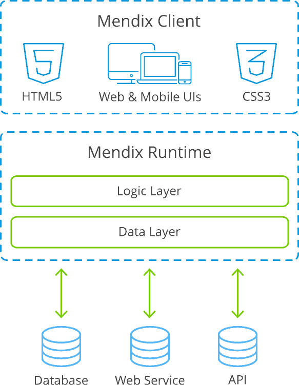
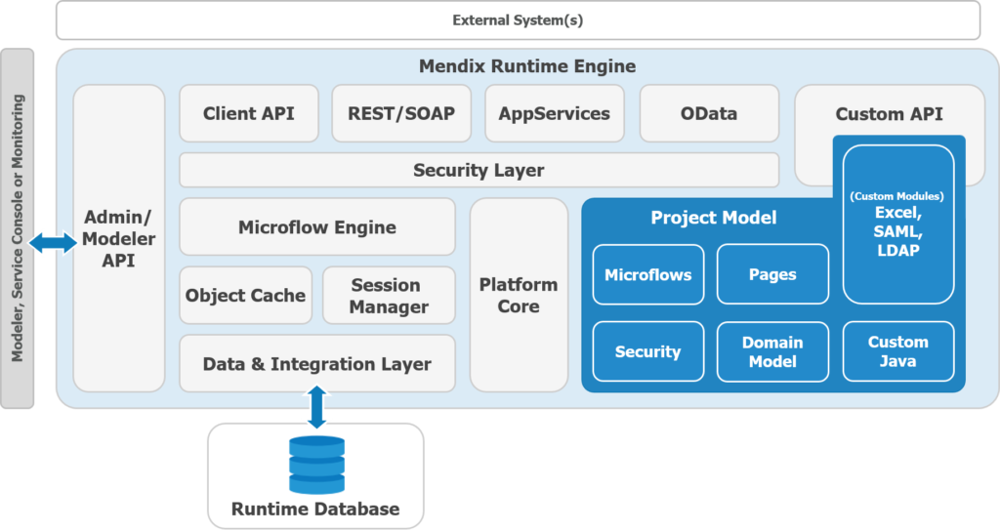
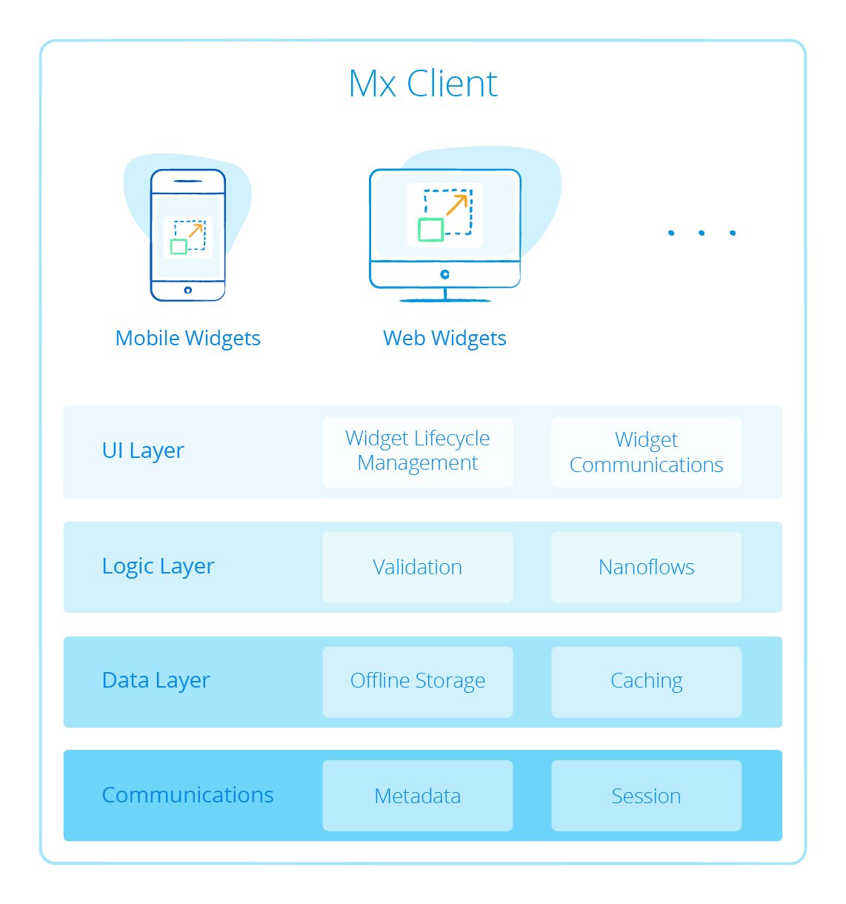

## 1 What Is the Mendix Runtime & How Does It Support Key Architectural Principles?

The Mendix Runtime executes your applications within the context of a cloud-native architecture. In this section, we will look at the core components of the Mendix Runtime and its related capabilities. We will also take a deeper look at several important aspects of runtime execution.

### 1.1 Which Component Is Responsible for Model Execution?

The Mendix Runtime interprets and executes the models of your apps. The Runtime has a [Twelve-Factor App-compatible](twelve-factor-architecture) design using industry-leading Java and Scala technologies.

### 1.2 How Does Mendix Execute Models? {#model-execution}

The Mendix Runtime directly executes models, meaning that the model literally is the application, not an intermediary. As opposed to approaches where a visually-modeled design would actually generate code (for example, Java or .NET), the Mendix model interpretation approach has a number of unique characteristics and advantages, which are described below.

#### 1.2.1 Change Management

Application changes can be accommodated more easily. In addition, since the model is the application, Mendix safeguards compatibility of the application and the model.

#### 1.2.2 Custom Extensions

Extending models with custom code is controlled more elegantly, as the model is aware of the custom code and includes it in consistency checks, in contrast to the insertion of custom code into generated code. Mendix’s model-interpretation approach solves the fundamental round-trip problem of code generation, whereby changes in the model would conflict with custom-code extensions. Further, not having custom changes in generated code means the technical architecture of the platform can be modernized without impacting your model. This means it is easier and cheaper to benefit from technical innovation.

#### 1.2.3 Monitoring

Monitoring and analyzing application behavior in the runtime can be set up more dynamically and flexibly versus defining monitor parameters beforehand.

#### 1.2.4 Debugging

Debugging and solving problems becomes easier for the developer, as they do not have to understand how the generated code relates to the visual model. Debugging and problem-solving are done on the model, not on the generated code.

### 1.3 How Does Mendix Implement Stateless Architecture?

To ensure scalability, performance, and high availability, Mendix has implemented a stateless runtime. This means that any runtime instance available can handle a user request, regardless of any previous requests or subsequent requests.

To achieve this, runtime instances have state for the duration of a user request. At the end of a request, all the committed state will be saved to the database. All the uncommitted state will be returned to the client, along with all other data that the client needs.

For more information, see [Clustered Mendix Runtime](https://docs.mendix.com/refguide/clustered-mendix-runtime) in the *Mendix Studio Pro Guide*.

## 2 What Are the Components of the Mendix Runtime?

The Runtime consists of 2 main components:

* **Clients** – web and mobile clients
* **Runtime server** – a scalable runtime to handle server-side logic

{}

{}

### 2.1 Server Architecture

The Mendix Server architecture consists of multiple components to execute logic, manage data, communicate with the client, and implement security. The diagram below presents an overview of all of the components, which is followed by a short description of their responsibilities:

{}

{}

The Mendix Runtime consists of the following components:

* **Platform core** – responsible for the correct startup and shutdown of your application and loading the required libraries and extensions
* **Object cache** – handles the creation and removal of objects
* **Session manager** – manages the creation of user sessions and the cleanup of logged-out or abandoned sessions.
* **HTTP server** – included in the Mendix Runtime to handle requests from the web and mobile client and to handle service requests
* **Microflow engine** – executes your microflows and microflow activities
* **Data layer** – persists and retrieves objects from your application database; also responsible for creating and updating the database structures required to persist your data: the data layer supports a large number of different databases, and data is stored using common data model design best practices (for details, see the section [What Databases Does Mendix Support?](../app-capabilities/data-storage#database-support) in *Data Storage*)
* **Integration layer** – handles incoming and outgoing service requests for web services, REST APIs, app services, and OData
* **Client API** – responsible for communication with web and mobile clients; the API is used to retrieve data, persist data changes, and execute microflow logic
* **Configuration API** – this JSON API is used by the Developer Portal and container buildpack to configure the runtime
* **Monitoring API** – this JSON API is used by the Developer Portal and container buildpack to retrieve monitoring metrics
* **Custom APIs** – this Java APIs is used to extend the Mendix Runtime (for example, with microflow activities or entity listeners)

### 2.2 Client Architecture

The Mendix Client is responsible for the user interaction and consists of a UI widget layer, a logic layer to execute offline logic, and a data layer for offline storage. This diagram presents an overview:

{}

{}

The Mendix Client consists of the following components:

* **Communications layer** – exchanges metadata, session managements, and data with the Mendix Runtime server while using a secure JSON over HTTP protocol
* **Data layer** – manages the data used in the front-end; based on the React Flux pattern to handle state and push changes to UI components
* **Logic layer** – handles data validations and more complex logic using Mendix nanoflows
* **UI component layer** – manages the widget lifecycle and communication between widgets, and provides out-of-the-box widgets

#### 2.2.1 Mobile Client

Mobile applications use the same HTML5-, CSS-, and React-based client architecture, but they are deployed using Apache Cordova. This framework enables mobile apps built using state-of-the-art web technologies to offer a great mobile user experience:

* **Accessibility** – apps can be discovered in the standard device app store, installed on mobile devices, and opened via an icon
* **Offline availability** – because the app is installed on mobile devices (including all required resources and potentially cached data), end-users can use your Mendix app offline, and relevant app data is cached in an SQLite database on your device
* **Support for native functionality** – Apache Cordova enables JavaScript applications to use native device functionality, which in turn allows you to benefit from all the sensors available in your mobile device, like the camera and microphone, for example

For more details on Mendix mobile device support, see [Native Mobile Apps](../app-capabilities/native-mobile-apps) and [Hybrid Mobile Apps](../app-capabilities/hybrid-mobile-apps).

#### 2.2.2 Web Client

The web client is designed using a single-page architecture, wherein a single JavaScript web page is loaded into the browser that will then update the page and interact with the Mendix Runtime as required by the actions of the user. This may include retrieving parts of the web page as well as retrieving and storing data.

The client is predominantly implemented using HTML5, CSS with Sass and Bootstrap, and the React framework. For more information, see [Web Client Settings](https://docs.mendix.com/refguide/custom-settings#9-web-client-settings) in the *Mendix Studio Pro Guide*.
