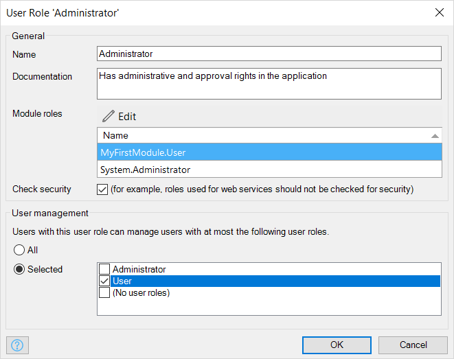
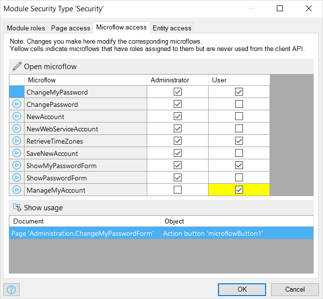
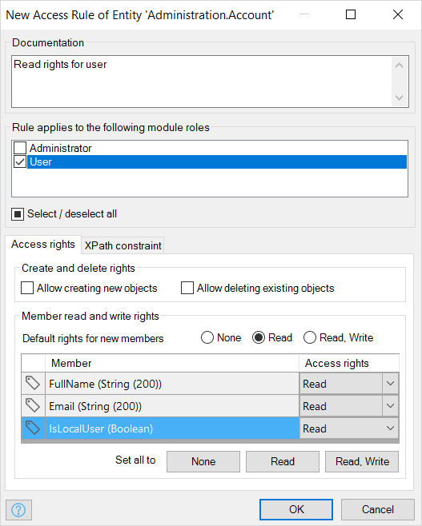

## 1 How Is Application Security Defined in Mendix?

Out of the box, Mendix provides role-based user access to applications built with the platform. Applications in Mendix consist of one or more modules. A module typically has a functional scope (for example, items, customers, orders) and is self-contained so that modules can be reused in multiple applications. Due to the distinction between applications and modules, security aspects are defined on both levels. Application-level security settings apply to all the modules within the application. Module-level settings are specific to each module.

Mendix application security is defined according to the parameters described below.

### 1.1 How Are App-Level Security & App Model Consistency Defined in Mendix?

The Mendix Platform supports configurable integrity checks for security on all the relevant aspects of applications deployed on the platform. Mendix checks the consistency of the security settings as well. For example, a person who is allowed to see a certain UI element that lists data from a table must also be authorized to view the data associated with that UI element.

Depending on the stage of development, application and integrity checks can be applied more or less stringently. This is advantageous in development and prototype contexts to avoid unnecessary activities regarding consistency and security in the preproduction stage. The security levels **Off** and **Prototype / demo** are only allowed for apps deployed to a development and/or local test environment, not for deployments in production environments. Deployment to the Mendix Cloud (except for Free Apps) requires the **Production** security level and the complete configuration of all security settings.

### 1.2 How Can I Define User Roles for My App?

An end-user of your application is assigned one or more user roles by an administrator or is provisioned automatically from a (third-party) identity and access management solution that can be integrated with the app. The user then gets all the access rights that these user roles represent.

Within a user role, it is possible to assign user management rights for this particular role as well, so that users assigned to this role can then manage access rights for other users with the selected role. This feature is relevant for supporting a delegated administration concept.

<video controls src="attachments/DM_ProjectSecurity.mp4">VIDEO</video>

Every user role has one or more module roles. Module roles define a role on a module level (for example, “order entry” or “approver”). This means that users with that user role have all the access rights defined for those module roles. An end-user of your application only sees the user roles and not the module roles, so only user roles can be assigned to an end-user, while module roles are assigned to user roles. A user role aggregates multiple access rights on data, pages, and microflows (logic) from the module roles.

What is more, Mendix supports logging in to applications by anonymous users through the configuration of a specific role for this purpose.

For further details, see the section [How Are User Roles Assigned to Users in My App?](#user-roles-assigned) below.

### 1.3 How Can I Define a Password Policy?

Password policies can be defined flexibly (for example, by configuring the password strength, character sets allowed/prescribed, and password expiry policies). A password policy can also be defined by the organization when implementing SSO authentication using, for example, SAML or OpenID.

Additionally, two-factor authentication can be enabled within the Mendix Cloud for sensitive activities. Two-factor authentication can also be added anywhere within a Mendix application to further secure access to the app or parts of the app.

For further details, see the section [How Are Passwords Stored in My Mendix App?](#password) below.

### 1.4 How Configurable Is File Access in Mendix?

The access rights for file storage and use of images in Mendix applications are fully configurable.

## 2 How Is Data-Level & UI-Level Security Defined in Mendix?

Each Mendix application model consists of various modules that are self-contained. Data-level and UI-level security for pages, microflows (which execute actions), entities, and data sets is defined in each module itself.

The sections below describe how this level of security is configured in Mendix apps.

### 2.1 How Do Module Roles Work in My Mendix App Model?

Mendix distinguishes module roles from user roles so that the module along with its roles can be reused in different applications and/or published to the [Mendix App Store](https://appstore.home.mendix.com/index3.html).

### 2.2 How Can I Define Module-Level Security Settings?

At the module level, security logic is separated from application logic. This allows for easy accessibility as well as the maintenance and validation of security settings even by less technical users. All the security settings are managed from the Mendix Desktop Modeler in order to define access rights for the elements described below.

This video presents the various module-level security settings that are available:

<video controls src="attachments/DM_ModuleSecurity.mp4">VIDEO</video>

### 2.3 How Does Mendix Protect the Pages of My App?

Page access defines which application pages users with a certain module role can access. The navigation items (menu bars and buttons) are optimized so that they only show items that direct to the pages to which the user has access.

Page access takes the shape of a matrix showing pages and module roles. For each combination, the user can indicate whether or not the module role has access to the page. This information can also be edited within a page using the **Visible for** property .

<video controls src="attachments/ModuleSecurity.mp4">VIDEO</video>

### 2.4 How Is Business & Process Security Defined in My Mendix App?

Microflows are used to visually define business and process logic. Microflow access defines which microflows can be executed by users with a certain module role. The navigation items (menu bars and buttons) are optimized so that they only show microflows to which the user has access.

Microflow access is managed within a matrix of microflows and module roles. For each combination, the user can indicate whether or not the module role has access to the microflow.

This information can also be edited within a microflow using the **Allowed roles** property.

### 2.5  How Is App Data Encapsulated Securely in Mendix?

Entity access defines for each module role whether users with this role are authorized to create, read, update, and delete objects of the entity. Entity access is configured with access rules that apply to entities. Each access rule in turn applies to a (set of) module role(s). The access rules of an entity define what a user is allowed to do with objects of the entity. Users can be allowed to create and delete objects as well as view and edit member values. A member is an attribute or an association of an entity.

Furthermore, the data sets of objects available for viewing, editing, and removing, which can be limited by means of an XPath constraint. Every access rule is applicable to one or more module roles. An access rule grants certain access rights to those roles. Rules are additive, which means that if multiple access rules apply to the same module role, all the access rights of those rules are combined for that module role. This feature is applied, for example, when applications are configured for multi-tenant usage.

<video controls src="attachments/DM_XpathSecurity.mp4">VIDEO</video>

These rules will be applied anytime your application uses an entity. The rules will be automatically applied to XPath retrieves done in your model. You can define XPath constraints on entities, which means you can define access rules depending on the user role or organization. This can be used to ensure strict data separation in multi-tenant applications.

## 3 How Can My Mendix App Integrate with Third-Party Identity Management Solutions?

The built-in security role and authentication mechanisms in the Mendix Runtime support integration with other third-party identity managers (such as Microsoft Active Directory and SAP IDM) using protocols like LDAP or Kerberos.
