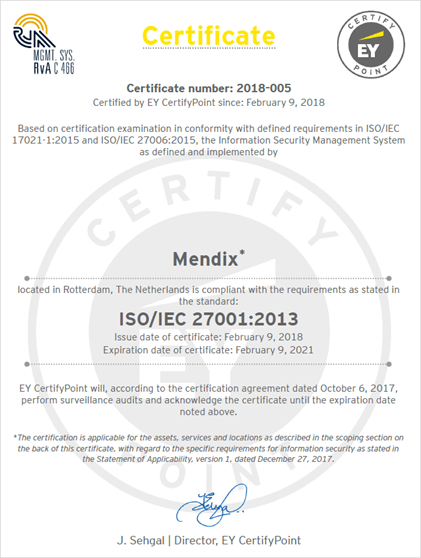

Mendix takes the security of your applications, the Mendix Platform your apps run on, and the cloud operations running the platform very seriously.  To achieve the levels of security required by our customers, Mendix has implemented an information security management system (ISMS) according to the ISO/IEC 27001 standards as well as comprehensive security and governance features built into the platform itself.

## How Is Information Security Organized in Mendix? {#organized}

Mendix has implemented an information security management system (ISMS) according to the ISO/IEC 27001 standard. The basis of this ISO standard is the development and implementation of a rigorous security program, which includes the development and implementation of an ISMS.

You can find more information in [How Is Information Security Organized in Mendix?](organization-compliance#security-organized).

## Which Third-Party Security Certifications & Assurance Reports Does Mendix Have? {#third}

Mendix complies with the following third-party security certifications and assurance reports:

* ISO/IEC 27001 Certification
* ISAE 3000 Type II Assurance Report
* ISAE 3402 Type II Assurance Report
* SOC 1 Type II Assurance Report
* SOC 2 Type II Assurance Report
* SOC 3 Type II Assurance Report
* PCI DSS Level 1 Service Provider Attestation of Compliance
* Cyber Essentials (UK)
* CSA STAR Certification

For more information, see [Which Third-Party Security Certifications and Assurance Reports Does Mendix Have?](organization-compliance#security-certifications)

## How Is Application Security Defined in Mendix? {#defined}

Application-specific security is defined using the security domain-specific language of Mendix Studio Pro. Your developers can create specific users roles which in turn are mapped to module roles inside your app model. Each module role defines the access and security levels to all assets in the module, including data. Fine-grained security restrictions can be created down to the attribute level on specific entities, along with database constraints to ensure data never leaves your servers if the constraints are not met in full.

For details, see [What Kind of Encryption Is Provided by the Mendix Platform?](platform-security#encryption).

## Read More

* [Organization & Compliance](organization-compliance)
* [Platform Security](platform-security)
* [Security Model](security-model)
* [Runtime Security](runtime-security)
* [Cloud Security](cloud-security)
