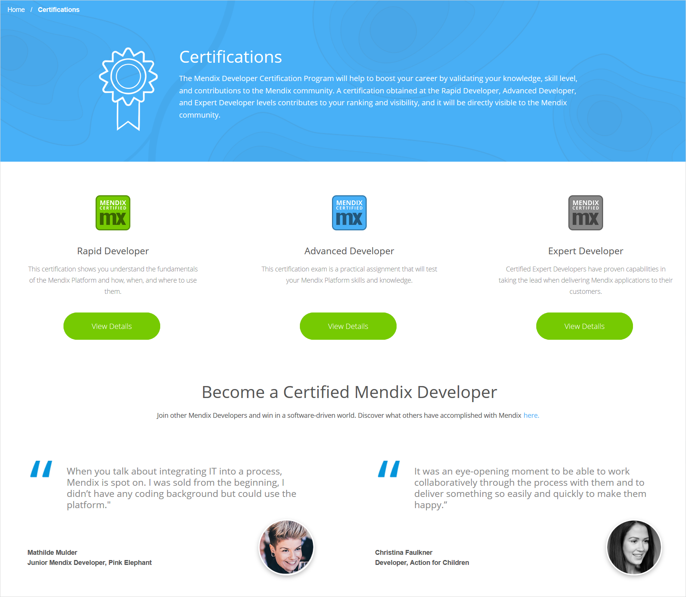
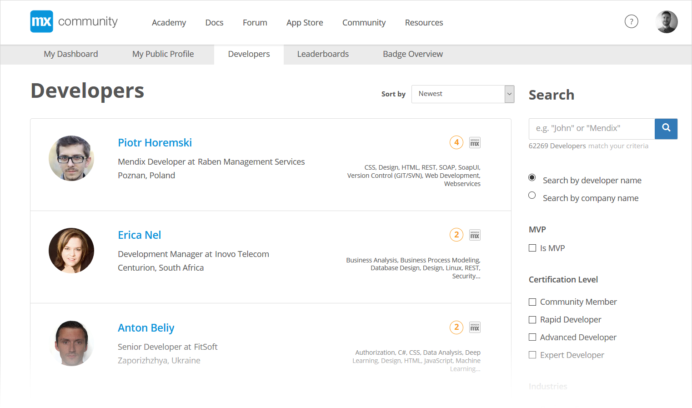

## 1 How Do I Get Certified in Mendix? {#get-certified}

The [Mendix Developer Certification Program](https://gettingstarted.mendixcloud.com/link/certification) will help to boost your career by validating your knowledge, skill level, and contributions to the Mendix community. A certification obtained at the Rapid Developer, Advanced Developer, and Expert Developer levels contributes to your ranking and visibility, and it will be directly visible to the Mendix community via your [Mendix Profile](community#mendix-profile).

Once you sign up on the platform, you will automatically join as a Mendix community member, so you can start training and building apps with Mendix right away. The three levels of Mendix certification that you can obtain after you join as a Mendix community member are described below.

{}

{}

### 1.1 Rapid Developer Certification

To get the [Rapid Developer Certification](https://gettingstarted.mendixcloud.com/link/certification/rapid), you need to pass an exam that proves you understand the fundamentals of the Mendix Platform and how, when, and where to use them.

This certification is proof of your basic Mendix knowledge and demonstrates that you can join a project team and independently build prototypes. You can then learn more on the job about the Mendix Platform and Agile development.

### 1.2 Advanced Developer Certification

To get the [Advanced Developer Certification](https://gettingstarted.mendixcloud.com/link/certification/advanced), you need to pass an exam that is a practical assignment testing your Mendix Platform skills and knowledge.

This certification is proof of your advanced knowledge of the platform and your professional experience with developing Mendix apps. As a certified Mendix Advanced Developer, you are able to work independently on complex user stories, start to specialize as a technical or business consultant, and coach more junior team members.

### 1.3 Expert Developer Certification

To get the [Expert Developer Certification](https://gettingstarted.mendixcloud.com/link/certification/expert) you need to send your application, and Mendix will evaluate your completion of the requirements as well as your motivation, project description, customer references, and portfolio.

When you reach the [Expert Developer Certification](https://gettingstarted.mendixcloud.com/link/certification/expert), you demonstrate capabilities in taking the lead when delivering Mendix applications to customers.

While the Rapid Developer Certification proves your Mendix knowledge and the Advanced Developer Certification proves your Mendix skills, the Expert Developer Certification proves more than just knowledge and skills—it proves expertise and experience. As a certified Mendix Expert Developer, you can lead project teams, do project estimations and proofs of concept, and coach other teams.

## 2 Where Can I Find Suitable Talent?

There are a number of ways Mendix can help you find the right talent to set up your development teams.

Mendix encourages customers to first look internally at their talent pool. In every organization, many suitable candidates are currently working as Business Analysts, Access/Excel/VBA Developers, or Business-Led Developers. Next to this group of no-code talent, Mendix encourages customers to extend the development teams with internal talent like Java and/or .NET developers in order to add low-code skills to the team.

If you are you looking to hire external resources, the [Mendix Job Board](https://developers.mendix.com/jobs/) features job openings posted by Mendix customers and partners.

Every member of the [Mendix community](https://developer.mendixcloud.com/link/community) is ranked by Mendix points, and their level of Mendix certification is also displayed on their Mendix Profile. These factors allow you to get a clear picture of a developer’s experience. On the [Mendix Community site](https://developer.mendixcloud.com/link/community), you can search for specific skills, locations, and experience. Each developer has a profile where you can see examples of work and references.

{}

{}

If you are looking for a Mendix partner company to help you with the implementation of a Mendix app development project, you can search through our extensive [list of Mendix partner companies](https://developer.mendixcloud.com/link/partneroverview). And for more information on Mendix partnerships, see [Strategic Partners](../strategic-partners/).

## 3 How Does the Mendix University Program Work?

Mendix works with many universities and higher education institutions to enable students to learn how to develop mobile and web applications quickly. The course curriculum is designed to give students a well-rounded knowledge of both the Mendix Platform and Agile requirements management using the Scrum framework. The curriculum allows students to receive hands-on experience with the process of building and deploying working applications.

When professors choose to use the Mendix Platform in their classrooms, each student receives a free license for the platform through the [Mendix University Program](https://www.mendix.com/university-program/). Students can build as many applications as they want and Mendix will host the apps, so students do not need to pay for additional cloud environments. There is also no requirement for students to develop, maintain, or integrate with an external database, because the database is built into Mendix.

Mendix works with universities such as Harvard, MIT, University of Pennsylvania, Brighton University, Technical University of Eindhoven, Hogeschool Rotterdam, Hogeschool van Amsterdam, Teesside University, and North Carolina State University.

Mendix has excellent recruitment programs in place with several institutions, which can be an important resource when setting up your team.
