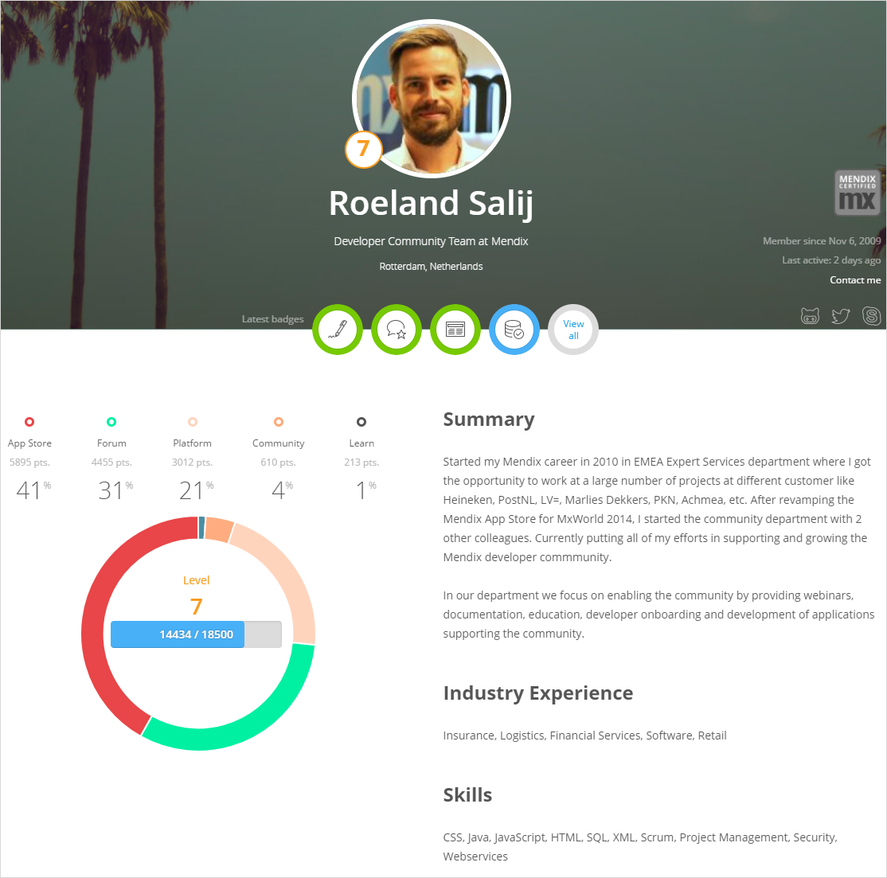
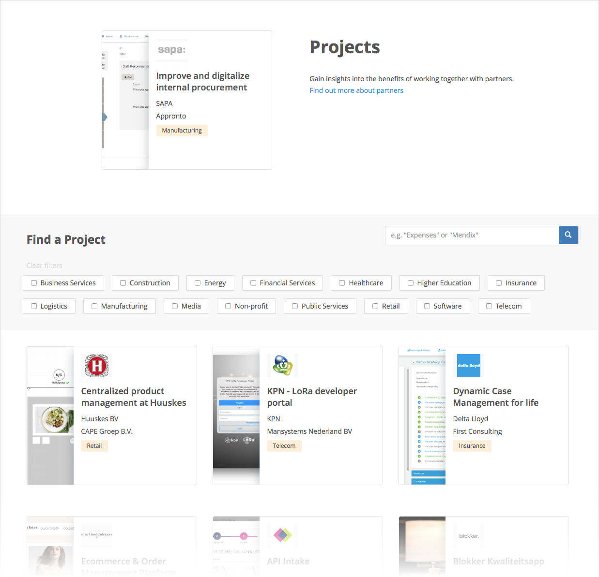

## 1 What Can the Mendix Community Do for Me? {#community-do-for-me}

Mendix has a vibrant community of tens of thousands users and active contributors. On the [Mendix Community site](http://developers.mendix.com), the community comes together around all the tools and information they need. This is where you can find out about updates in the Mendix [Forum](http://forum.mendixcloud.com) and [App Store](http://appstore.home.mendix.com), [product releases](https://www.mendix.com/releases/), [webinars](http://learn.mendix.com/link/webinar), [meetups](https://www.meetup.com/Mendix-Netherlands), [new blog posts](https://developers.mendix.com/spotlight/), and new [Academy](http://learn.mendix.com) content.

<video controls  src="attachments/community-page-scroll.mp4">VIDEO</video>

## 2 How Do I Use the Mendix Community Profile? {#community-profile}

The [Mendix Community Profile](https://developer.mendixcloud.com/link/community) is integrated into all of the community tools. The profile encourages the online community to grow by enabling individual developers to showcase their projects and skills, and it serves as a human touch in your interactions with other Mendix community members. When you click the name of a community member somewhere on the Mendix Platform, their Community Profile will open and you can see all of the interesting and useful information about them. And if they have set their [profile to public](https://docs.mendix.com/community/tools/how-to-set-up-your-profile), you can contact them directly.

{}

{}

With the goal of gaining different levels, points, and badges, Mendix incentivizes the community to add App Store content, answer Forum questions, and stay on the top of the [Mendix leaderboards](https://developer.mendixcloud.com/link/leaderboards).

{}

{}

This gamification system makes it fun to learn, build, and contribute to Mendix while you get rewarded for your achievements.

## 3 What Can the Mendix Partner Community Do for Me? {#mendix-partners}

Customers may wish to outsource the development and management of their applications to a partner. All Mendix development partners have to go through a training and verification process before they can qualify themselves as a Mendix partner. This helps us ensure that our partners deliver a level of service that meets our expectations.

{}

{}

Partners are ranked using the [Mendix Partner Profiles](https://developer.mendixcloud.com/link/partneroverview). Customers can see how many trained and certified engineers each partner has, the [app development projects](https://developer.mendixcloud.com/link/customers) they have completed, and their references. The partners can be filtered by experience, industry, and area.

{}

{}

The Mendix development partners can give advice, help you realize projects, and even take over complete development cycles.
